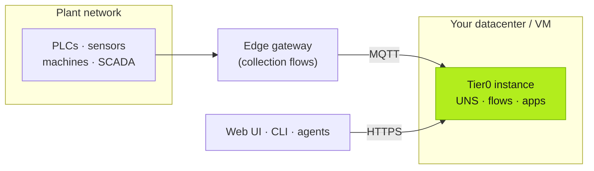

This page covers what you're actually running when you host Tier0 yourself — the open-source **Edge** edition on a single machine, or **Enterprise** at plant and multi-site scale. Cloud users can skip it entirely.

## Platform components

A Tier0 instance is composed of:

| Component | Role |
|---|---|
| **UNS core** | The Unified Namespace: MQTT-based pub/sub broker plus the semantic namespace model and history |
| **Flow runtime** | Node-RED instances executing your **SourceFlows** (collection) and **EventFlows** (processing) |
| **App runtime + Launchpad** | Runs generated and library apps; Launchpad is where end users open them |
| **Notebook** | The analytics workspace, connected live to the UNS |
| **Gateway / API** | REST + auth layer the web UI and `tier0` CLI talk to |

## Topologies

### Edge: one machine, open source

The Edge edition runs the whole stack — Node-RED flows, semantic MQTT core, TimescaleDB/PostgreSQL — on a single machine via Docker. Minimum 4-core CPU / 8 GB RAM / 100 GB disk (recommended 8-core / 16 GB / 1 TB); Ubuntu 24.04 or Windows 10/11. Install from [FREEZONEX/Tier0-Edge](https://github.com/FREEZONEX/Tier0-Edge) — see [Get Started](/intro/get-started/).

### Enterprise, single instance (Base / Plus)

One instance inside your network. Edges — gateways or industrial PCs near the equipment — run collection flows and publish into the instance over MQTT.



### Enterprise, cluster (HA, multi-instance)

Multiple instances for high availability and horizontal scale. Namespaces, flows, and apps deploy once and are reused across sites — the same structure can serve every plant.

## Getting the software

Self-hosted packages are delivered with your license. Start at [tier0.app/download](https://tier0.app/download) or [talk to the team](https://tier0.app/talk-to-team) — deployment is guided, including sizing for your signal volume and edge count.

## Pointing clients at your instance

Every client (CLI, agents, CI) must be told where your instance lives **before** authenticating:

```bash
tier0 config --base-url https://tier0.your-company.com
tier0 login          # or: tier0 config --api-key sk-per-xxxxxx
tier0 info           # verify gateway connectivity
```

:::caution[Changed the base URL?]
API keys are per-instance. After any `--base-url` change, log in again — old keys against the new address fail with an `authentication` error.
:::

## Operational notes

- **Edges are additive.** License edge nodes as you grow ($2,000/edge/year); each new edge is a flow deployment, not an integration project.
- **Back up flows before deploying.** `tier0 flow data --id <id> --out backup.json` exports a canvas; `flow deploy` replaces all nodes on the target. See [Connect](/using-tier0/connect/).
- **One namespace, many sites.** Design your top-level paths (`<Site>/<Area>/<Line>/…`) before scaling out — see [What is Tier0](/intro/what-is-tier0/#what-the-namespace-looks-like).
