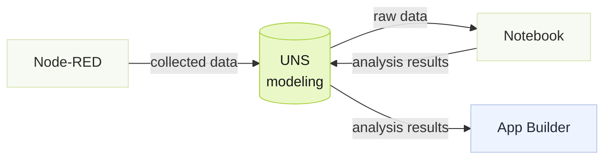

---
title: Building Analytics Apps
description: Building an analysis app with the Notebook 鈥?the Aramco Bowtie case (sanitized data).
editions: [cloud, enterprise]
sidebar:
  order: 3
---
import { Aside, Steps } from '@astrojs/starlight/components';

:::caution[TODO 鈥?鍐欎綔绾跨储 (Huize)]
浠ユ€濇簮鍋氱殑 Aramco Bowtie App 涓轰緥(鑴辨晱鏁版嵁),浠嬬粛濡備綍閫氳繃 Notebook 鏋勫缓鍒嗘瀽 app銆?
:::

*(Placeholder 鈥?this page will be rewritten. The skeleton below marks the intended structure.)*

Tier0 adopts Marimo Notebook to do advanced data analysis with Python, and a Bowtie application is used as an example to demonstrate the process.




## Example Background

Refinery corrosion is a complex process influenced by multiple operating factors. This example demonstrates a real-time corrosion risk assessment workflow that combines process data to estimate the likelihood of corrosion and support proactive maintenance.

## Getting Raw Data

<Steps>
1. In Tier0, go to **UNS**, and import the following models.

    - Corrosion Monitoring
    
      ```json
      {
        "name": "Corrosion_Monitoring",
        "topic": "Aramco/CDU_Plant/Atmospheric_Overhead/Metric/Corrosion_Monitoring",
        "type": "Metric",
        "description": "Real-time process measurements for CDU atmospheric overhead corrosion monitoring",
        "fields": [
          {
            "name": "D103_CHLORIDE",
            "dataType": "FLOAT",
            "unit": "ppm",
            "description": "D-103 Overhead Reflux Drum Chloride concentration"
          },
          {
            "name": "D103_PH",
            "dataType": "FLOAT",
            "unit": "pH",
            "description": "D-103 Overhead Reflux Drum pH value"
          },
          {
            "name": "WASH_WATER_FLOW",
            "dataType": "FLOAT",
            "unit": "t/h",
            "description": "Overhead wash water flow"
          },
          {
            "name": "DESALTER_SALT_PTB",
            "dataType": "FLOAT",
            "unit": "PTB",
            "description": "Salt content in desalted crude"
          },
          {
            "name": "DESALTER_BSW",
            "dataType": "FLOAT",
            "unit": "%",
            "description": "Basic sediment and water content"
          },
          {
            "name": "WASH_WATER_RATE",
            "dataType": "FLOAT",
            "unit": "%",
            "description": "Wash water rate"
          },
          {
            "name": "RRD_PH",
            "dataType": "FLOAT",
            "unit": "pH",
            "description": "Reflux drum sour water pH"
          },
          {
            "name": "RRD_CHLORIDE",
            "dataType": "FLOAT",
            "unit": "ppm",
            "description": "Reflux drum chloride concentration"
          },
          {
            "name": "RRD_TOTAL_IRON",
            "dataType": "FLOAT",
            "unit": "ppm",
            "description": "Total iron concentration indicating corrosion"
          }
        ]
      }
      ```
    
    - Corrosion Risk
    
      ```json
      {
        "name": "Corrosion_Risk",
        "topic": "Aramco/CDU_Plant/Atmospheric_Overhead/State/Corrosion_Risk",
        "type": "State",
        "description": "Bayesian Network inferred corrosion risk state",
        "fields": [
          {
            "name": "risk_state",
            "dataType": "STRING",
            "description": "Current corrosion risk state: NORMAL, DEVELOPING, CONFIRMED"
          },
          {
            "name": "previous_state",
            "dataType": "STRING",
            "description": "Previous corrosion risk state"
          },
          {
            "name": "confidence",
            "dataType": "FLOAT",
            "unit": "%",
            "description": "Inference confidence"
          },
          {
            "name": "timestamp",
            "dataType": "DATETIME"
          }
        ]
      }
      ```
    
    - Corrosion Risk Probability
    
      ```json
      {
        "name": "Corrosion_Risk_Probability",
        "topic": "Aramco/CDU_Plant/Atmospheric_Overhead/Metric/Corrosion_Risk_Probability",
        "type": "Metric",
        "description": "Bayesian Network posterior probability results",
        "fields": [
          {
            "name": "P_NORMAL",
            "dataType": "FLOAT"
          },
          {
            "name": "P_DEVELOPING",
            "dataType": "FLOAT"
          },
          {
            "name": "P_CONFIRMED",
            "dataType": "FLOAT"
          },
          {
            "name": "LOPC_PROBABILITY",
            "dataType": "FLOAT"
          },
          {
            "name": "SHUTDOWN_PROBABILITY",
            "dataType": "FLOAT"
          },
          {
            "name": "ESCALATION_PROBABILITY",
            "dataType": "FLOAT"
          }
        ]
      }
      ```
2. Go to **Flows**, create **Source Flow** to connect raw data and publish to **UNS**.

    *(Node-RED connects data and publishes it to UNS.)*
    ```json
    ```
</Steps>

## Building Analytic App in Notebook

<Steps>
1. In Tier0, go to **Notebook**, and create a new notebook.

2. Access the notebook, and add the following cells to analyze data from **UNS**.

    - Cell 1: Get data from UNS

      ```python
      ```

    - Cell 2: Validate and organize data

      ```python
      ```

    - Cell 3: Discretize continuous values

      ```python
      ```

    - Cell 4: Define Bayesian network structure and CPTs

      ```python
      ```

    - Cell 5: Build the network and run inference

      ```python
      ```

    - Cell 6: Organize analysis results

      ```python
      ```

    - Cell 7: Write results back to UNS through MQTT

      ```python
      ```
3. Run all cells and go to **UNS** to check the results.
</Steps>

## Building Bow-tie App
<Steps>
1. In Tier0, go to **Builder**.
2. Enter the application requirements in the dialog, and start building.

    <Aside type="caution" title="What must be stated">
      Remember to tell the agent to use data from UNS, specific topic paths are necessary. Otherwise the agent might have trouble displaying the correct data.
    </Aside>

    ```
    prompt
    ```
3. Once the application is complete after certain rounds of refining, click **Deploy** at the upper-right corner.
4. Go to **Launchpad**, open the application and check.
</Steps>
