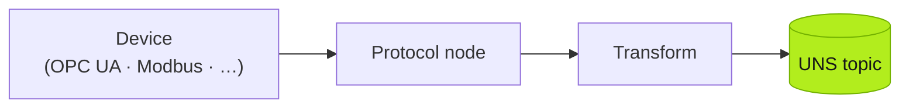

:::caution[TODO — 写作线索 (Huize)]
详细介绍如何用 NodeRED 连接典型协议进入 UNS,给出真实 NodeRED Flow Json Reference。
:::

*(Placeholder — this page will be rewritten. The skeleton below marks the intended structure.)*



## OPC UA

> TODO

```json
// TODO: real Node-RED flow JSON reference
```

## Modbus

> TODO

```json
// TODO: real Node-RED flow JSON reference
```
