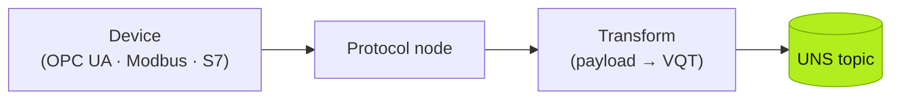

:::caution[TODO — 写作线索 (Huize)]
详细介绍**如何用 Node-RED 连接典型协议进入 UNS**,给出**真实 Node-RED Flow JSON reference**。建议每种协议一节,统一结构:前置条件(设备/模拟器、网络)→ 节点选择与配置截图 → 数据转换(协议 payload → VQT)→ 发布到 UNS topic → **可下载/可复制的完整 flow JSON**(`tier0 flow deploy -f` 可直接导入)。协议清单建议:OPC UA(open62541 参考 TASK-022 的积累)、Modbus TCP/RTU、Siemens S7、MQTT 桥接;每个 JSON 用脱敏的真实 flow。
:::

*(Placeholder — this page will be rewritten. The skeleton below marks the intended structure.)*

Every protocol follows the same pattern in a SourceFlow:



## OPC UA

> TODO: prerequisites, node config, address-space browsing, transform, publish; full flow JSON below.

```json
// TODO: real, sanitized Node-RED flow JSON — importable via `tier0 flow deploy -f`
```

## Modbus (TCP / RTU)

> TODO: register mapping, polling interval, scaling, transform, publish; full flow JSON below.

```json
// TODO: real, sanitized Node-RED flow JSON
```

## Siemens S7

> TODO.

## MQTT bridge

> TODO: bridging an existing broker into the UNS topic scheme.

## Verifying the data path

```bash
tier0 uns read "Plant/+/Metric/#" --json
tier0 flow list --source
```
