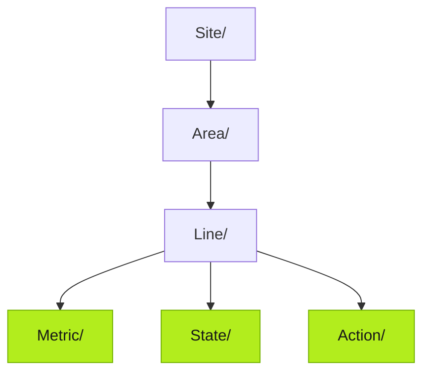

:::caution[TODO — 写作线索 (Huize)]
将 **Demo UNS 的构建思路**写在这里,介绍包括**防止 Topic 爆炸**、**payload structure** 的最佳实践。建议覆盖:① Demo 工厂的层级设计(Site/Area/Line/Cell…)与为什么这么分;② Topic 爆炸的反例与对策——把高基数维度放进 payload 字段而不是路径、按语义聚合字段到一个 topic(一个 VQT value 对象带多字段)、通配符订阅友好的路径设计;③ payload structure 规范——字段命名、单位、类型、嵌套深度上限、示例 JSON;④ Metric/State/Action 选型决策表;⑤ 从 Demo UNS 导出的 JSON(`tier0 uns create --file`)作为可复用模板附在页内。
:::

*(Placeholder — this page will be rewritten. The skeleton below marks the intended structure.)*

## How the Demo UNS is structured

> TODO: the demo factory hierarchy and the reasoning behind each level.



## Avoiding topic explosion

> TODO: anti-patterns (one topic per tag × per batch × per shift…); put high-cardinality dimensions into payload fields, not paths; wildcard-friendly hierarchies.

## Payload structure

> TODO: field naming, units, types, nesting limits; one VQT object with multiple fields beats many single-value topics.

```json
{ "value": { "temperature": 27.5, "unit": "C", "humidity": 58.6 }, "quality": "Good", "timeStamp": 1733382000000 }
```

## Metric vs State vs Action

> TODO: decision table with real examples from the demo plant.

## Reusable template

> TODO: attach the demo namespace export (`tier0 uns create --file structure.json`).
