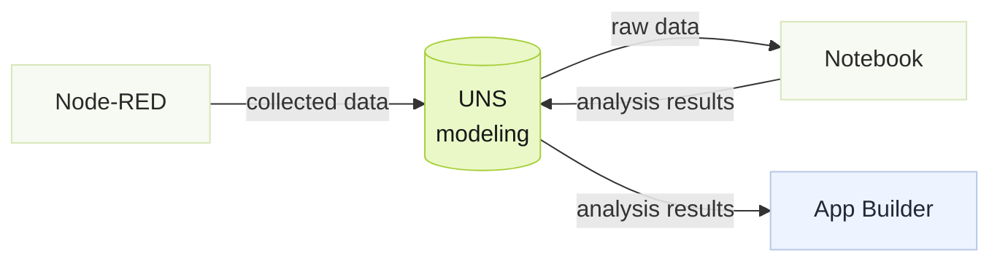

---
title: Crear apps de analítica
description: "Crear una app de analítica con Notebook usando el caso Aramco Bowtie (datos anonimizados)."
editions: [cloud, enterprise]
sidebar:
  order: 3
---
import { Aside, Steps } from '@astrojs/starlight/components';

Tier0 usa Marimo Notebook para análisis avanzado de datos con Python. Esta guía usa una aplicación Bowtie como flujo de ejemplo.




## Contexto del ejemplo

La corrosión en refinería es un proceso complejo influido por múltiples factores operativos. Este ejemplo muestra un flujo de evaluación de riesgo de corrosión en tiempo real que combina datos de proceso para estimar la probabilidad de corrosión y apoyar el mantenimiento proactivo.

## Obtener datos raw

<Steps>
1. In Tier0, go to **UNS**, and import the data model.
    
      <details className="notebook-cell">
      <summary>Show UNS model JSON</summary>

      ```json
      {
        "notes": "type:PATH|TOPIC,topicType:STATE|ACTION|METRIC,schema.type:INTEGER|STRING|FLOAT|DOUBLE|BOOLEAN|LONG|DATETIME",
        "namespace": [
          {
            "name": "Refinery",
            "type": "PATH",
            "children": [
              {
                "name": "CDU_Plant",
                "type": "PATH",
                "children": [
                  {
                    "name": "State",
                    "type": "PATH",
                    "topicType": "STATE",
                    "children": [
                      {
                        "name": "Corrosion_Risk",
                        "type": "TOPIC",
                        "topicType": "STATE",
                        "description": "Current corrosion risk state inferred by Bayesian Network",
                        "enableHistory": "TRUE",
                        "schema": [
                          {
                            "name": "risk_state",
                            "type": "STRING"
                          },
                          {
                            "name": "previous_state",
                            "type": "STRING"
                          },
                          {
                            "name": "model_confidence",
                            "type": "FLOAT"
                          },
                          {
                            "name": "timestamp",
                            "type": "DATETIME"
                          }
                        ]
                      }
                    ]
                  },
                  {
                    "name": "Metric",
                    "type": "PATH",
                    "topicType": "METRIC",
                    "children": [
                      {
                        "name": "Corrosion_Monitoring",
                        "type": "TOPIC",
                        "topicType": "METRIC",
                        "description": "Real-time process measurements for CDU atmospheric overhead corrosion monitoring",
                        "enableHistory": "TRUE",
                        "mockData": "FALSE",
                        "schema": [
                          {
                            "name": "d103_chloride",
                            "type": "FLOAT"
                          },
                          {
                            "name": "d103_ph",
                            "type": "FLOAT"
                          },
                          {
                            "name": "wash_water_flow",
                            "type": "FLOAT"
                          },
                          {
                            "name": "desalter_salt_ptb",
                            "type": "FLOAT"
                          },
                          {
                            "name": "desalter_bsw",
                            "type": "FLOAT"
                          },
                          {
                            "name": "wash_water_rate",
                            "type": "FLOAT"
                          },
                          {
                            "name": "rrd_ph",
                            "type": "FLOAT"
                          },
                          {
                            "name": "rrd_chloride",
                            "type": "FLOAT"
                          },
                          {
                            "name": "rrd_total_iron",
                            "type": "FLOAT"
                          },
                          {
                            "name": "sap_evidence",
                            "type": "STRING"
                          },
                          {
                            "name": "injection_quill_fail",
                            "type": "BOOLEAN"
                          },
                          {
                            "name": "timestamp",
                            "type": "DATETIME"
                          }
                        ]
                      },
                      {
                        "name": "Corrosion_Analysis",
                        "type": "TOPIC",
                        "topicType": "METRIC",
                        "description": "Posterior probabilities generated by the Bayesian Network",
                        "enableHistory": "TRUE",
                        "mockData": "FALSE",
                        "schema": [
                          {
                            "name": "p_normal",
                            "type": "DOUBLE"
                          },
                          {
                            "name": "p_developing",
                            "type": "DOUBLE"
                          },
                          {
                            "name": "p_confirmed",
                            "type": "DOUBLE"
                          },
                          {
                            "name": "total_corrosion_risk",
                            "type": "DOUBLE"
                          },
                          {
                            "name": "lopc_probability",
                            "type": "DOUBLE"
                          },
                          {
                            "name": "shutdown_probability",
                            "type": "DOUBLE"
                          },
                          {
                            "name": "escalation_probability",
                            "type": "DOUBLE"
                          },
                          {
                            "name": "timestamp",
                            "type": "DATETIME"
                          }
                        ]
                      }
                    ]
                  }
                ]
              }
            ]
          }
        ]
      }
      ```

      </details>
    
2. Go to **Flows**, create **Source Flow** to connect raw data and publish to **UNS**.

    *(Node-RED connects data and publishes it to UNS.)*
    <details className="notebook-cell">
    <summary>Show Source Flow JSON</summary>

    ```json
      [
          {
              "id": "6173469ed5064ccf",
              "type": "tab",
              "label": "corrosion",
              "disabled": false,
              "info": ""
          },
          {
              "id": "ad20b016baf7247f",
              "type": "OpcUa-Client",
              "z": "6173469ed5064ccf",
              "endpoint": "66bd118c33eb12f8",
              "action": "subscribe",
              "deadbandtype": "a",
              "deadbandvalue": 1,
              "time": 10,
              "timeUnit": "s",
              "certificate": "n",
              "localfile": "",
              "localkeyfile": "",
              "securitymode": "None",
              "securitypolicy": "None",
              "useTransport": false,
              "maxChunkCount": 1,
              "maxMessageSize": 8192,
              "receiveBufferSize": 8192,
              "sendBufferSize": 8192,
              "setstatusandtime": false,
              "keepsessionalive": false,
              "name": "",
              "x": 280,
              "y": 440,
              "wires": [
                  [
                      "ac9195bb4863dbdd",
                      "5a3d61b2ae40dcb6"
                  ],
                  [],
                  []
              ]
          },
          {
              "id": "b6746ed066ba0e1a",
              "type": "inject",
              "z": "6173469ed5064ccf",
              "name": "",
              "props": [
                  {
                      "p": "payload"
                  },
                  {
                      "p": "topic",
                      "vt": "str"
                  }
              ],
              "repeat": "",
              "crontab": "",
              "once": false,
              "onceDelay": 0.1,
              "topic": "multiple",
              "payload": "[   {     \"name\": \"D103_CHLORIDE\",     \"nodeId\": \"ns=2;i=3\",     \"datatype\": \"Float\"   },   {     \"name\": \"D103_PH\",     \"nodeId\": \"ns=2;i=4\",     \"datatype\": \"Float\"   },   {     \"name\": \"WASH_WATER_FLOW\",     \"nodeId\": \"ns=2;i=5\",     \"datatype\": \"Float\"   },   {     \"name\": \"DESALTER_SALT_PTB\",     \"nodeId\": \"ns=2;i=6\",     \"datatype\": \"Float\"   },   {     \"name\": \"DESALTER_BSW\",     \"nodeId\": \"ns=2;i=7\",     \"datatype\": \"Float\"   },   {     \"name\": \"WASH_WATER_RATE\",     \"nodeId\": \"ns=2;i=8\",     \"datatype\": \"Float\"   },   {     \"name\": \"RRD_PH\",     \"nodeId\": \"ns=2;i=9\",     \"datatype\": \"Float\"   },   {     \"name\": \"RRD_CHLORIDE\",     \"nodeId\": \"ns=2;i=10\",     \"datatype\": \"Float\"   },   {     \"name\": \"RRD_TOTAL_IRON\",     \"nodeId\": \"ns=2;i=11\",     \"datatype\": \"Float\"   },   {     \"name\": \"SAP_EVIDENCE\",     \"nodeId\": \"ns=2;i=12\",     \"datatype\": \"UInt16\"   },   {     \"name\": \"INJECTION_QUILL_FAIL\",     \"nodeId\": \"ns=2;i=13\",     \"datatype\": \"Boolean\"   } ]",
              "payloadType": "json",
              "x": 90,
              "y": 440,
              "wires": [
                  [
                      "ad20b016baf7247f"
                  ]
              ]
          },
          {
              "id": "ac9195bb4863dbdd",
              "type": "debug",
              "z": "6173469ed5064ccf",
              "name": "debug 2",
              "active": true,
              "tosidebar": true,
              "console": false,
              "tostatus": false,
              "complete": "false",
              "statusVal": "",
              "statusType": "auto",
              "x": 490,
              "y": 480,
              "wires": []
          },
          {
              "id": "5a3d61b2ae40dcb6",
              "type": "function",
              "z": "6173469ed5064ccf",
              "name": "function 1",
              "func": "const TOPIC = \"Refinery/CDU_Plant/Metric/Corrosion_Monitoring\";\n\nconst nodeMap = {\n    \"ns=2;i=3\": { field: \"d103_chloride\", type: \"float\" },\n    \"ns=2;i=4\": { field: \"d103_ph\", type: \"float\" },\n    \"ns=2;i=5\": { field: \"wash_water_flow\", type: \"float\" },\n    \"ns=2;i=6\": { field: \"desalter_salt_ptb\", type: \"float\" },\n    \"ns=2;i=7\": { field: \"desalter_bsw\", type: \"float\" },\n    \"ns=2;i=8\": { field: \"wash_water_rate\", type: \"float\" },\n    \"ns=2;i=9\": { field: \"rrd_ph\", type: \"float\" },\n    \"ns=2;i=10\": { field: \"rrd_chloride\", type: \"float\" },\n    \"ns=2;i=11\": { field: \"rrd_total_iron\", type: \"float\" },\n    \"ns=2;i=12\": { field: \"sap_evidence\", type: \"sap\" },\n    \"ns=2;i=13\": { field: \"injection_quill_fail\", type: \"boolean\" }\n};\n\nconst sapMap = {\n    0: \"none\",\n    1: \"work_order\",\n    2: \"inspection_finding\"\n};\n\nfunction normalizeNodeId(v) {\n    if (!v) return \"\";\n    if (typeof v === \"string\") return v;\n    if (v.toString) return v.toString();\n    return \"\";\n}\n\nfunction extractValue(payload) {\n    // OPC UA DataValue: payload.value.value\n    if (payload && payload.value && payload.value.value !== undefined) {\n        return payload.value.value;\n    }\n\n    // Some OPC UA nodes output Variant directly.\n    if (payload && payload.value !== undefined) {\n        return payload.value;\n    }\n\n    return payload;\n}\n\nfunction extractNodeId(msg) {\n    return normalizeNodeId(\n        msg.nodeId ||\n        msg.topic ||\n        msg.payload?.nodeId ||\n        msg.payload?.nodeid\n    );\n}\n\nconst nodeId = extractNodeId(msg);\nconst spec = nodeMap[nodeId];\n\nif (!spec) {\n    node.warn(`Unknown OPC UA nodeId: ${nodeId}`);\n    return null;\n}\n\nlet value = extractValue(msg.payload);\n\nif (spec.type === \"float\") {\n    value = Number(value);\n} else if (spec.type === \"boolean\") {\n    value = Boolean(value);\n} else if (spec.type === \"sap\") {\n    value = sapMap[Number(value)] || \"unknown\";\n}\n\nlet latest = context.get(\"latest\") || {};\nlatest[spec.field] = value;\nlatest.timestamp = new Date().toISOString();\ncontext.set(\"latest\", latest);\n\n// Publish only after all 11 fields have been received at least once.\nconst requiredFields = Object.values(nodeMap).map(x => x.field);\nconst ready = requiredFields.every(field => latest[field] !== undefined);\n\nif (!ready) {\n    node.status({\n        fill: \"yellow\",\n        shape: \"ring\",\n        text: `waiting ${Object.keys(latest).length - 1}/11`\n    });\n    return null;\n}\n\nmsg.topic = TOPIC;\nmsg.payload = {\n    d103_chloride: latest.d103_chloride,\n    d103_ph: latest.d103_ph,\n    wash_water_flow: latest.wash_water_flow,\n    desalter_salt_ptb: latest.desalter_salt_ptb,\n    desalter_bsw: latest.desalter_bsw,\n    wash_water_rate: latest.wash_water_rate,\n    rrd_ph: latest.rrd_ph,\n    rrd_chloride: latest.rrd_chloride,\n    rrd_total_iron: latest.rrd_total_iron,\n    sap_evidence: latest.sap_evidence,\n    injection_quill_fail: latest.injection_quill_fail,\n    timestamp: latest.timestamp\n};\n\nnode.status({\n    fill: \"green\",\n    shape: \"dot\",\n    text: \"published corrosion monitoring\"\n});\n\nreturn msg;",
              "outputs": 1,
              "timeout": 0,
              "noerr": 0,
              "initialize": "",
              "finalize": "",
              "libs": [],
              "x": 370,
              "y": 580,
              "wires": [
                  [
                      "aa15be33a84fb812",
                      "4fdd68dda3ee5c9e"
                  ]
              ]
          },
          {
              "id": "aa15be33a84fb812",
              "type": "mqtt out",
              "z": "6173469ed5064ccf",
              "name": "",
              "topic": "",
              "qos": "",
              "retain": "",
              "respTopic": "",
              "contentType": "",
              "userProps": "",
              "correl": "",
              "expiry": "",
              "broker": "broker-djx75cwgiywq",
              "x": 550,
              "y": 580,
              "wires": []
          },
          {
              "id": "4fdd68dda3ee5c9e",
              "type": "debug",
              "z": "6173469ed5064ccf",
              "name": "debug 3",
              "active": true,
              "tosidebar": true,
              "console": false,
              "tostatus": false,
              "complete": "false",
              "statusVal": "",
              "statusType": "auto",
              "x": 450,
              "y": 680,
              "wires": []
          },
          {
              "id": "66bd118c33eb12f8",
              "type": "OpcUa-Endpoint",
              "endpoint": "opc.tcp://172.31.151.237:4850",
              "secpol": "None",
              "secmode": "None",
              "none": true,
              "login": false,
              "usercert": false,
              "usercertificate": "",
              "userprivatekey": ""
          },
          {
              "id": "broker-djx75cwgiywq",
              "type": "mqtt-broker",
              "z": "6173469ed5064ccf",
              "name": "corrosion",
              "broker": "emqx",
              "port": "1883",
              "clientid": "357356352615696",
              "usetls": false,
              "protocolVersion": "4",
              "keepalive": "60",
              "cleansession": true,
              "birthTopic": "",
              "birthQos": "0",
              "birthPayload": "",
              "closeTopic": "",
              "closeQos": "0",
              "closePayload": "",
              "willTopic": "",
              "willQos": "0",
              "willPayload": ""
          },
          {
              "id": "c5201f1ad482b182",
              "type": "global-config",
              "env": [],
              "modules": {
                  "node-red-contrib-opcua": "0.2.339"
              }
          }
      ]
    ```

    </details>

</Steps>

## Crear una app de analítica en Notebook

1. In Tier0, go to **Notebook**, and create a new notebook.

2. Access the notebook, and add the following cells to analyze data from **UNS**.

    - Cell 1 - Import Libraries & Configuration

      Import required libraries and configure the MQTT broker, topics, and runtime settings.

      <details className="notebook-cell">
      <summary>Show code</summary>

      ```python
      @app.cell
      def _():
          """Imports and runtime configuration."""
          import json
          import math
          import os
          import threading
          import time
          from datetime import datetime, timezone

          import marimo as mo
          import pandas as pd
          import paho.mqtt.client as mqtt

          MQTT_BROKER_HOST = os.getenv("TIER0_MQTT_HOST", "enterprise-new-dev.tier0.dev")
          MQTT_BROKER_PORT = int(os.getenv("TIER0_MQTT_PORT", "1883"))
          MQTT_USERNAME = os.getenv("TIER0_MQTT_USERNAME", "357890055321856")
          MQTT_PASSWORD = os.getenv("TIER0_MQTT_PASSWORD", "caa6b34242002a3dff4948dd73ce8a")
          MQTT_CLIENT_ID = os.getenv(
              "TIER0_MQTT_CLIENT_ID",
              "357890055321856_bn",
          )

          SOURCE_TOPIC = "Refinery/CDU_Plant/Metric/Corrosion_Monitoring"
          ANALYSIS_TOPIC = "Refinery/CDU_Plant/Metric/Corrosion_Analysis"
          RISK_TOPIC = "Refinery/CDU_Plant/State/Corrosion_Risk"

          SOURCE_QOS = int(os.getenv("TIER0_SOURCE_QOS", "1"))
          OUTPUT_QOS = int(os.getenv("TIER0_OUTPUT_QOS", "1"))
          AUTOSTART = os.getenv("TIER0_BN_AUTOSTART", "true").lower() in {
              "1", "true", "yes", "on"
          }
          ROOT_CONFIDENCE = float(os.getenv("TIER0_BN_ROOT_CONFIDENCE", "0.85"))

          def utc_now_iso() -> str:
              return (
                  datetime.now(timezone.utc)
                  .isoformat(timespec="milliseconds")
                  .replace("+00:00", "Z")
              )

          mo.md(
              """
              # CDU Corrosion Bayesian Analysis

              This notebook subscribes to a complete corrosion-monitoring snapshot,
              performs one Bayesian inference for each new source message, and publishes
              the analysis results back to the UNS.
              """
          )
          return (
              ANALYSIS_TOPIC,
              AUTOSTART,
              MQTT_BROKER_HOST,
              MQTT_BROKER_PORT,
              MQTT_CLIENT_ID,
              MQTT_PASSWORD,
              MQTT_USERNAME,
              OUTPUT_QOS,
              RISK_TOPIC,
              ROOT_CONFIDENCE,
              SOURCE_QOS,
              SOURCE_TOPIC,
              datetime,
              json,
              math,
              mo,
              mqtt,
              os,
              pd,
              threading,
              time,
              timezone,
              utc_now_iso,
          )
      ```

      </details>

    - Cell 2 - Define Bayesian Network Structure

      Define the Bayesian Network topology, state spaces, CPT generators, and probability rules.

      <details className="notebook-cell">
      <summary>Show code</summary>

      ```python
      @app.cell
      def _(math, pd):
          """Static Bayesian-network definition and CPT generators."""
          import itertools

          from pgmpy.factors.discrete import TabularCPD
          from pgmpy.inference import VariableElimination
          from pgmpy.models import DiscreteBayesianNetwork

          STATE_SPACES = {
              "STATE_3": ["LOW", "NORMAL", "HIGH"],
              "STATE_YN": ["NO", "YES"],
              "PB2_3STATE": ["FAIL", "IL_OK", "SL_OK"],
              "TOP_EVENT_STATE": ["NORMAL", "DEVELOPING", "CONFIRMED"],
          }

          NODE_STATE_SPACE = {
              "T1_HighChlorideLoad": "STATE_3",
              "T2_ChemProtectionFail": "STATE_3",
              "T3_WashWaterLow": "STATE_3",
              "PB1_Desalter_OK": "STATE_YN",
              "PB2_WashQty_State": "PB2_3STATE",
              "PB3_Neutralization_OK": "STATE_YN",
              "MB1_ESD_OK": "STATE_YN",
              "MB2_TSV_OK": "STATE_YN",
              "TE_CorrosionState": "TOP_EVENT_STATE",
              "EV_TOTIRON_High": "STATE_YN",
              "EV_SAP_Positive": "STATE_YN",
              "EV_QuillFailure": "STATE_YN",
              "C1_LOPC": "STATE_YN",
              "C2_UnplannedShutdown": "STATE_YN",
              "C3_Escalation": "STATE_YN",
          }

          EDGES = [
              ("T1_HighChlorideLoad", "TE_CorrosionState"),
              ("T2_ChemProtectionFail", "TE_CorrosionState"),
              ("T3_WashWaterLow", "TE_CorrosionState"),
              ("PB1_Desalter_OK", "TE_CorrosionState"),
              ("PB2_WashQty_State", "TE_CorrosionState"),
              ("PB3_Neutralization_OK", "TE_CorrosionState"),
              ("TE_CorrosionState", "EV_TOTIRON_High"),
              ("TE_CorrosionState", "EV_SAP_Positive"),
              ("TE_CorrosionState", "EV_QuillFailure"),
              ("TE_CorrosionState", "C1_LOPC"),
              ("MB1_ESD_OK", "C1_LOPC"),
              ("MB2_TSV_OK", "C1_LOPC"),
              ("TE_CorrosionState", "C2_UnplannedShutdown"),
              ("MB1_ESD_OK", "C2_UnplannedShutdown"),
              ("C1_LOPC", "C3_Escalation"),
              ("MB1_ESD_OK", "C3_Escalation"),
              ("MB2_TSV_OK", "C3_Escalation"),
          ]

          def states_for(node_id: str) -> list[str]:
              return STATE_SPACES[NODE_STATE_SPACE[node_id]]

          def softmax(values: list[float]) -> list[float]:
              maximum = max(values)
              exps = [math.exp(value - maximum) for value in values]
              total = sum(exps)
              return [value / total for value in exps]

          THREAT_SCORE = {"LOW": 0.0, "NORMAL": 1.0, "HIGH": 2.0}
          PB1_OK_BONUS = {"NO": 0.8, "YES": -0.6}
          PB3_OK_BONUS = {"NO": 1.0, "YES": -0.7}
          PB2_STATE_BONUS = {"FAIL": 1.2, "IL_OK": 0.3, "SL_OK": -0.6}

          def top_event_distribution(t1, t2, t3, pb1, pb2, pb3) -> dict[str, float]:
              score = (
                  THREAT_SCORE[t1]
                  + THREAT_SCORE[t2]
                  + THREAT_SCORE[t3]
                  + PB1_OK_BONUS[pb1]
                  + PB2_STATE_BONUS[pb2]
                  + PB3_OK_BONUS[pb3]
              )
              probabilities = softmax(
                  [
                      2.2 - score,
                      -0.2 + 0.6 * score,
                      -1.2 + 0.8 * score,
                  ]
              )
              return dict(zip(STATE_SPACES["TOP_EVENT_STATE"], probabilities))

          TE_PARENTS = [
              "T1_HighChlorideLoad",
              "T2_ChemProtectionFail",
              "T3_WashWaterLow",
              "PB1_Desalter_OK",
              "PB2_WashQty_State",
              "PB3_Neutralization_OK",
          ]

          TE_PARENT_SPACES = [states_for(parent) for parent in TE_PARENTS]
          te_rows = []
          for combination in itertools.product(*TE_PARENT_SPACES):
              distribution = top_event_distribution(*combination)
              te_rows.append(
                  [
                      *combination,
                      distribution["NORMAL"],
                      distribution["DEVELOPING"],
                      distribution["CONFIRMED"],
                  ]
              )
          TE_CPT_DF = pd.DataFrame(
              te_rows,
              columns=TE_PARENTS
              + ["P_NORMAL", "P_DEVELOPING", "P_CONFIRMED"],
          )

          def evidence_yes_probability(te_state: str, kind: str) -> float:
              mappings = {
                  "TOTIRON": {"NORMAL": 0.15, "DEVELOPING": 0.65, "CONFIRMED": 0.85},
                  "SAP": {"NORMAL": 0.08, "DEVELOPING": 0.35, "CONFIRMED": 0.75},
                  "QUILL": {"NORMAL": 0.03, "DEVELOPING": 0.15, "CONFIRMED": 0.55},
              }
              return mappings[kind][te_state]

          def lopc_yes_probability(te: str, mb1: str, mb2: str) -> float:
              base = {"NORMAL": 0.02, "DEVELOPING": 0.08, "CONFIRMED": 0.25}[te]
              return min(0.98, base + (0.10 if mb1 == "NO" else 0) + (0.18 if mb2 == "NO" else 0))

          def shutdown_yes_probability(te: str, mb1: str) -> float:
              base = {"NORMAL": 0.05, "DEVELOPING": 0.35, "CONFIRMED": 0.60}[te]
              return min(0.98, base + (0.10 if mb1 == "NO" else 0))

          def escalation_yes_probability(lopc: str, mb1: str, mb2: str) -> float:
              if lopc == "NO":
                  return 0.01
              return min(0.98, 0.10 + (0.18 if mb1 == "NO" else 0) + (0.35 if mb2 == "NO" else 0))

          def peaked_prior(node_id: str, center_state: str, confidence: float) -> list[float]:
              states = states_for(node_id)
              confidence = min(max(float(confidence), 0.0), 1.0)
              if center_state not in states:
                  return [1.0 / len(states)] * len(states)
              if len(states) == 1:
                  return [1.0]
              remainder = (1.0 - confidence) / (len(states) - 1)
              probabilities = [remainder] * len(states)
              probabilities[states.index(center_state)] = confidence
              return probabilities

          def binary_cpd(child: str, parent: str, yes_probability_fn):
              parent_states = states_for(parent)
              yes_values = [float(yes_probability_fn(state)) for state in parent_states]
              return TabularCPD(
                  variable=child,
                  variable_card=2,
                  values=[[1.0 - value for value in yes_values], yes_values],
                  evidence=[parent],
                  evidence_card=[len(parent_states)],
                  state_names={child: states_for(child), parent: parent_states},
              )

          def binary_multi_cpd(child: str, parents: list[str], yes_probability_fn):
              parent_spaces = [states_for(parent) for parent in parents]
              combinations = list(itertools.product(*parent_spaces))
              yes_values = [float(yes_probability_fn(*combination)) for combination in combinations]
              return TabularCPD(
                  variable=child,
                  variable_card=2,
                  values=[[1.0 - value for value in yes_values], yes_values],
                  evidence=parents,
                  evidence_card=[len(space) for space in parent_spaces],
                  state_names={
                      child: states_for(child),
                      **{parent: states_for(parent) for parent in parents},
                  },
              )

          return (
              DiscreteBayesianNetwork,
              EDGES,
              NODE_STATE_SPACE,
              STATE_SPACES,
              TE_CPT_DF,
              TE_PARENTS,
              TabularCPD,
              VariableElimination,
              binary_cpd,
              binary_multi_cpd,
              escalation_yes_probability,
              evidence_yes_probability,
              itertools,
              lopc_yes_probability,
              peaked_prior,
              shutdown_yes_probability,
              states_for,
          )
      ```

      </details>

    - Cell 3 - Validate & Discretize Source Data

      Validate the incoming MQTT payload and convert continuous process values into Bayesian Network states.

      <details className="notebook-cell">
      <summary>Show code</summary>

      ```python
      @app.cell
      def _(ROOT_CONFIDENCE, utc_now_iso):
          """Source validation, discretization, and one-snapshot analysis."""
          import hashlib

          REQUIRED_SOURCE_FIELDS = [
              "d103_chloride",
              "d103_ph",
              "wash_water_flow",
              "desalter_salt_ptb",
              "desalter_bsw",
              "wash_water_rate",
              "rrd_ph",
              "rrd_chloride",
              "rrd_total_iron",
              "sap_evidence",
              "injection_quill_fail",
              "timestamp",
          ]

          def parse_boolean(value) -> bool:
              if isinstance(value, bool):
                  return value
              if isinstance(value, (int, float)):
                  return bool(value)
              if isinstance(value, str):
                  normalized = value.strip().lower()
                  if normalized in {"true", "1", "yes", "y", "on"}:
                      return True
                  if normalized in {"false", "0", "no", "n", "off"}:
                      return False
              raise ValueError(f"invalid boolean value: {value!r}")

          def normalize_sap(value) -> str:
              normalized = str(value).strip().lower()
              if normalized in {"0", "none", "normal", "", "nan"}:
                  return "None"
              if normalized in {"1", "work_order", "work order", "minor", "warning"}:
                  return "Minor corrosion observed"
              if normalized in {
                  "2",
                  "inspection_finding",
                  "inspection finding",
                  "confirmed",
                  "abnormal",
              }:
                  return "Confirmed corrosion / thickness loss"
              raise ValueError(f"unsupported sap_evidence value: {value!r}")

          def normalize_source_payload(payload: dict) -> dict:
              if not isinstance(payload, dict):
                  raise TypeError("source MQTT payload must be a JSON object")

              lower = {str(key).lower(): value for key, value in payload.items()}
              missing = [field for field in REQUIRED_SOURCE_FIELDS if field not in lower]
              if missing:
                  raise ValueError(f"source payload is missing fields: {missing}")

              normalized = {
                  "d103_chloride": float(lower["d103_chloride"]),
                  "d103_ph": float(lower["d103_ph"]),
                  "wash_water_flow": float(lower["wash_water_flow"]),
                  "desalter_salt_ptb": float(lower["desalter_salt_ptb"]),
                  "desalter_bsw": float(lower["desalter_bsw"]),
                  "wash_water_rate": float(lower["wash_water_rate"]),
                  "rrd_ph": float(lower["rrd_ph"]),
                  "rrd_chloride": float(lower["rrd_chloride"]),
                  "rrd_total_iron": float(lower["rrd_total_iron"]),
                  "sap_evidence": normalize_sap(lower["sap_evidence"]),
                  "injection_quill_fail": parse_boolean(lower["injection_quill_fail"]),
                  "timestamp": str(lower["timestamp"]).strip(),
              }

              numeric_ranges = {
                  "d103_chloride": (0.0, 1000.0),
                  "d103_ph": (0.0, 14.0),
                  "wash_water_flow": (0.0, 10000.0),
                  "desalter_salt_ptb": (0.0, 1000.0),
                  "desalter_bsw": (0.0, 100.0),
                  "wash_water_rate": (0.0, 100.0),
                  "rrd_ph": (0.0, 14.0),
                  "rrd_chloride": (0.0, 10000.0),
                  "rrd_total_iron": (0.0, 10000.0),
              }
              for field, (minimum, maximum) in numeric_ranges.items():
                  value = normalized[field]
                  if not minimum <= value <= maximum:
                      raise ValueError(f"{field} out of accepted range: {value}")

              if not normalized["timestamp"]:
                  raise ValueError("timestamp cannot be empty")
              return normalized

          def source_message_id(payload: dict) -> str:
              # Timestamp is the primary event key. Hash protects against two different
              # snapshots accidentally sharing the same timestamp.
              ordered = "|".join(str(payload[field]) for field in REQUIRED_SOURCE_FIELDS)
              return hashlib.sha256(ordered.encode("utf-8")).hexdigest()

          def discretize_source(payload: dict) -> tuple[dict, dict]:
              t1 = (
                  "LOW"
                  if payload["d103_chloride"] < 5.0
                  else "NORMAL"
                  if payload["d103_chloride"] <= 20.0
                  else "HIGH"
              )

              chemical_failure_score = int(payload["d103_ph"] < 5.5) + int(
                  payload["d103_chloride"] > 10.0
              )
              t2 = (
                  "HIGH"
                  if chemical_failure_score == 2
                  else "NORMAL"
                  if chemical_failure_score == 1
                  else "LOW"
              )

              t3 = (
                  "HIGH"
                  if payload["wash_water_flow"] < 6.0
                  else "NORMAL"
                  if payload["wash_water_flow"] <= 10.0
                  else "LOW"
              )

              pb1 = (
                  "YES"
                  if payload["desalter_salt_ptb"] <= 1.0
                  and payload["desalter_bsw"] <= 0.2
                  else "NO"
              )

              pb2 = (
                  "FAIL"
                  if payload["wash_water_rate"] < 4.0
                  else "IL_OK"
                  if payload["wash_water_rate"] < 6.0
                  else "SL_OK"
              )

              pb3 = (
                  "YES"
                  if payload["rrd_ph"] >= 5.5 and payload["rrd_chloride"] <= 10.0
                  else "NO"
              )

              root_centers = {
                  "T1_HighChlorideLoad": t1,
                  "T2_ChemProtectionFail": t2,
                  "T3_WashWaterLow": t3,
                  "PB1_Desalter_OK": pb1,
                  "PB2_WashQty_State": pb2,
                  "PB3_Neutralization_OK": pb3,
                  # The source model currently has no MB fields. Keep both mitigations
                  # available by default, matching the previous notebook UI defaults.
                  "MB1_ESD_OK": "YES",
                  "MB2_TSV_OK": "YES",
              }

              evidence = {
                  "EV_TOTIRON_High": "YES" if payload["rrd_total_iron"] >= 10.0 else "NO",
                  "EV_SAP_Positive": "YES" if payload["sap_evidence"] != "None" else "NO",
                  "EV_QuillFailure": "YES" if payload["injection_quill_fail"] else "NO",
              }
              return root_centers, evidence

          return (
              REQUIRED_SOURCE_FIELDS,
              discretize_source,
              normalize_source_payload,
              parse_boolean,
              source_message_id,
          )
      ```

      </details>

    - Cell 4 - Build Model & Run Inference

      Build a Bayesian Network for the current snapshot, execute inference, and generate output payloads.

      <details className="notebook-cell">
      <summary>Show code</summary>

      ```python
      @app.cell
      def _(
          DiscreteBayesianNetwork,
          EDGES,
          ROOT_CONFIDENCE,
          STATE_SPACES,
          TE_CPT_DF,
          TE_PARENTS,
          TabularCPD,
          VariableElimination,
          binary_cpd,
          binary_multi_cpd,
          discretize_source,
          escalation_yes_probability,
          evidence_yes_probability,
          itertools,
          lopc_yes_probability,
          peaked_prior,
          shutdown_yes_probability,
          states_for,
          utc_now_iso,
      ):
          """Build a fresh BN for the current snapshot and execute inference."""

          def factor_probability(factor, variable: str, state: str) -> float:
              states = factor.state_names[variable]
              values = list(map(float, factor.values))
              return float(values[states.index(state)])

          def build_model(root_centers: dict):
              model = DiscreteBayesianNetwork(EDGES)

              root_cpds = []
              for node_id, center_state in root_centers.items():
                  states = states_for(node_id)
                  probabilities = peaked_prior(node_id, center_state, ROOT_CONFIDENCE)
                  root_cpds.append(
                      TabularCPD(
                          variable=node_id,
                          variable_card=len(states),
                          values=[[probability] for probability in probabilities],
                          state_names={node_id: states},
                      )
                  )

              te_values = [
                  TE_CPT_DF["P_NORMAL"].astype(float).tolist(),
                  TE_CPT_DF["P_DEVELOPING"].astype(float).tolist(),
                  TE_CPT_DF["P_CONFIRMED"].astype(float).tolist(),
              ]
              te_cpd = TabularCPD(
                  variable="TE_CorrosionState",
                  variable_card=3,
                  values=te_values,
                  evidence=TE_PARENTS,
                  evidence_card=[len(states_for(parent)) for parent in TE_PARENTS],
                  state_names={
                      "TE_CorrosionState": STATE_SPACES["TOP_EVENT_STATE"],
                      **{parent: states_for(parent) for parent in TE_PARENTS},
                  },
              )

              evidence_cpds = [
                  binary_cpd(
                      "EV_TOTIRON_High",
                      "TE_CorrosionState",
                      lambda state: evidence_yes_probability(state, "TOTIRON"),
                  ),
                  binary_cpd(
                      "EV_SAP_Positive",
                      "TE_CorrosionState",
                      lambda state: evidence_yes_probability(state, "SAP"),
                  ),
                  binary_cpd(
                      "EV_QuillFailure",
                      "TE_CorrosionState",
                      lambda state: evidence_yes_probability(state, "QUILL"),
                  ),
              ]

              consequence_cpds = [
                  binary_multi_cpd(
                      "C1_LOPC",
                      ["TE_CorrosionState", "MB1_ESD_OK", "MB2_TSV_OK"],
                      lopc_yes_probability,
                  ),
                  binary_multi_cpd(
                      "C2_UnplannedShutdown",
                      ["TE_CorrosionState", "MB1_ESD_OK"],
                      shutdown_yes_probability,
                  ),
                  binary_multi_cpd(
                      "C3_Escalation",
                      ["C1_LOPC", "MB1_ESD_OK", "MB2_TSV_OK"],
                      escalation_yes_probability,
                  ),
              ]

              model.add_cpds(*root_cpds, te_cpd, *evidence_cpds, *consequence_cpds)
              if not model.check_model():
                  raise RuntimeError("Bayesian network model validation failed")
              return model

          def analyze_snapshot(payload: dict, previous_risk_state: str | None = None) -> dict:
              root_centers, evidence = discretize_source(payload)
              model = build_model(root_centers)
              inference = VariableElimination(model)

              q_te = inference.query(["TE_CorrosionState"], evidence=evidence, show_progress=False)
              q_c1 = inference.query(["C1_LOPC"], evidence=evidence, show_progress=False)
              q_c2 = inference.query(["C2_UnplannedShutdown"], evidence=evidence, show_progress=False)
              q_c3 = inference.query(["C3_Escalation"], evidence=evidence, show_progress=False)

              p_normal = factor_probability(q_te, "TE_CorrosionState", "NORMAL")
              p_developing = factor_probability(q_te, "TE_CorrosionState", "DEVELOPING")
              p_confirmed = factor_probability(q_te, "TE_CorrosionState", "CONFIRMED")
              probabilities = {
                  "NORMAL": p_normal,
                  "DEVELOPING": p_developing,
                  "CONFIRMED": p_confirmed,
              }
              risk_state = max(probabilities, key=probabilities.get)
              analysis_timestamp = utc_now_iso()

              analysis_payload = {
                  "p_normal": p_normal,
                  "p_developing": p_developing,
                  "p_confirmed": p_confirmed,
                  "total_corrosion_risk": p_developing + p_confirmed,
                  "lopc_probability": factor_probability(q_c1, "C1_LOPC", "YES"),
                  "shutdown_probability": factor_probability(
                      q_c2, "C2_UnplannedShutdown", "YES"
                  ),
                  "escalation_probability": factor_probability(q_c3, "C3_Escalation", "YES"),
                  "timestamp": analysis_timestamp,
              }

              risk_payload = {
                  "risk_state": risk_state,
                  "previous_state": previous_risk_state or risk_state,
                  "model_confidence": max(probabilities.values()),
                  "timestamp": analysis_timestamp,
              }

              return {
                  "source_timestamp": payload["timestamp"],
                  "root_states": root_centers,
                  "evidence": evidence,
                  "analysis_payload": analysis_payload,
                  "risk_payload": risk_payload,
                  "risk_state": risk_state,
              }

          return analyze_snapshot, build_model, factor_probability
      ```

      </details>

    - Cell 5 - Run MQTT Analysis Service

      Subscribe to the source topic, process each incoming snapshot, run Bayesian analysis, and publish the results.

      <details className="notebook-cell">
      <summary>Show code</summary>

      ```python
      @app.cell
      def _(
          ANALYSIS_TOPIC,
          AUTOSTART,
          MQTT_BROKER_HOST,
          MQTT_BROKER_PORT,
          MQTT_CLIENT_ID,
          MQTT_PASSWORD,
          MQTT_USERNAME,
          OUTPUT_QOS,
          RISK_TOPIC,
          SOURCE_QOS,
          SOURCE_TOPIC,
          analyze_snapshot,
          json,
          mqtt,
          normalize_source_payload,
          source_message_id,
          threading,
          utc_now_iso,
      ):
          """Long-running MQTT subscriber and publisher service."""

          class CorrosionBNService:
              def __init__(self):
                  self.lock = threading.RLock()
                  self.client = None
                  self.running = False
                  self.connected = False
                  self.last_message_id = None
                  self.last_source_timestamp = None
                  self.last_analysis_timestamp = None
                  self.previous_risk_state = None
                  self.processed_count = 0
                  self.duplicate_count = 0
                  self.error_count = 0
                  self.last_error = None
                  self.last_result = None
                  self.connection_rc = None

              def _create_client(self):
                  # Use MQTT 3.1.1 and callback API v1 for broad compatibility with
                  # EMQX and different paho-mqtt releases bundled in Notebook images.
                  kwargs = {
                      "client_id": MQTT_CLIENT_ID,
                      "clean_session": True,
                      "protocol": mqtt.MQTTv311,
                      "transport": "tcp",
                  }
                  try:
                      client = mqtt.Client(
                          callback_api_version=mqtt.CallbackAPIVersion.VERSION1,
                          **kwargs,
                      )
                  except (AttributeError, TypeError):
                      client = mqtt.Client(**kwargs)

                  client.username_pw_set(MQTT_USERNAME, MQTT_PASSWORD)
                  client.on_connect = self._on_connect
                  client.on_disconnect = self._on_disconnect
                  client.on_message = self._on_message
                  client.reconnect_delay_set(min_delay=1, max_delay=30)
                  client.enable_logger()
                  return client

              def _on_connect(self, client, userdata, flags, rc, properties=None):
                  code = int(rc)
                  with self.lock:
                      self.connected = code == 0
                      self.connection_rc = code
                      self.last_error = None if code == 0 else f"MQTT connection rejected, rc={code}"
                  if code == 0:
                      sub_rc, mid = client.subscribe(SOURCE_TOPIC, qos=SOURCE_QOS)
                      if sub_rc != mqtt.MQTT_ERR_SUCCESS:
                          with self.lock:
                              self.last_error = f"MQTT subscribe failed, rc={sub_rc}"
                          return
                      print(f"[BN SERVICE] connected and subscribed to {SOURCE_TOPIC}")
                  else:
                      print(f"[BN SERVICE ERROR] connection rejected rc={code}")

              def _on_disconnect(self, client, userdata, rc, properties=None):
                  with self.lock:
                      self.connected = False
                      self.connection_rc = int(rc) if rc is not None else None
                      if self.running and rc:
                          self.last_error = f"MQTT disconnected unexpectedly, rc={rc}"
                  print(f"[BN SERVICE] disconnected: {rc}")

              def _publish_json(self, topic: str, payload: dict):
                  info = self.client.publish(
                      topic,
                      payload=json.dumps(payload, separators=(",", ":"), ensure_ascii=False),
                      qos=OUTPUT_QOS,
                      retain=False,
                  )
                  info.wait_for_publish(timeout=10)
                  if info.rc != mqtt.MQTT_ERR_SUCCESS:
                      raise RuntimeError(f"MQTT publish failed for {topic}: rc={info.rc}")

              def _on_message(self, client, userdata, msg):
                  try:
                      raw_payload = json.loads(msg.payload.decode("utf-8"))
                      payload = normalize_source_payload(raw_payload)
                      message_id = source_message_id(payload)

                      with self.lock:
                          if message_id == self.last_message_id:
                              self.duplicate_count += 1
                              return
                          previous_risk_state = self.previous_risk_state

                      result = analyze_snapshot(payload, previous_risk_state)

                      # Publish only after both payloads have been generated successfully.
                      self._publish_json(ANALYSIS_TOPIC, result["analysis_payload"])
                      self._publish_json(RISK_TOPIC, result["risk_payload"])

                      with self.lock:
                          self.last_message_id = message_id
                          self.last_source_timestamp = payload["timestamp"]
                          self.last_analysis_timestamp = result["analysis_payload"]["timestamp"]
                          self.previous_risk_state = result["risk_state"]
                          self.processed_count += 1
                          self.last_result = result
                          self.last_error = None

                      print(
                          "[BN SERVICE] processed",
                          payload["timestamp"],
                          "->",
                          result["risk_state"],
                      )
                  except Exception as exc:
                      with self.lock:
                          self.error_count += 1
                          self.last_error = f"{type(exc).__name__}: {exc}"
                      print("[BN SERVICE ERROR]", self.last_error)

              def start(self):
                  with self.lock:
                      if self.running:
                          return False
                      if not MQTT_PASSWORD:
                          raise RuntimeError(
                              "TIER0_MQTT_PASSWORD is empty. Set it before starting the service."
                          )
                      self.client = self._create_client()
                      self.running = True
                  try:
                      # Synchronous connect surfaces DNS, socket, and authentication
                      # failures immediately instead of leaving running=True forever.
                      rc = self.client.connect(
                          MQTT_BROKER_HOST,
                          MQTT_BROKER_PORT,
                          keepalive=30,
                      )
                      if rc != mqtt.MQTT_ERR_SUCCESS:
                          raise RuntimeError(f"MQTT connect() failed, rc={rc}")
                      self.client.loop_start()
                      return True
                  except Exception as exc:
                      with self.lock:
                          self.running = False
                          self.connected = False
                          self.last_error = f"{type(exc).__name__}: {exc}"
                          self.client = None
                      raise

              def stop(self):
                  with self.lock:
                      if not self.running:
                          return False
                      client = self.client
                      self.running = False
                      self.connected = False
                      self.client = None
                  try:
                      client.disconnect()
                  finally:
                      client.loop_stop()
                  return True

              def restart(self):
                  self.stop()
                  return self.start()

              def status(self) -> dict:
                  with self.lock:
                      return {
                          "running": self.running,
                          "connected": self.connected,
                          "connection_rc": self.connection_rc,
                          "client_id": MQTT_CLIENT_ID,
                          "broker": f"{MQTT_BROKER_HOST}:{MQTT_BROKER_PORT}",
                          "source_topic": SOURCE_TOPIC,
                          "analysis_topic": ANALYSIS_TOPIC,
                          "risk_topic": RISK_TOPIC,
                          "processed_count": self.processed_count,
                          "duplicate_count": self.duplicate_count,
                          "error_count": self.error_count,
                          "last_source_timestamp": self.last_source_timestamp,
                          "last_analysis_timestamp": self.last_analysis_timestamp,
                          "previous_risk_state": self.previous_risk_state,
                          "last_error": self.last_error,
                      }

          # Reuse a previous service instance when the cell is re-executed, preventing
          # duplicate subscribers inside the same Python process.
          existing = globals().get("_CORROSION_BN_SERVICE")
          if existing is not None:
              try:
                  existing.stop()
              except Exception:
                  pass

          CORROSION_BN_SERVICE = CorrosionBNService()
          globals()["_CORROSION_BN_SERVICE"] = CORROSION_BN_SERVICE

          AUTOSTART_ERROR = None
          if AUTOSTART:
              try:
                  CORROSION_BN_SERVICE.start()
              except Exception as exc:
                  AUTOSTART_ERROR = f"{type(exc).__name__}: {exc}"

          return AUTOSTART_ERROR, CORROSION_BN_SERVICE, CorrosionBNService
      ```

      </details>

    - Cell 6 - Display Service Status

      Display the MQTT connection status and service statistics.

      <details className="notebook-cell">
      <summary>Show code</summary>

      ```python
      @app.cell
      def _(AUTOSTART_ERROR, CORROSION_BN_SERVICE, mo, pd):
          """Service status and usage instructions."""
          status = CORROSION_BN_SERVICE.status()

          blocks = [
              mo.md("## MQTT analysis service"),
              pd.DataFrame([status]),
          ]
          if status.get("last_error"):
              blocks.append(mo.md(f"### Connection / processing error\n`{status['last_error']}`"))
          elif status.get("running") and not status.get("connected"):
              blocks.append(mo.md("### Connecting\nThe MQTT client has started but has not completed the broker connection yet."))

          if AUTOSTART_ERROR:
              blocks.append(
                  mo.md(
                      f"""
                      ### Service not started

                      `{AUTOSTART_ERROR}`

                      Set the MQTT password in the Notebook environment and run this cell again:

                      ~~~python
                      import os
                      # MQTT credentials are already configured in this notebook.
                      ~~~
                      """
                  )
              )
          else:
              blocks.append(
                  mo.md(
                      """
                      The service starts automatically and processes one complete source
                      snapshot for every new MQTT message. No manual analysis trigger or SQL
                      polling is required.

                      Available controls in Python:

                      ~~~python
                      CORROSION_BN_SERVICE.status()
                      CORROSION_BN_SERVICE.stop()
                      CORROSION_BN_SERVICE.start()
                      CORROSION_BN_SERVICE.restart()
                      ~~~
                      """
                  )
              )

          mo.vstack(blocks)
          return status,
      ```

      </details>

    - Cell 7 - Display Latest Analysis Result

      Display the most recent Bayesian analysis result.

      <details className="notebook-cell">
      <summary>Show code</summary>

      ```python
      @app.cell
      def _(CORROSION_BN_SERVICE, mo):
          """Display the most recent analysis result when one is available."""
          latest = CORROSION_BN_SERVICE.last_result
          if latest is None:
              mo.md("### Latest result\nNo source message has been processed yet.")
          else:
              mo.vstack(
                  [
                      mo.md("### Latest source snapshot result"),
                      mo.md(f"- Source timestamp: `{latest['source_timestamp']}`"),
                      mo.md(f"- Risk state: `{latest['risk_state']}`"),
                      mo.md("#### Root states"),
                      latest["root_states"],
                      mo.md("#### Evidence"),
                      latest["evidence"],
                      mo.md("#### Corrosion analysis payload"),
                      latest["analysis_payload"],
                      mo.md("#### Corrosion risk payload"),
                      latest["risk_payload"],
                  ]
              )
          return


      if __name__ == "__main__":
          app.run()
      ```

      </details>

3. Run all cells and go to **UNS** to check the results.

## Crear Bow-tie App
<Steps>
1. In Tier0, go to **Builder**.
2. Enter the application requirements in the dialog, and start building.

    <Aside type="caution" title="What must be stated">
      Recuerda indicar al agent que use datos de UNS y proporcionar topic paths específicos. De lo contrario, el agent puede tener problemas para mostrar los datos correctos.
    </Aside>

    <details className="notebook-cell">
    <summary>Show Builder prompt</summary>

    ```text
    Build a modern industrial Bow-Tie Analysis application for CDU Atmospheric Overhead Corrosion.

    Use the following UNS topics as the only data sources:

    - Refinery/CDU_Plant/Metric/Corrosion_Monitoring
    - Refinery/CDU_Plant/Metric/Corrosion_Analysis
    - Refinery/CDU_Plant/State/Corrosion_Risk

    The application should help operators understand current corrosion risk, contributing threats, barrier conditions, and possible consequences.

    Create a single-page dashboard with:

    1. A Bow-Tie diagram as the main section:
      - Threats on the left
      - Preventative barriers between threats and the top event
      - Corrosion as the central top event
      - Mitigative barriers after the top event
      - Consequences on the right

    2. A prominent risk summary showing:
      - Current risk state
      - Model confidence
      - Normal, developing, and confirmed probabilities
      - Total corrosion risk

    3. A compact live process data panel showing key values from Corrosion_Monitoring, including chloride, pH, wash water flow, desalter performance, wash water rate, total iron, SAP evidence, and injection quill status.

    4. Consequence indicators for:
      - Loss of primary containment
      - Unplanned shutdown
      - Escalation risk

    5. Visual status rules:
      - Green for normal or healthy conditions
      - Yellow for developing risk or warning conditions
      - Red for confirmed risk, failed barriers, or severe consequences
      - Gray when data is unavailable

    6. Interaction:
      - Selecting a threat, barrier, or consequence should show its current state, related process values, and a short explanation.
      - Update the interface automatically when new data arrives.
      - Show the latest data timestamp and connection status.

    Use a clean, professional refinery operations style with clear hierarchy, compact cards, readable labels, and responsive layout.

    Use the payload fields exactly as defined in the corresponding UNS models. Do not invent additional fields, calculated values, or mock data.
    ```

    </details>
3. Once the application is complete after certain rounds of refining, deploy it.
4. Go to **Launchpad**, open the application and check.
</Steps>
