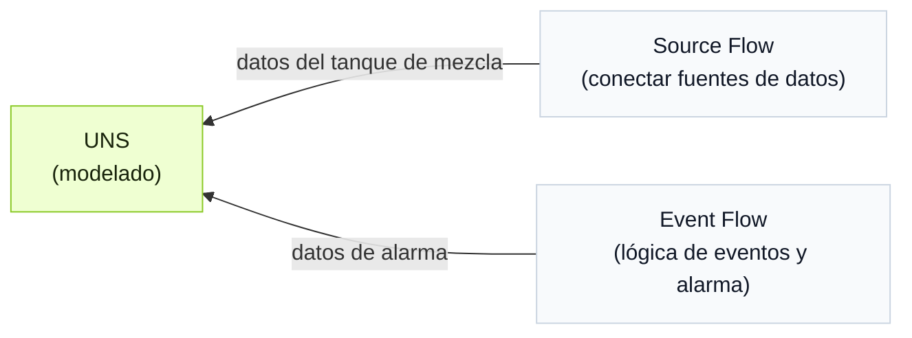

import { Steps } from '@astrojs/starlight/components';

En lugar de crear modelos, conexiones y eventos paso a paso en distintos módulos, UNS Agent gestiona el workflow mediante conversación.

## Contexto del workflow

Un tanque de mezcla combina materiales mientras los calienta. Crea un modelo de datos y recopila temperatura, nivel de agua y estado del calentador para determinar si el tanque se sobrecalienta y activar una alarma.

<div className="t0-compact-mermaid">



</div>

## Cómo crear el workflow

<Steps>
1. Inicia una conversación con UNS Agent en **UNS** usando `full_access`.
2. Introduce el prompt para crear los modelos UNS.
    ```text
    Crea un modelo de datos que represente la temperatura, el nivel de agua y el estado del calentador de un tanque de mezcla. Coloca temperatura y nivel en un metric topic, y el estado del calentador en un state topic.
    ```
3. Cuando confirmes que el modelo está completo, introduce el prompt para que el Agent conecte los datos correspondientes al modelo.
    ```text
    Crea un Source Flow para enviar datos a estos 2 topics y simula datos razonables.
    ```

    :::tip[Cuando tengas fuentes de datos reales]
    Indica al Agent la información de la fuente de datos para que realice la conexión.
    :::

4. Introduce el prompt para crear un evento con la siguiente lógica.
    - Advertencia de bajo nivel de agua: se activa cuando el nivel de agua es inferior al 20% y el calentador está encendido.
    - Alarma de calentamiento en seco: se activa cuando el nivel de agua es inferior al 15%, la temperatura supera 90°C y el calentador está encendido.

    ```md
    Crea un Event Flow para la siguiente lógica de alarma:
      - Warning: activar cuando level < 20 y heater_status = true.
      - Critical: activar cuando level < 15, temperature > 90 y heater_status = true.
      - Limpiar la alarma activa cuando level > 25 o heater_status = false.
    Crea un nuevo topic bajo el modelo UNS existente para recibir el resultado de la alarma. Incluye el nivel de alarma, el mensaje, el estado activo y la marca de tiempo en la salida.
    ```
5. Comprueba los resultados en **UNS**.
</Steps>

:::note
Después de cada paso, puedes seguir hablando con el Agent para ajustar el resultado.
:::
