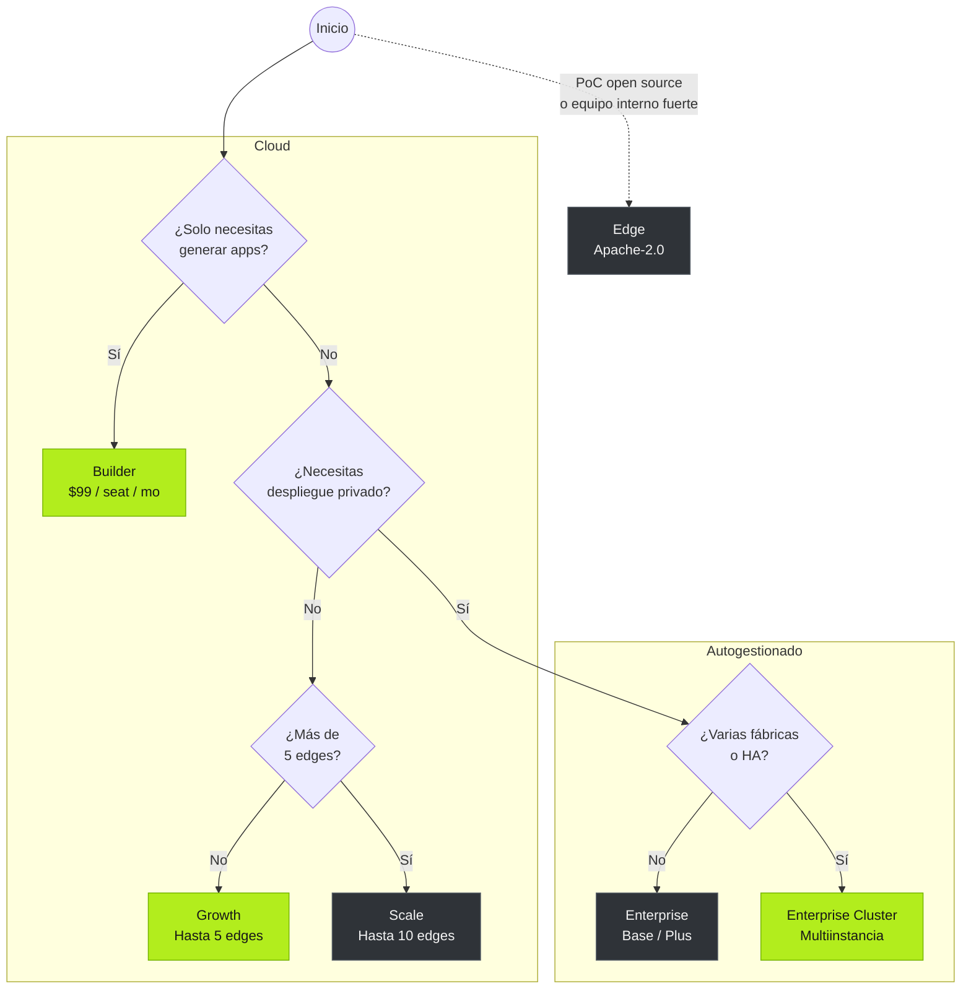

Tier0 está disponible en tres ediciones. Cada edición tiene sus propias funciones, planes y capacidades.

<section class="t0-board t0-frame not-content">
	
	

		

			
Open source

			<h3>Edge</h3>
			
La base UNS en una sola máquina. Completamente tuya.

			
Para evaluación técnica, PoC y equipos cómodos operando software open source por su cuenta.

			

				

					Apache-2.0
					gratis
					
Integración de datos UNS, almacenamiento histórico y despliegue Docker en una sola máquina.

				

			

			<a class="t0-col-cta" href="https://github.com/FREEZONEX/Tier0-Edge">Clonar en GitHub</a>
		

		

			
SaaS gestionado

			La mayoría de los equipos empiezan aquí
			<h3>Cloud</h3>
			
La plataforma completa, operada por nosotros.

			
Apps, notebooks y launchpad desde el primer día, sin infraestructura que operar.

			

				

					Builder
					$99/seat/mo
					
Solo generación de apps.

				

				

					Growth Recomendado
					$20,000/yr
					
Hasta 5 edges. Para una sola fábrica con pocas apps y necesidad de empezar rápido.

				

				

					Scale
					$38,000/yr
					
Hasta 10 edges. Para usuarios con varias fábricas y muchas apps.

				

			

			<a class="t0-col-cta t0-cta-btn" href="https://tier0.app/cloud-trial">Iniciar la prueba de 14 días</a>
		

		

			
Despliegue privado

			<h3>Enterprise</h3>
			
La plataforma completa, bajo tus condiciones.

			
Para soberanía de datos, escala, gobernanza y supervisión empresarial.

			

				

					Base
					$10,000/yr
					
Base de datos unificada. Un pequeño número de apps de propósito único.

				

				

					Plus
					$20,000/yr
					
Instancia única. Integración de datos para una sola fábrica y apps para varios casos de uso.

				

				

					Cluster Recomendado
					$39,900+/yr
					
Multiinstancia. Varias fábricas, muchas apps y gestión centralizada en nube privada.

				

			

			<a class="t0-col-cta" href="https://tier0.app/talk-to-team">Hablar con el equipo</a>
		

	

</section>

**Add-ons**: Se pueden agregar edge nodes y applications a los planes existentes según tus requisitos. Para más detalles, consulta [tier0.app/pricing](https://tier0.app/pricing).

:::note[Explicación de términos especiales]
En los planes Cloud, un edge es un nodo de conexión que se comunica con tu Tier0 en la nube. Puede ser un Edge Tier0, un gateway o una PC industrial.
:::

## Matriz de capacidades

| Capacidad | Edge | Cloud | Enterprise |
|---|---|---|---|
| UNS / Modelado de datos | &#10003; UNS en una sola máquina | &#10003; Growth / Scale | &#10003; Base / Plus / Cluster |
| Protocolos industriales | &#10003; MQTT | &#10003; Growth / Scale: MQTT, REST, i3X, OPC UA | &#10003; Base: MQTT; Plus / Cluster: MQTT, REST, i3X, OPC UA |
| UNS Agent | &#215; | &#10003; Growth / Scale | &#215; |
| Notebook (análisis avanzado) | &#215; | &#10003; Growth / Scale | &#10003; Plus / Cluster |
| Vision | &#215; | &#10003; Scale | &#10003; Plus / Cluster |
| Anchor | &#215; | &#10003; Scale | &#10003; Cluster |
| App Builder + Template Library | &#215; | &#10003; Builder / Growth / Scale | &#215; |
| LaunchPad / My Apps | &#215; | &#10003; Builder / Growth / Scale | &#10003; Base / Plus / Cluster |
| Auditoría / logs de apps y sistema | &#215; | &#10003; Growth / Scale | &#10003; Plus / Cluster; SIEM en Cluster |
| HA / multiinstancia / gobernanza | &#215; | &#215; | &#10003; Cluster |
| Operaciones | Tú | FREEZONEX | Tú, con soporte |

## Requisitos de hardware de Edge

:::tip[Si quieres usar Edge]
Edge está pensado para evaluación técnica y requiere experiencia operativa.
Asegúrate de que tu entorno cumpla los siguientes requisitos de hardware antes de usarlo.
:::

| | Mínimo | Recomendado |
|---|---|---|
| CPU | 4 cores | 8 cores |
| Memory | 8 GB | 16 GB |
| Disk | 100 GB (1000 IOPS) | 1 TB |
| OS | Ubuntu 24.04, Windows 10/11 (Docker) | - |

## Árbol de decisión

¿Todavía no sabes qué opción elegir? Sigue la ruta para decidir.

## Siguiente

- [Crear apps sobre UNS](../../using-tier0/build-apps/) - Crea aplicaciones industriales con datos UNS.
- [Instalación](../installation/) - La prueba Cloud de 14 días incluye la plataforma completa.
