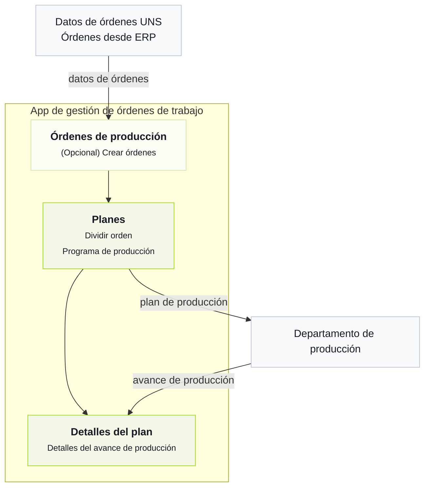

import { Steps } from '@astrojs/starlight/components';

La forma más rápida de entender Tier0 es explorar una fábrica que ya funciona.
## Negocio de la fábrica
La fábrica en Tier0 obtiene órdenes desde ERP, divide las órdenes, programa la producción según esas órdenes, envía el programa y obtiene datos de avance de producción durante el proceso.

## Conocer el proceso de negocio
<Steps>
1. En Tier0, ve a **UNS** y revisa los detalles de las órdenes que vienen de ERP.
    - `DemoFactory/ERP/ProductionOrders/State/UpsertProductionOrder`: Órdenes.
    - `DemoFactory/ERP/ProductionOrders/State/OrderList`: Snapshot de la lista actual de órdenes.
    :::tip[¿Cómo se recopilan estos datos en UNS?]
    Ve a **Flows** > **Source Flow** > **DemoFactory-Flow** para revisar el proceso de recolección de datos.
    :::
2. (Opcional) Ve a **Launchpad**, abre la aplicación **Work Order Management** y crea órdenes en la página **Production Orders**.
3. En **Work Order Management**, divide órdenes y programa planes de producción para las órdenes de trabajo divididas en la página **Plans**.
4. Envía el plan a producción y revisa los detalles del plan en los siguientes topics de **UNS**.
    - `DemoFactory/ERP/WorkOrderPlan/Metric/SplitCount`: Número de workorders después de la división.
    - `DemoFactory/ERP/WorkOrderPlan/State/PlanStatus`: Estado actual del plan.
    - `DemoFactory/ERP/WorkOrderPlan/State/WorkOrderList`: Lista de workorders después de programar el plan de producción.

    :::note
    La aplicación envía directamente los plans y workorders a **UNS**.
    :::
5. Revisa los datos de avance de producción en la página **Plan Details** de la aplicación.
    :::tip[¿De dónde vienen los detalles?]
    Los datos de avance de producción se recopilan desde **DemoFactory-Flow** en **Source Flow**, se publican en **UNS** y se muestran en la página **Plan Details**.
    - `DemoFactory/Site_01/Production/Line_01/WorkOrderExecution/State/CurrentWorkOrder`: La orden en proceso.
    - `DemoFactory/Site_01/Production/Line_01/WorkOrderExecution/State/WorkOrderStatus`: El estado de ejecución de la orden actual.
    - `DemoFactory/Site_01/Production/Line_01/WorkOrderExecution/Metric/Target_Qty`: La cantidad objetivo de producción de la orden actual.
    - `DemoFactory/Site_01/Production/Line_01/WorkOrderExecution/Metric/Produced_Qty`: La cantidad de productos ya completados de la orden actual.
    - `DemoFactory/Site_01/Production/Line_01/WorkOrderExecution/Metric/Defect_Qty`: La cantidad de defectos de la orden actual.
    - `DemoFactory/Site_01/Production/Line_01/WorkOrderExecution/Metric/Completion_Rate`: La tasa de finalización de la orden actual.
    :::
</Steps>
## Siguiente

- [Elegir la mejor versión](../choosing-version/)
- [Conceptos de UNS](../../using-tier0/uns-concepts/) - Understand data modeling in Unified Namespace.
