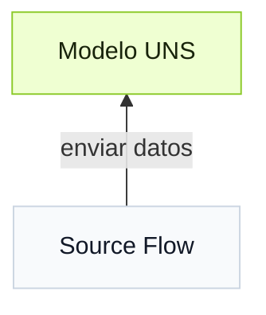

import { Steps } from '@astrojs/starlight/components';

Para conectar datos a Tier0, primero crea un modelo en **UNS** y luego conecta fuentes de datos mediante **Source Flow**, usando los modelos UNS como destinos.


## Cómo construir un modelo de datos
Define la jerarquía de datos como un árbol basado en una estructura simple de carpetas y archivos.

### Crear modelos manualmente

:::note[Modelo de ejemplo]
**Model**:
```
  Factory_A
  └── Site_01
      └── SMT_Line_1
          └── Metric
              └── Machine_001
```
**Payload**:
```json
"temperature": 85,
"vibration": 2.8
```
:::
<Steps>
1. En **UNS**, agrega el path raíz `Factory_A`.
2. Agrega el segundo path `Site_01` bajo `Factory_A`, y luego los paths siguientes en el orden jerárquico mostrado en el árbol.
3. Agrega el topic `Machine_001` bajo `SMT_Line_1` y configura su **Topic Type** como **Metric**.
4. Define el payload del topic. Agrega 2 campos, `temperature` y `vibration`, y configura sus tipos de datos.
5. Selecciona **Mock Data** para enviar datos simulados al modelo, y **Enable History** para almacenar los datos en la base de datos.
</Steps>

:::tip[Parámetros adicionales]
**Auto Parsing** analiza texto JSON y lo convierte en campos generales.
:::

### Importar modelos
:::tip
Usa LLMs como ChatGPT para ayudarte a importar modelos.
:::

<Steps>
1. Copia el JSON de plantilla o descarga el archivo de plantilla en la ventana **Import**.
2. Envía la plantilla a la IA y usa un prompt similar.
    ```
    Generate a UNS model used for xx in xx plant, including xx equipment and data sources based on the template.
    ```
3. Importa el resultado generado en UNS.
</Steps>

## Cómo conectar datos a UNS
**Source Flow**, basado en **Node-RED**, se usa para conectar fuentes de datos a Tier0.
:::tip[Para entender Source Flow]
En **Source Flow**:
- Cada flow termina con un nodo **mqtt out**. Funciona como cliente MQTT para publicar datos al broker.
- El broker UNS está integrado en el nodo **mqtt out** con el mismo nombre que el flow.
- Cuando se usa un modelo UNS como topic, los datos van directamente al modelo correspondiente en **UNS**.
:::
<Steps>
1. Crea un **Source Flow** en **Flows**.
2. Usa nodos según el tipo de fuente de datos y termina el flow con un nodo **mqtt out**.
3. Asegúrate de que el **Server** del nodo esté configurado como el broker UNS.
4. Usa un modelo **UNS** como topic MQTT (por ejemplo, `Factory_A/Site_01/SMT_Line_1/Metric/Machine_001`).
</Steps>

## Opciones adicionales
:::note
Esta sección describe parámetros o configuraciones adicionales relacionados con el flujo de trabajo.
:::

| Scope | Parameter | Item | When to use |
|------|-----------|------|-------------|
| Path | Extended Attribute/Custom Attributes | - | Úsalo cuando necesites agregar atributos adicionales al path, como información de unidades. |
| Topic | Topic Type | [Metric, State, Action](../uns-concepts/#metric-state-action) | Selecciona el tipo de topic que coincida con la semántica de los datos: mediciones, estado actual u operaciones ejecutables. |
| Topic | Attribute Generation Method | Pre-defined | Configura manualmente los atributos del topic uno por uno. |
| Topic | Attribute Generation Method | Auto-Parsing | Convierte atributos automáticamente desde texto JSON por lotes. |

## Siguiente

- [Crear apps sobre UNS](../build-apps/) - Crea aplicaciones industriales con datos UNS.
- [Analizar datos UNS](../analyze-data/) - Analiza datos UNS con Marimo Notebook y Python.
