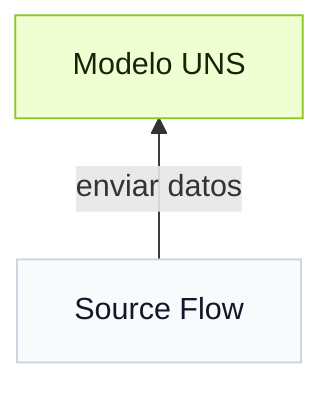

import { Steps } from '@astrojs/starlight/components';

Primero construye un modelo en **UNS** y luego conecta los datos mediante **Source Flow** al modelo, formando una base de datos para su uso posterior.


```mermaid
flowchart BT
  uns["Modelo UNS"]
  flow["Source Flow"]

  flow -->|"enviar datos"| uns

  classDef t0accent fill:#EFFFD2,stroke:#8AC926,stroke-width:1px,color:#18230B
  classDef t0node fill:#F8FAFC,stroke:#CBD5E1,stroke-width:1px,color:#111827
  class uns t0accent
  class flow t0node
```

{/* 
:::note
El proceso se puede completar mediante conversaciones con el UNS Agent. Consulta los detalles [aquí](../../best-practice/building-data-workflow-with-agent/).
:::
*/}

## Construir un modelo de datos
Define la jerarquía de datos como un mapa de árbol según:
  - La ubicación física de la que provienen los datos ([ISA-95](../../reference/isa-95-equipment-hierarchy/));
  - La lógica de negocio que siguen los datos.

### Construir modelos manualmente

<Steps>
1. Diseña la estructura del modelo y añade las rutas en orden antes de añadir el topic.
2. Configura **Topic Type** entre **Metric**, **State** y **Action** según las [características de los datos](../uns-concepts/#metric-state-action).
3. Selecciona **Mock Data** para enviar datos simulados al modelo y **Enable History** para guardar los datos en la base de datos.
    
    :::note
    Se creará un flow en **Flows** para enviar datos simulados al modelo.
    :::

4. Añade campos de datos al topic con los tipos correctos mediante **Auto Parsing** o **Pre-defined**.
    - **Auto Parsing**: Convierte automáticamente campos desde texto JSON por lotes.
    - **Pre-defined**: Configura manualmente los campos del topic uno por uno.
</Steps>

### Importar modelos
:::tip
Usa LLMs como ChatGPT para ayudar a importar modelos.
:::

<Steps>
1. Envía el JSON de plantilla de **Import** a la IA y usa un prompt similar.
    ```
    Genera un modelo UNS usado para xx en la planta xx, incluyendo xx equipos y fuentes de datos, según la plantilla.
    ```
2. Importa el resultado generado en UNS.
</Steps>

## Conectar datos a UNS

### Características del flujo de datos
- Basado en Node-RED.
- Cada flow termina con un nodo `mqtt out`. Funciona como un MQTT client para publicar datos en el broker UNS.
- El broker UNS está integrado en los nodos `mqtt out` y `mqtt in` con el mismo nombre que el flow.
- Cuando se usa un modelo UNS como topic, los datos van directamente al modelo correspondiente en **UNS**.

### Pasos

<Steps>
1. Usa nodos según el tipo de fuente de datos para crear un flow y termínalo con un nodo `mqtt out`.

    :::tip[Si necesitas nodos que no están disponibles]
    Instala nodos de la comunidad de Node-RED según tus requisitos. Los nodos de la comunidad suelen comenzar con `node-red-contrib`.
    :::

2. Asegúrate de que el **Server** del nodo `mqtt out` esté configurado como el broker UNS y que el topic sea un modelo de **UNS**.
</Steps>

### Gestión de versiones de flow
Guarda versiones del flujo de datos para poder volver a una versión anterior o iniciar un nuevo flow desde una versión histórica.

:::caution
La reversión de versiones no está disponible en la edición Edge.
:::

## Siguiente

- [Crear apps con datos de fábrica](../build-apps/) - Crea aplicaciones industriales con datos UNS.
- [Analizar datos de fábrica](../analyze-data/) - Analiza datos UNS con Marimo Notebook y Python.
