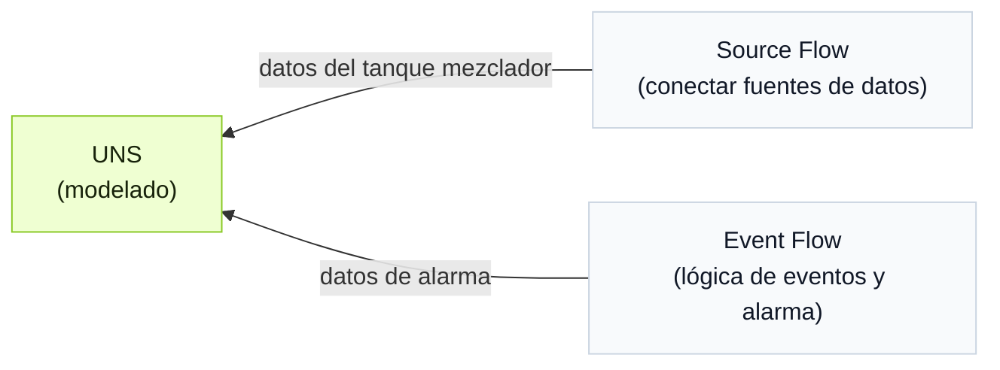

import { Steps } from '@astrojs/starlight/components';
import { Tabs, TabItem } from '@astrojs/starlight/components';

Tier0 proporciona un agent junto a los modelos UNS para operar UNS y flows mediante lenguaje natural.

:::note[Por qué existe UNS agent]
En lugar de pasar paso a paso por modelado de datos, conexión y creación de eventos entre distintos módulos, UNS agent se encarga de ello mediante conversaciones.
:::

## Contexto del workflow
:::note
Se usa un workflow de ejemplo para demostrar lo sencillo que es dejar que el agent haga el trabajo.
:::
Un tanque mezclador se usa para mezclar materiales mientras se calientan. Crea un modelo de datos y recopila temperatura, nivel de agua y estado del calentador para determinar si el tanque está sobrecalentado y activar una alarma.

<div className="t0-compact-mermaid">



</div>

## Cómo crear el workflow
<Steps>
1. Inicia sesión en Tier0, ve a **UNS** e inicia una conversación con el UNS agent en el lado derecho.
2. Cambia el permiso de la conversación a `full_access` e introduce el prompt.
    ```text
    Crea un modelo de datos que represente la temperatura, el nivel de agua y el estado del calentador de un tanque mezclador. Coloca temperatura y nivel en un metric topic, y el estado del calentador en un state topic.
    ```
3. Cuando confirmes que el modelo está completo, introduce el prompt y deja que el agent conecte los datos correspondientes al modelo.
    ```text
    Crea un source flow para enviar datos a estos 2 topics y simula datos razonables.
    ```
    :::tip[Cuando tienes fuentes de datos reales]
    Indica al agent la información de tus fuentes de datos y haz que las conecte.
    :::
4. Introduce el prompt para crear un event con la siguiente lógica.
    - Warning de bajo nivel de agua: se activa cuando el nivel de agua está por debajo del 20% y el calentador está encendido.
    - Alarm de calentamiento en seco: se activa cuando el nivel de agua está por debajo del 15%, la temperatura supera los 90°C y el calentador está encendido.
    ```md
    Crea un Event Flow para la siguiente lógica de alarma:
      - Warning: activar cuando level < 20 y heater_status = true.
      - Critical: activar cuando level < 15, temperature > 90 y heater_status = true.
      - Limpiar la alarma activa cuando level > 25 o heater_status = false.
    Crea un nuevo topic bajo el source path existente para recibir el resultado de la alarma. Incluye nivel de alarma, mensaje, estado activo y timestamp en la salida.
    ```
5. Revisa los resultados en **UNS**.
</Steps>

