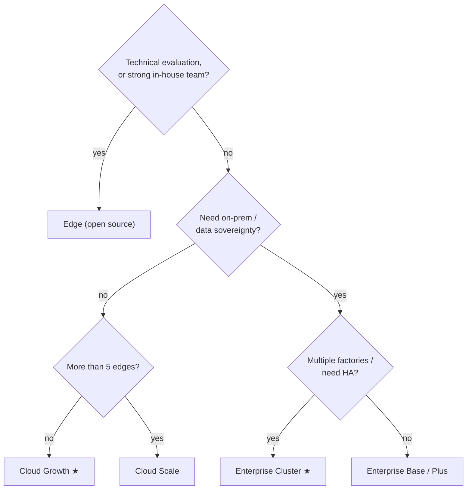

Tier0 is one platform in three editions. Same namespace model, same flows, same CLI — the difference is who runs it and how much platform you get.

<section class="t0-board not-content">
	

		

			

				
Open source

			

			

				

					<h3>Edge</h3>
					
The UNS foundation, on one machine. Yours entirely.

					
For technical evaluation, PoCs, and teams comfortable operating open-source software on their own.

				

				

					

						Apache-2.0
						free
						
UNS core, SourceFlows/EventFlows, history storage — single-machine Docker deployment.

					

				

				<a class="t0-col-cta" href="https://github.com/FREEZONEX/Tier0-Edge">Clone on GitHub</a>
			

		

		

			

				
Managed SaaS

			

			

				

					<h3>Cloud Most teams start here</h3>
					
The full platform, operated for you.

					
Apps, notebooks, and launchpad on day one — no infrastructure to run.

				

				

					

						Growth ★
						$20,000/yr
						
Up to 5 edges. For a single factory with a few apps, wanting a quick start.

					

					

						Scale
						$38,000/yr
						
Up to 10 edges. For users with multiple factories and many apps.

					

				

				<a class="t0-col-cta t0-cta-btn" href="https://tier0.app/cloud-trial">Start the 14-day trial</a>
			

		

		

			

				
Private deployment

			

			

				

					<h3>Enterprise</h3>
					
The full platform, on your terms.

					
For data sovereignty, scale, governance, and enterprise-grade oversight.

				

				

					

						Base
						$10,000/yr
						
Data Foundation. A small number of single-purpose apps — e.g. energy monitoring, equipment management.

					

					

						Plus
						$20,000/yr
						
Single Instance. Single-factory data integration, apps across multiple use cases.

					

					

						Cluster ★
						$39,900+/yr
						
Multi-Instance. Multiple factories, many apps, centralized private-cloud management.

					

				

				<a class="t0-col-cta" href="https://tier0.app/talk-to-team">Talk to the team</a>
			

		

	

</section>

**Add-ons:** extra edge nodes $2,000 /edge/year · additional instances $10,000 /instance/year. Prices are for orientation — the source of truth is [tier0.app/pricing](https://tier0.app/pricing).

## Edge hardware requirements

:::caution[TODO — 写作线索 (Huize)]
Edge:适合进行技术测试,或具备充分技术能力的用户。要加入硬件要求。
:::

| | Minimum | Recommended |
|---|---|---|
| CPU | 4 cores | 8 cores |
| Memory | 8 GB | 16 GB |
| Disk | 100 GB (1000 IOPS) | 1 TB |
| OS | Ubuntu 24.04 · Windows 10/11 (Docker) | — |

## Not sure? Trace the path

## Capability matrix

| Capability | Edge | Cloud | Enterprise |
|---|---|---|---|
| UNS core (semantic MQTT namespace) | ✓ | ✓ | ✓ |
| SourceFlow / EventFlow (Node-RED) | ✓ | ✓ | ✓ |
| History storage (TimescaleDB / PostgreSQL) | ✓ single machine | ✓ managed | ✓ your infrastructure |
| `tier0` CLI + agent skills | ✓ | ✓ | ✓ |
| App Builder + App Library | — | ✓ | ✓ |
| Notebook (Advanced Analysis) | — | ✓ | ✓ |
| Launchpad (front-line apps) | — | ✓ | ✓ |
| HA / multi-instance / governance | — | — | ✓ Cluster |
| Operations | you | FREEZONEX | you, with support |

## What's an "edge" (the unit)?

In Cloud plans, an *edge* is a connection point that collects data close to your equipment — typically a gateway or industrial PC running collection flows — and publishes into the namespace. Count roughly one per site or isolated network segment. Not to be confused with the **Edge edition** (the open-source distribution above).

## Next

- [Build Apps on UNS](/using-tier0/build-apps/) — deploying containers on Edge and Enterprise
- [Installation](/get-started/installation/) — the 14-day Cloud trial is the full platform
