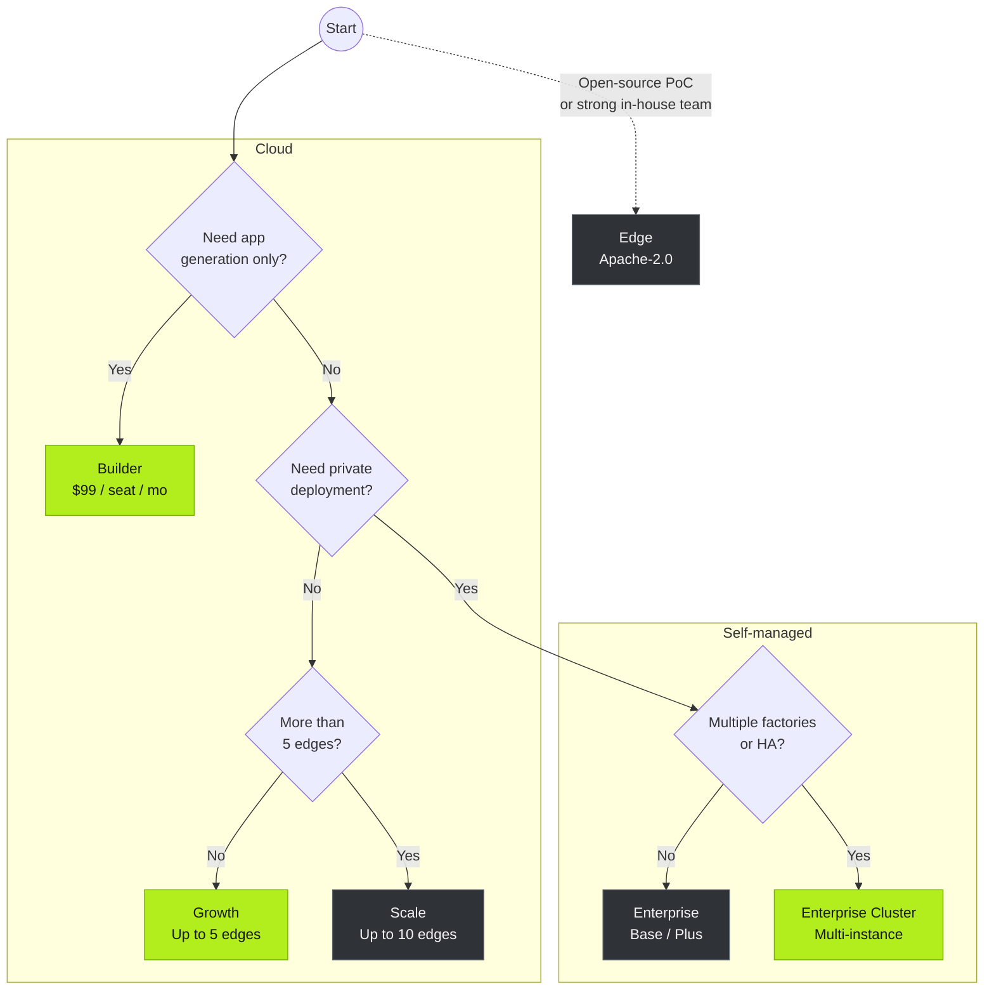

Tier0 comes in three editions. Each edition has its own features, plans, and capabilities.

<section class="t0-board t0-frame not-content">
	
	

		

			
Open source

			<h3>Edge</h3>
			
The UNS foundation, on one machine. Yours entirely.

			
For technical evaluation, PoCs, and teams comfortable operating open-source software on their own.

			

				

					Apache-2.0
					free
					
UNS data integration, history storage - single-machine Docker deployment.

				

			

			<a class="t0-col-cta" href="https://github.com/FREEZONEX/Tier0-Edge">Clone on GitHub</a>
		

		

			
Managed SaaS

			Most teams start here
			<h3>Cloud</h3>
			
The full platform, operated for you.

			
Apps, notebooks, and launchpad on day one - no infrastructure to run.

			

				

					Builder
					$99/seat/mo
					
App generation only.

				

				

					Growth Recommended
					$20,000/yr
					
Up to 5 edges. For a single factory with a few apps, wanting a quick start.

				

				

					Scale
					$38,000/yr
					
Up to 10 edges. For users with multiple factories and many apps.

				

			

			<a class="t0-col-cta t0-cta-btn" href="https://tier0.app/cloud-trial">Start the 14-day trial</a>
		

		

			
Private deployment

			<h3>Enterprise</h3>
			
The full platform, on your terms.

			
For data sovereignty, scale, governance, and enterprise-grade oversight.

			

				

					Base
					$10,000/yr
					
Unified data foundation. A small number of single-purpose apps.

				

				

					Plus
					$20,000/yr
					
Single Instance. Single-factory data integration, apps across multiple use cases.

				

				

					Cluster Recommended
					$39,900+/yr
					
Multi-Instance. Multiple factories, many apps, centralized private-cloud management.

				

			

			<a class="t0-col-cta" href="https://tier0.app/talk-to-team">Talk to the team</a>
		

	

</section>

**Add-ons**: Edge nodes and applications can be added to existing plans based on your requirements. For details, see [tier0.app/pricing](https://tier0.app/pricing).

:::note[Special term explanation]
In Cloud plans, an edge is a connection node that communicates with your cloud Tier0. It can be an Edge Tier0, or a gateway or industrial PC.
:::

## Capability Matrix

| Capability | Edge | Cloud | Enterprise |
|---|---|---|---|
| UNS / Data Modeling | &#10003; single-machine UNS | &#10003; Growth / Scale | &#10003; Base / Plus / Cluster |
| Industrial protocols | &#10003; MQTT | &#10003; Growth / Scale: MQTT, REST, i3X, OPC UA | &#10003; Base: MQTT; Plus / Cluster: MQTT, REST, i3X, OPC UA |
| UNS Agent | &#215; | &#10003; Growth / Scale | &#215; |
| Notebook (Advanced Analysis) | &#215; | &#10003; Growth / Scale | &#10003; Plus / Cluster |
| Vision | &#215; | &#10003; Scale | &#10003; Plus / Cluster |
| Anchor | &#215; | &#10003; Scale | &#10003; Cluster |
| App Builder + Template Library | &#215; | &#10003; Builder / Growth / Scale | &#215; |
| LaunchPad / My Apps | &#215; | &#10003; Builder / Growth / Scale | &#10003; Base / Plus / Cluster |
| Audit / app & system logs | &#215; | &#10003; Growth / Scale | &#10003; Plus / Cluster; SIEM in Cluster |
| HA / multi-instance / governance | &#215; | &#215; | &#10003; Cluster |
| Operations | You | FREEZONEX | You, with support |

## Edge Hardware Requirements

:::tip[If you want to use Edge]
Edge is intended for technical evaluation and requires operational experience.
Make sure your environment meets the following hardware requirements before using it.
:::

| | Minimum | Recommended |
|---|---|---|
| CPU | 4 cores | 8 cores |
| Memory | 8 GB | 16 GB |
| Disk | 100 GB (1000 IOPS) | 1 TB |
| OS | Ubuntu 24.04, Windows 10/11 (Docker) | - |

## Decision Tree

Still not sure which option to choose? Trace the path to decide.

## Next

- [Build Apps on UNS](../../using-tier0/build-apps/) — Build industrial applications with UNS data.
- [Installation](../installation/) — The 14-day Cloud trial is the full platform.
