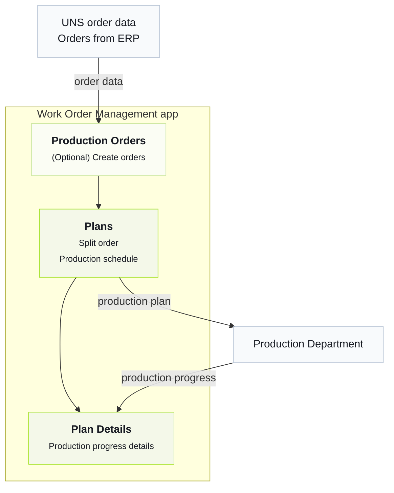

import { Steps } from '@astrojs/starlight/components';

The quickest way to understand Tier0 is to explore a factory that already works.
## Factory Business
The factory in Tier0 receives orders from ERP, splits them, schedules production, sends the schedule to production, and receives production progress data as work proceeds.

## Getting to Know the Business Process
<Steps>
1. In Tier0, go to **UNS** and check the details of orders that came from ERP.
    - `DemoFactory/ERP/ProductionOrders/State/UpsertProductionOrder`: Orders.
    - `DemoFactory/ERP/ProductionOrders/State/OrderList`: Current order list snapshot.
    :::tip[How is data collected into UNS?]
    Go to **Flows** > **Source Flow** > **DemoFactory-Flow** to check the data collection process.
    :::
2. (optional) Go to **Launchpad**, access the **Work Order Management** application, and create orders on the **Production Orders** page.
3. In **Work Order Management**, split orders and schedule production plans for the split work orders on the **Plans** page.
4. Send the plan to production, and check the plan details on the following topics on **UNS**.
    - `DemoFactory/ERP/WorkOrderPlan/Metric/SplitCount`: The number of work orders after splitting.
    - `DemoFactory/ERP/WorkOrderPlan/State/PlanStatus`: Current plan status.
    - `DemoFactory/ERP/WorkOrderPlan/State/WorkOrderList`: The work order list after the production plan is scheduled.

    :::note
    The application directly sends the plans and work orders to **UNS**.
    :::
5. Check the production progress data on the **Plan Details** page in the application.
    :::tip[Where do the details come from?]
    The production progress data is sent from **DemoFactory-Flow** in **Source Flow** to **UNS**, and displayed on the **Plan Details** page.
    - `DemoFactory/Site_01/Production/Line_01/WorkOrderExecution/State/CurrentWorkOrder`: The order in process.
    - `DemoFactory/Site_01/Production/Line_01/WorkOrderExecution/State/WorkOrderStatus`: The execution status of the current order.
    - `DemoFactory/Site_01/Production/Line_01/WorkOrderExecution/Metric/Target_Qty`: The target production amount of the current order.
    - `DemoFactory/Site_01/Production/Line_01/WorkOrderExecution/Metric/Produced_Qty`: The quantity already produced for the current order.
    - `DemoFactory/Site_01/Production/Line_01/WorkOrderExecution/Metric/Defect_Qty`: The defect quantity for the current order.
    - `DemoFactory/Site_01/Production/Line_01/WorkOrderExecution/Metric/Completion_Rate`: The completion rate of the current order.
    :::
</Steps>
## Next

- [Choosing the Best Version](../choosing-version/)
- [UNS Concepts](../../using-tier0/uns-concepts/) — Understand data modeling in Unified Namespace.
