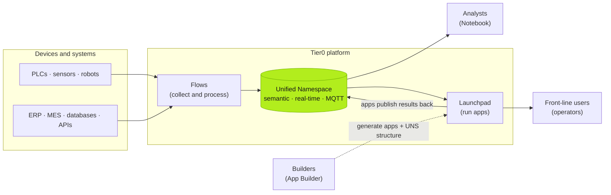
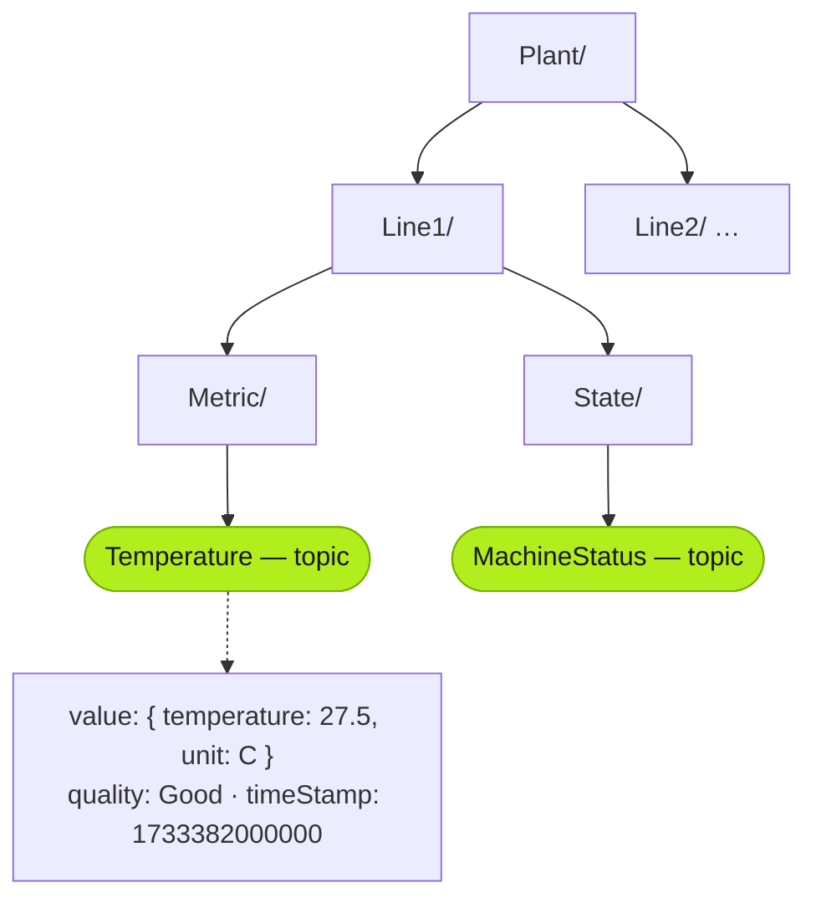

Tier0 is an **agentic industrial platform**. It unifies industrial signals — machines, sensors, business systems — into one real-time **Unified Namespace (UNS)**, then lets you build and run applications, analytics, and AI on top of that shared foundation.

Instead of wiring system A to system B for every project, you connect each source **once**. Data lands in a semantic namespace organized the way operations actually work — sites, areas, equipment, processes, orders — and every app, dashboard, notebook, or AI agent consumes from the same place.

## The platform in one picture

## Core modules

| Module | What it does |
|---|---|
| **Unified Namespace** | Real-time, structured namespace on MQTT pub/sub. The single source of truth for operational data. |
| **Data Collection (Flows)** | Flow-based integration: connect protocols and systems, transform, and publish into the namespace. Node-RED under the hood. |
| **App Builder** | Describe the app you need; AI generates an MES-class application *and* its UNS structure together. |
| **App Library** | Production-ready apps (MES, warehouse, quality, maintenance…) built on the UNS, customizable to your process. |
| **Advanced Analytics** | Tier0 Notebook — explore, calculate, and visualize live UNS data; operationalize results into apps and alerts. |

## Key concepts

These terms appear throughout the docs and the CLI:

| Concept | Meaning |
|---|---|
| **Workspace** | Your tenant. All resources are isolated per workspace. |
| **UNS** | The Unified Namespace — a tree of paths organizing all data points. |
| **Path** | An intermediate segment in the tree (a "folder"), e.g. `Plant/Line1`. Browsable, not readable. |
| **Topic** | A full path to a leaf data point, e.g. `Plant/Line1/Metric/Temperature`. Topics are what you read and write. |
| **Node** | Any entry in the namespace: a `PATH` (folder) or a `TOPIC` (data point of type `METRIC`, `ACTION`, or `STATE`). |
| **VQT** | The value structure of a topic: `value` (an object), `quality`, and `timeStamp`. |
| **SourceFlow** | A flow that collects from industrial protocols and publishes into the UNS. |
| **EventFlow** | A flow that subscribes to UNS messages and applies business processing. |
| **Launchpad** | Where published apps live for authorized end users. |

## What the namespace looks like

Paths (`Plant/`, `Line1/`) are folders; the lime leaves are **topics** — the only nodes you can read and write. Every topic carries a VQT: `value` (an object), `quality`, and `timeStamp`.

Three properties make this more than a message broker:

- **Semantic structure** — data is organized by operational context, not by which source system it came from. Software (and AI) can interpret it.
- **Publish once, consume many** — one data point serves dashboards, workflows, analytics, and models without new integrations.
- **Bidirectional** — apps write their outcomes (records, approvals, events) back into the namespace, so context keeps compounding.

## Next steps

- [Get started — install and take the tour](/intro/get-started/)
- [Choose the right version](/architecture/choosing-version/)
