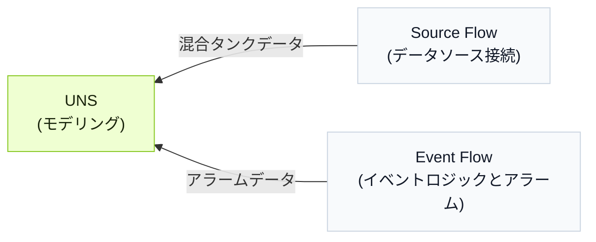

import { Steps } from '@astrojs/starlight/components';

データモデル、接続、イベントを複数のモジュールで順番に作る代わりに、UNS Agent が会話を通じてワークフローを処理します。

## ワークフローの背景

混合タンクは材料を混ぜながら加熱します。データモデルを構築し、温度、水位、ヒーター状態を収集して、タンクの過熱を判定しアラームを発生させます。

<div className="t0-compact-mermaid">



</div>

## ワークフローの構築方法

<Steps>
1. **UNS** で `full_access` を指定して UNS Agent との会話を開始します。
2. UNS モデルを構築するためのプロンプトを入力します。
    ```text
    混合タンクの温度、水位、ヒーター状態を表すデータモデルを作成します。温度と水位は 1 つの metric topic に、ヒーター状態は 1 つの state topic に配置してください。
    ```
3. モデルが完成したことを確認したら、対応するデータをモデルに接続するプロンプトを入力します。
    ```text
    この 2 つの topic にデータを送信する Source Flow を作成し、妥当なデータをシミュレートしてください。
    ```

    :::tip[実際のデータソースがある場合]
    データソース情報を Agent に伝えて接続させます。
    :::

4. 次のロジックでイベントを作成するプロンプトを入力します。
    - 低水位警告：水位が 20% 未満でヒーターがオンの場合に発生します。
    - 空焚きアラーム：水位が 15% 未満、温度が 90°C を超え、ヒーターがオンの場合に発生します。

    ```md
    次のアラームロジックの Event Flow を作成してください：
      - Warning：level < 20 かつ heater_status = true のときに発生。
      - Critical：level < 15、temperature > 90、heater_status = true のときに発生。
      - level > 25 または heater_status = false のとき、アクティブなアラームをクリア。
    既存の UNS モデル配下にアラーム結果を受け取る新しい topic を作成してください。出力にはアラームレベル、メッセージ、アクティブ状態、タイムスタンプを含めます。
    ```
5. **UNS** で結果を確認します。
</Steps>

:::note
各ステップの後も Agent と会話を続けて結果を調整できます。
:::
