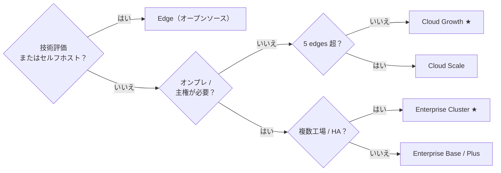

Tier0 は 1 つのプラットフォームを 3 つのエディションで提供します。名前空間モデル、flows、CLI は同じ——違いは誰が運用するか、そして得られるプラットフォームの範囲です。

<section class="t0-board not-content">
	

		

			

				
オープンソース

			

			

				

					<h3>Edge</h3>
					
1 台のマシン上で動く UNS 基盤。すべて自分で管理できます。

					
技術評価、PoC、自社でオープンソースソフトウェアを運用できるチーム向け。

				

				

					

						Apache-2.0
						無料
						
UNS コア、SourceFlows/EventFlows、履歴保存——単一マシン Docker デプロイ。

					

					<a class="t0-col-cta" href="https://github.com/FREEZONEX/Tier0-Edge">GitHub でクローン</a>
				

			

		

		

			

				
マネージド SaaS

			

			

				

					<h3>Cloud 多くのチームはここから始めます</h3>
					
フルプラットフォームを運用込みで利用できます。

					
初日から apps、notebooks、launchpad を利用でき、インフラ運用は不要です。

				

				

					

						Builder
						$199/seat/mo
						
アプリ生成のみ。

					

					

						Growth ★
						$20,000/yr
						
最大 5 edges。少数のアプリで素早く始めたい単一工場向け。

					

					

						Scale
						$38,000/yr
						
最大 10 edges。複数工場と多数のアプリを持つユーザー向け。

					

					<a class="t0-col-cta" href="https://tier0.dev/login">14 日間トライアルを開始</a>
				

			

		

		

			

				
プライベートデプロイ

			

			

				

					<h3>Enterprise</h3>
					
フルプラットフォームを自社要件に合わせて利用できます。

					
データ主権、スケール、ガバナンス、エンタープライズ監督が必要な環境向け。

				

				

					

						Base
						$10,000/yr
						
統合データ基盤。少数の単目的アプリ。

					

					

						Plus
						$20,000/yr
						
シングルインスタンス。単一工場のデータ統合と複数ユースケースのアプリ。

					

					

						Cluster ★
						$39,900+/yr
						
マルチインスタンス。複数工場、多数のアプリ、集中型プライベートクラウド管理。

					

					<a class="t0-col-cta" href="https://tier0.app/talk-to-team">チームに相談</a>
				

			

		

	

</section>

**Add-ons：** 追加 edge ノード $2,000 /edge/年 · 追加インスタンス $10,000 /instance/年。価格は目安です——正は [tier0.app/pricing](https://tier0.app/pricing) を参照してください。

:::note[用語説明]
Cloud プランでは、edge はクラウド Tier0 と通信する接続ノードです。Edge Tier0、ゲートウェイ、または産業用 PC にできます。
:::

## 機能マトリクス

| 機能 | Edge | Cloud | Enterprise |
|---|---|---|---|
| UNS / データモデリング | &#10003; 単一マシン UNS | &#10003; Growth / Scale | &#10003; Base / Plus / Cluster |
| 産業プロトコル | &#10003; MQTT | &#10003; Growth / Scale：MQTT、REST、i3X、OPC UA | &#10003; Base：MQTT；Plus / Cluster：MQTT、REST、i3X、OPC UA |
| UNS Agent | &#215; | &#10003; Growth / Scale | &#215; |
| Notebook（高度分析） | &#215; | &#10003; Growth / Scale | &#10003; Plus / Cluster |
| Vision | &#215; | &#10003; Scale | &#10003; Plus / Cluster |
| Anchor | &#215; | &#10003; Scale | &#10003; Cluster |
| App Builder + Template Library | &#215; | &#10003; Builder / Growth / Scale | &#215; |
| LaunchPad / My Apps | &#215; | &#10003; Builder / Growth / Scale | &#10003; Base / Plus / Cluster |
| 監査 / アプリとシステムログ | &#215; | &#10003; Growth / Scale | &#10003; Plus / Cluster；Cluster では SIEM |
| HA / マルチインスタンス / ガバナンス | &#215; | &#215; | &#10003; Cluster |
| 運用 | 自分で運用 | FREEZONEX | 自分で運用、サポート付き |

## Edge ハードウェア要件

:::tip[Edge を使いたい場合]
Edge は技術評価向けで、運用経験が必要です。
使用前に、環境が以下のハードウェア要件を満たしていることを確認してください。
:::

| | 最小 | 推奨 |
|---|---|---|
| CPU | 4 cores | 8 cores |
| Memory | 8 GB | 16 GB |
| Disk | 100 GB (1000 IOPS) | 1 TB |
| OS | Ubuntu 24.04、Windows 10/11 (Docker) | - |

## 判断ツリー

まだどれを選ぶべきか迷う場合は、パスをたどって判断してください。

## 「edge」（単位）とは？

Cloud プランでは、*edge* は設備の近くでデータを収集する接続ポイントです——通常は収集 flows を動かすゲートウェイや産業用 PC——で、名前空間へ公開します。おおよそサイトまたは隔離されたネットワークセグメントごとに 1 つと数えます。上記の **Edge エディション**（オープンソース配布）と混同しないでください。

## 次へ

- [UNS 上にアプリを構築](../../using-tier0/build-apps/) — Edge と Enterprise へのコンテナデプロイ
- [インストール](../installation/) — 14 日間 Cloud トライアルはフルプラットフォームです
