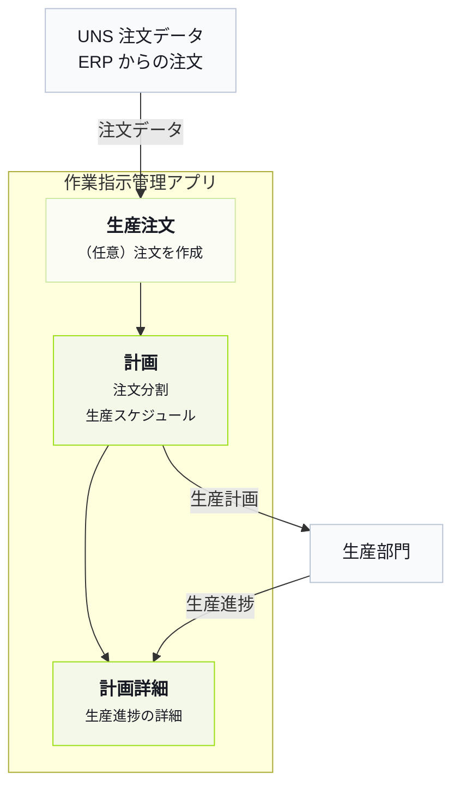

import { Steps } from '@astrojs/starlight/components';

Tier0 を理解する最も早い方法は、すでに動いている工場を触ってみることです。
## 工場ビジネス
Tier0 の工場は ERP から注文を取得し、注文を分割し、注文に基づいて生産をスケジュールし、計画を送信しながら生産進捗データを取得します。

## 業務プロセスを理解する
<Steps>
1. Tier0 で **UNS** に移動し、ERP から取得した注文の詳細を確認します。
    - `DemoFactory/ERP/ProductionOrders/State/UpsertProductionOrder`：注文。
    - `DemoFactory/ERP/ProductionOrders/State/OrderList`：現在の注文リストのスナップショット。
    :::tip[これらのデータはどのように UNS に収集されますか？]
    **Flows** > **Source Flow** > **DemoFactory-Flow** に移動し、データ収集プロセスを確認します。
    :::
2. （任意）**Launchpad** に移動し、**Work Order Management** アプリケーションを開き、**Production Orders** ページで注文を作成します。
3. **Work Order Management** で、**Plans** ページから注文を分割し、分割された作業指示の生産計画をスケジュールします。
4. 計画を生産へ送信し、**UNS** の以下の topics で計画詳細を確認します。
    - `DemoFactory/ERP/WorkOrderPlan/Metric/SplitCount`：分割後の作業指示数。
    - `DemoFactory/ERP/WorkOrderPlan/State/PlanStatus`：現在の計画ステータス。
    - `DemoFactory/ERP/WorkOrderPlan/State/WorkOrderList`：生産計画のスケジュール後の作業指示リスト。

    :::note
    アプリケーションは plans と workorders を **UNS** に直接送信します。
    :::
5. アプリケーションの **Plan Details** ページで生産進捗データを確認します。
    :::tip[詳細データはどこから来ますか？]
    生産進捗データは **Source Flow** の **DemoFactory-Flow** で収集され、**UNS** に公開され、**Plan Details** ページに表示されます。
    - `DemoFactory/Site_01/Production/Line_01/WorkOrderExecution/State/CurrentWorkOrder`：処理中の注文。
    - `DemoFactory/Site_01/Production/Line_01/WorkOrderExecution/State/WorkOrderStatus`：現在の注文の実行ステータス。
    - `DemoFactory/Site_01/Production/Line_01/WorkOrderExecution/Metric/Target_Qty`：現在の注文の目標生産数量。
    - `DemoFactory/Site_01/Production/Line_01/WorkOrderExecution/Metric/Produced_Qty`：現在の注文で完了した製品数量。
    - `DemoFactory/Site_01/Production/Line_01/WorkOrderExecution/Metric/Defect_Qty`：現在の注文の不良数量。
    - `DemoFactory/Site_01/Production/Line_01/WorkOrderExecution/Metric/Completion_Rate`：現在の注文の完了率。
    :::
</Steps>
## 次へ

- [最適なバージョンを選ぶ](../choosing-version/)
- [UNS の概念](../../using-tier0/uns-concepts/) - Understand data modeling in Unified Namespace.
