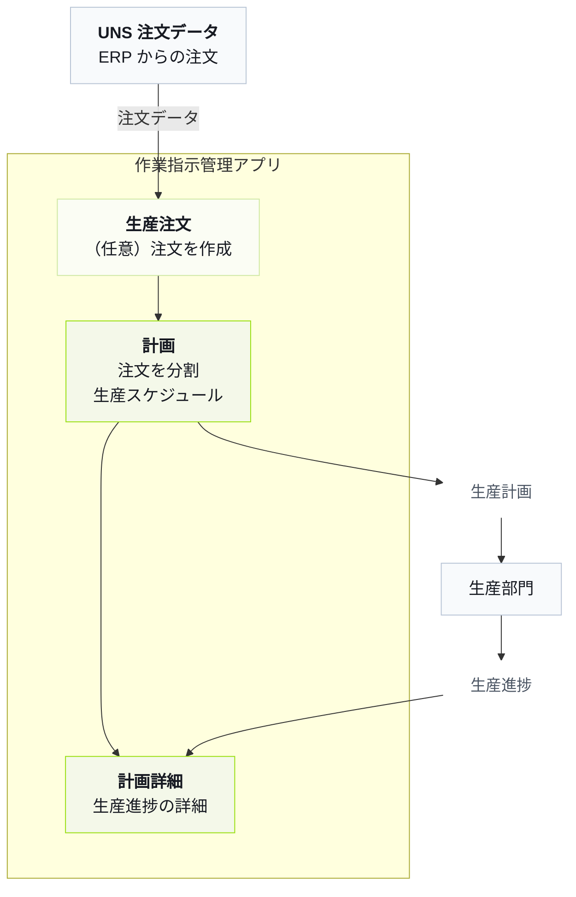

import { Steps } from '@astrojs/starlight/components';

Tier0 を理解する最短の方法は、すでに動作している工場を探索することです。

## ビジネス背景

Tier0 の工場は ERP から注文を受け取り、注文を分割し、生産をスケジュールし、その計画を生産部門に送信して、作業の進行に伴い生産進捗データを受け取ります。

```mermaid
%%{init: {"themeVariables": {"fontSize": "18px"}, "themeCSS": ".nodeLabel, .edgeLabel, .cluster-label { font-size: 18px !important; } .nodeLabel b, .nodeLabel strong { font-size: 19px !important; }"}}%%
flowchart TB
  uns["<span style='font-size:18px;font-weight:700'>UNS 注文データ</span><br/><span style='font-size:16px'>ERP からの注文</span>"]
  production["<span style='font-size:18px'>生産部門</span>"]

  subgraph app["作業指示管理アプリ"]
    direction TB
    appSpacer[" "]
    subgraph appPages[" "]
      direction LR
      orders["<span style='font-size:18px;font-weight:700'>生産注文</span><br/><span style='font-size:16px'>（任意）注文を作成</span>"]
      plans["<span style='font-size:18px;font-weight:700'>計画</span><br/><span style='font-size:16px'>注文を分割<br/>生産スケジュール</span>"]
      details["<span style='font-size:18px;font-weight:700'>計画詳細</span><br/><span style='font-size:16px;white-space:nowrap'>生産進捗の詳細</span>"]
    end
  end

  uns -- "注文データ" --> orders
  orders --> plans
  plans --> details
  plans --> planLabel["生産計画"]
  planLabel --> production
  production --> progressLabel["生産進捗"]
  progressLabel --> details

  classDef external fill:#f8fafc,stroke:#b8c4d5,color:#171a22,stroke-width:1px,font-size:18px
  classDef optional fill:#fbfdf4,stroke:#cfe8a3,color:#171a22,stroke-width:1px,font-size:18px
  classDef appNode fill:#f4f8e9,stroke:#9adf11,color:#171a22,stroke-width:1px,font-size:18px
  classDef labelNode fill:transparent,stroke:transparent,color:#4b5563,font-size:17px
  classDef invisible fill:transparent,stroke:transparent,color:transparent
  class uns,production external
  class orders optional
  class plans,details appNode
  class planLabel,progressLabel labelNode
  class appSpacer invisible
  style appPages fill:transparent,stroke:transparent
```

## プロセスを理解する

<Steps>
1. Tier0 で **UNS** に移動し、ERP から来た注文の詳細を確認します。
    - `DemoFactory/ERP/ProductionOrders/State/UpsertProductionOrder`：注文。
    - `DemoFactory/ERP/ProductionOrders/State/OrderList`：現在の注文リストのスナップショット。
    :::tip[データはどのように UNS に収集されますか？]
    **Flows** > **Source Flow** > **DemoFactory-Flow** に移動し、データ収集の詳細を確認します。
    :::
2. （任意）**Launchpad** に移動し、**Work Order Management** アプリケーションを開いて、**Production Orders** ページで注文を作成します。
3. **Work Order Management** で **Plans** ページを使い、注文を分割して、分割された作業指示の生産計画をスケジュールします。
4. 計画を生産部門へ送信し、**UNS** の以下の topics で計画詳細を確認します。
    - `DemoFactory/ERP/WorkOrderPlan/Metric/SplitCount`：分割後の作業指示数。
    - `DemoFactory/ERP/WorkOrderPlan/State/PlanStatus`：現在の計画ステータス。
    - `DemoFactory/ERP/WorkOrderPlan/State/WorkOrderList`：生産計画のスケジュール後の作業指示リスト。

    :::note
    アプリケーションは plans と workorders を直接 **UNS** に書き戻します。
    :::
5. アプリケーションの **Plan Details** ページで生産進捗データを確認します。
    :::tip[詳細データはどこから来ますか？]
    生産進捗データは生産部門から送られ、**Source Flow** の **DemoFactory-Flow** によって収集されて **UNS** に公開され、**Plan Details** ページに表示されます。
    - `DemoFactory/Site_01/Production/Line_01/WorkOrderExecution/State/CurrentWorkOrder`：処理中の注文。
    - `DemoFactory/Site_01/Production/Line_01/WorkOrderExecution/State/WorkOrderStatus`：現在の注文の実行ステータス。
    - `DemoFactory/Site_01/Production/Line_01/WorkOrderExecution/Metric/Target_Qty`：現在の注文の目標生産数量。
    - `DemoFactory/Site_01/Production/Line_01/WorkOrderExecution/Metric/Produced_Qty`：現在の注文で完了した製品数量。
    - `DemoFactory/Site_01/Production/Line_01/WorkOrderExecution/Metric/Defect_Qty`：現在の注文の不良数量。
    - `DemoFactory/Site_01/Production/Line_01/WorkOrderExecution/Metric/Completion_Rate`：現在の注文の完了率。
    :::
</Steps>

## 次へ

- [最適なバージョンを選ぶ](../choosing-version/) - 各バージョンを比較し、最適なものを選択します
- [UNS の概念](../../using-tier0/uns-concepts/) - Unified Namespace におけるデータモデリングを理解します
