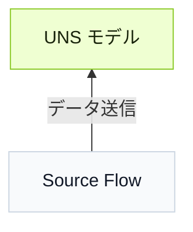

import { Steps } from '@astrojs/starlight/components';

データを Tier0 に接続するには、まず **UNS** でモデルを構築し、次に **Source Flow** でデータソースを接続し、UNS モデルを送信先として使用します。


## データモデルの構築方法
シンプルなフォルダーとファイルの構造に基づき、データ階層をツリーマップとして定義します。

### 手動でモデルを構築する

:::note[サンプルモデル]
**Model**:
```
  Factory_A
  └── Site_01
      └── SMT_Line_1
          └── Metric
              └── Machine_001
```
**Payload**:
```json
"temperature": 85,
"vibration": 2.8
```
:::
<Steps>
1. **UNS** でルート path `Factory_A` を追加します。
2. `Factory_A` の下に 2 階層目の path `Site_01` を追加し、ツリーマップに示された階層順に後続の path を追加します。
3. `SMT_Line_1` の下に topic `Machine_001` を追加し、**Topic Type** を **Metric** に設定します。
4. topic payload を定義します。`temperature` と `vibration` の 2 フィールドを追加し、それぞれのデータ型を設定します。
5. **Mock Data** を選択してモデルへシミュレーションデータを送信し、**Enable History** でデータをデータベースに保存します。
</Steps>

:::tip[追加パラメータ]
**Auto Parsing** は JSON テキストを解析し、一般フィールドに変換します。
:::

### モデルをインポートする
:::tip
ChatGPT などの LLM を使ってモデルのインポートを支援できます。
:::

<Steps>
1. **Import** ウィンドウでテンプレート JSON をコピーするか、テンプレートファイルをダウンロードします。
2. テンプレートを AI に送り、次のような prompt を使います。
    ```
    Generate a UNS model used for xx in xx plant, including xx equipment and data sources based on the template.
    ```
3. 生成された結果を UNS にインポートします。
</Steps>

## UNS にデータを接続する方法
**Source Flow** は **Node-RED** をベースにしており、データソースを Tier0 に接続するために使用します。
:::tip[Source Flow を理解する]
**Source Flow** では：
- すべての flow は **mqtt out** ノードで終わります。これは MQTT client として broker にデータを publish します。
- UNS broker は flow と同じ名前の **mqtt out** ノードに組み込まれています。
- UNS モデルを topic として使用すると、データは **UNS** の対応するモデルに直接入ります。
:::
<Steps>
1. **Flows** で **Source Flow** を作成します。
2. データソースタイプに応じたノードを使用し、flow の最後を **mqtt out** ノードにします。
3. ノードの **Server** が UNS broker に設定されていることを確認します。
4. **UNS** モデルを MQTT topic として使用します（例：`Factory_A/Site_01/SMT_Line_1/Metric/Machine_001`）。
</Steps>

## 追加オプション
:::note
このセクションでは、ワークフローに関連する追加パラメータまたは設定について説明します。
:::

| Scope | Parameter | Item | When to use |
|------|-----------|------|-------------|
| Path | Extended Attribute/Custom Attributes | - | 単位情報など、path に追加属性を加える必要がある場合に使用します。 |
| Topic | Topic Type | [Metric, State, Action](../uns-concepts/#metric-state-action) | 測定値、現在状態、実行可能操作など、データの意味に合う topic type を選択します。 |
| Topic | Attribute Generation Method | Pre-defined | topic の属性を 1 つずつ手動設定します。 |
| Topic | Attribute Generation Method | Auto-Parsing | JSON テキストから属性をまとめて自動変換します。 |

## 次へ

- [UNS 上にアプリを構築](../build-apps/) - UNS データを使って産業アプリケーションを構築します。
- [UNS データを分析](../analyze-data/) - Marimo Notebook と Python で UNS データを分析します。
