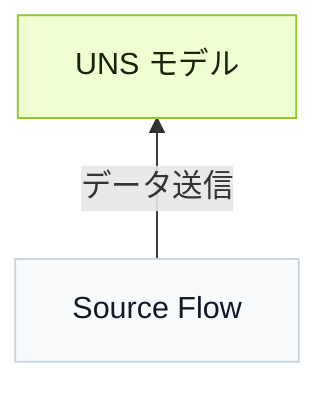

import { Steps } from '@astrojs/starlight/components';

まず **UNS** でモデルを構築し、その後 **Source Flow** でデータをモデルへ接続して、後続利用のためのデータ基盤を作ります。


```mermaid
flowchart BT
  uns["UNS モデル"]
  flow["Source Flow"]

  flow -->|"データ送信"| uns

  classDef t0accent fill:#EFFFD2,stroke:#8AC926,stroke-width:1px,color:#18230B
  classDef t0node fill:#F8FAFC,stroke:#CBD5E1,stroke-width:1px,color:#111827
  class uns t0accent
  class flow t0node
```

{/* 
:::note
このプロセスは UNS Agent との会話で完了できます。詳細は[こちら](../../best-practice/building-data-workflow-with-agent/)を確認してください。
:::
*/}

## データモデルを構築する
次の内容に基づいて、データ階層をツリーマップとして定義します。
  - データが発生する物理的な場所（[ISA-95](../../reference/isa-95-equipment-hierarchy/) を参照）；
  - データが従う業務ロジック。

### モデルを手動で構築する

<Steps>
1. モデル構造を設計し、topic を追加する前に順序どおりに path を追加します。
2. [データ特性](../uns-concepts/#metric-state-action)に基づいて、**Metric**、**State**、**Action** から **Topic Type** を設定します。
3. **Mock Data** を選択してモデルへシミュレーションデータを送信し、**Enable History** を有効にしてデータをデータベースへ保存します。
4. **Auto Parsing** または **Pre-defined** を使って、正しいデータ型のフィールドを topic に追加します。
    - **Auto Parsing**：JSON テキストからフィールドを一括で自動変換します。
    - **Pre-defined**：topic のフィールドを 1 つずつ手動で設定します。
</Steps>

### モデルをインポートする
:::tip
ChatGPT などの LLM を使ってモデルのインポートを支援できます。
:::

<Steps>
1. **Import** からテンプレート JSON を AI に送り、次のような prompt を使用します。
    ```
    テンプレートに基づき、xx 工場の xx 用途で使う UNS モデルを生成してください。xx 設備とデータソースを含めてください。
    ```
2. 生成された結果を UNS にインポートします。
</Steps>

## データを UNS に接続する

### データフローの特徴
- Node-RED をベースにしています。
- すべての flow は `mqtt out` ノードで終わります。このノードは MQTT client として UNS broker にデータを publish します。
- UNS broker は、flow と同じ名前の `mqtt out` と `mqtt in` ノードに組み込まれています。
- UNS モデルを topic として使用すると、データは **UNS** の対応するモデルへ直接入ります。

### 手順

<Steps>
1. データソースの種類に応じてノードを使って flow を構築し、最後を `mqtt out` ノードにします。

    :::tip[必要なノードがない場合]
    要件に合わせて Node-RED コミュニティからノードをインストールできます。公式コミュニティノードは、多くの場合 `node-red-contrib` で始まります。
    :::

2. `mqtt out` ノードの **Server** が UNS broker に設定され、topic が **UNS** のモデルになっていることを確認します。
</Steps>

### Flow のバージョン管理
データ flow のバージョンを保存すると、以前のバージョンへロールバックしたり、履歴バージョンから新しい flow を開始したりできます。

:::caution
Edge edition ではバージョンロールバックはサポートされていません。
:::

## 次へ

- [工場データでアプリを構築](../build-apps/) - UNS データを使って産業アプリケーションを構築します。
- [工場データを分析する](../analyze-data/) - Marimo Notebook と Python で UNS データを分析します。
