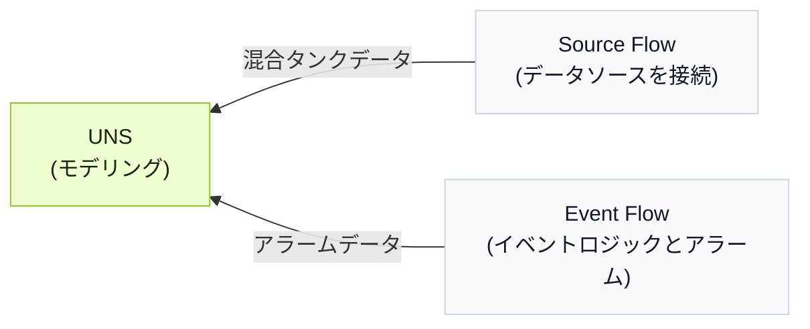

import { Steps } from '@astrojs/starlight/components';
import { Tabs, TabItem } from '@astrojs/starlight/components';

Tier0 は UNS モデルの側に agent を提供し、自然言語で UNS と flow を操作できるようにします。

:::note[UNS agent が必要な理由]
複数のモジュールを行き来しながら、データモデリング、接続、イベント構築を段階的に進める代わりに、UNS agent が会話だけでそれらを処理します。
:::

## Workflow の背景
:::note
ここでは、agent に作業を任せるシンプルさを示すために、サンプル workflow を使用します。
:::
混合タンクは、材料を加熱しながら混ぜるために使われます。データモデルを構築し、温度、水位、ヒーター状態を収集して、タンクが過熱しているかどうかを判断し、アラームをトリガーします。

<div className="t0-compact-mermaid">



</div>

## Workflow の構築方法
<Steps>
1. Tier0 にログインし、**UNS** に移動して、右側の UNS agent と会話を開始します。
2. 会話権限を `full_access` に変更し、prompt を入力します。
    ```text
    混合タンクの温度、水位、ヒーター状態を表すデータモデルを作成してください。温度と水位は 1 つの metric topic に、ヒーター状態は state topic に配置してください。
    ```
3. モデルが完成したことを確認したら、prompt を入力して、対応するデータをモデルに接続するよう agent に依頼します。
    ```text
    この 2 つの topic にデータを送信する source flow を作成し、妥当なデータをシミュレートしてください。
    ```
    :::tip[実際のデータソースがある場合]
    データソース情報を agent に伝え、接続させます。
    :::
4. 次のロジックで event を作成する prompt を入力します。
    - 低水位 warning：水位が 20% 未満で、ヒーターがオンのときにトリガーされます。
    - 空焚き alarm：水位が 15% 未満、温度が 90°C を超え、ヒーターがオンのときにトリガーされます。
    ```md
    次のアラームロジックで Event Flow を作成してください：
      - Warning：level < 20 かつ heater_status = true のときにトリガーします。
      - Critical：level < 15、temperature > 90、heater_status = true のときにトリガーします。
      - level > 25 または heater_status = false のとき、アクティブなアラームをクリアします。
    既存の source path の下に、アラーム結果を受信する新しい topic を作成してください。出力にはアラームレベル、メッセージ、アクティブ状態、timestamp を含めてください。
    ```
5. **UNS** で結果を確認します。
</Steps>

