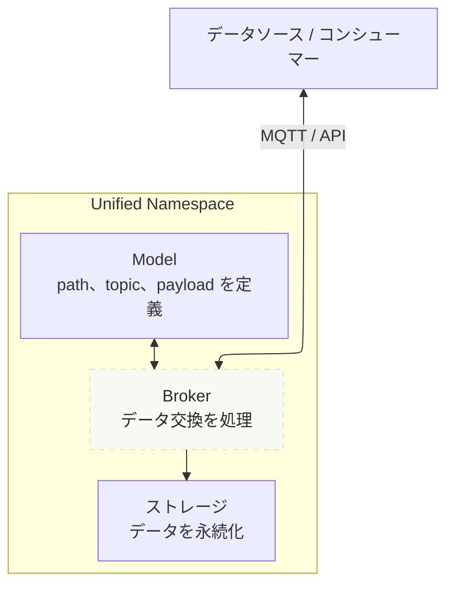
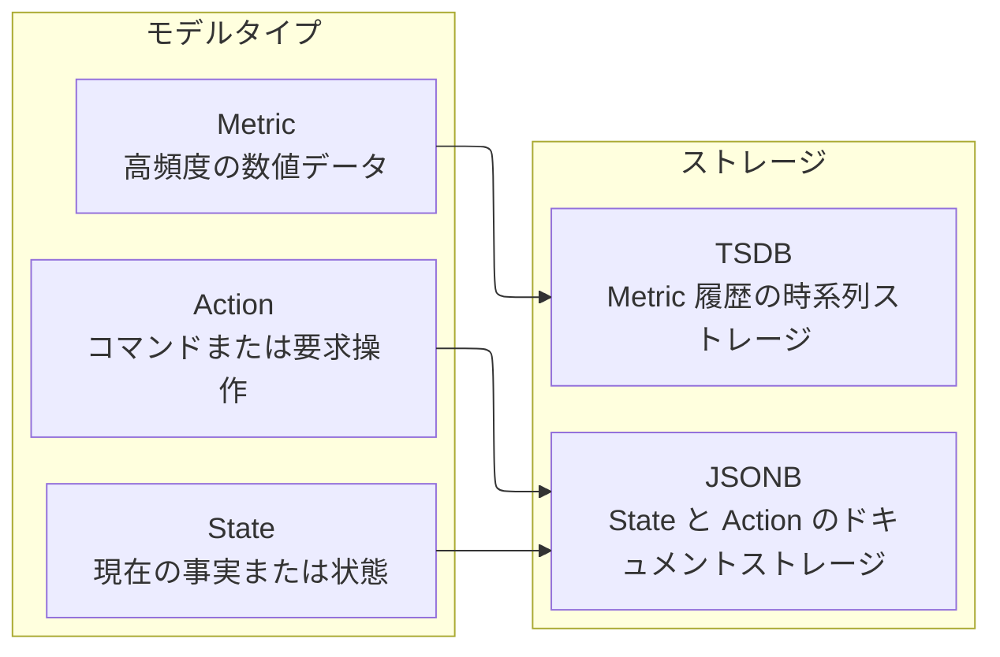

import { Tabs, TabItem } from '@astrojs/starlight/components';


Tier0 では、工場データは UNS（Unified Namespace）の考え方に基づき、明確なツリー構造のモデルとして整理され、統一されたデータ基盤を形成します。
- Broker は model topic を通じてデータを受信、送信します。

<div className="t0-uns-foundation-mermaid t0-uns-foundation-mermaid--flow">

</div>
- Model は **Metric**、**State**、**Action** の 3 種類に分類されます。
- データは model type に応じて異なるデータベースに保存されます。
    - **Action/State**: JSONB (PostgreSQL)
    - **Metric**: リアルタイムデータ（TSDB）

<div className="t0-uns-foundation-mermaid t0-uns-foundation-mermaid--types">

</div>
## Broker
UNS broker は、データモデルに基づいて MQTT または OpenAPI 経由でデータを受信、送信するプラットフォームコンポーネントです。
- **MQTT の場合**：model tree 内の各 node の完全な path が topic address として機能し、message payload を渡します。
- **OpenAPI の場合**：HTTP request を通じて data model に対する CRUD コマンドを実行します。
:::tip[API リファレンス]
API の詳細は [API Reference](../../reference/api-reference/) を参照してください。
:::

## Model
:::tip[モデルを作るとき、どのガイドに従うべきですか？]
データが何を表しているかに基づいて、モデリング方法を選びます。
- **Physical Data**：物理機械からのリアルタイムデータです。通常は **ISA-95** 標準に基づいて整理され、場所の階層に強く依存します。
- **Business Data**：生産要件、スケジュール、タスク、ディスパッチに関係するデータです。通常は **business domain と object** によって整理されます。
:::

### Metric, State, Action
産業データは変化頻度と用途が異なるため、Tier0 は UNS model を 3 つの固定 type に分けます。

| Type | Object | Example |
|---|---|---|
| `METRIC` | 継続的に収集され、時系列保存が必要な高頻度データ向けに設計されています。 | Machine temperature/pressure/voltage |
| `STATE` | 変化頻度が比較的低く、object の現在状態または事実を表すデータ向けに設計されています。 | Machine operational status |
| `ACTION` | 外部システムまたは operator が実行すべき内容を記録する低頻度の command data 向けに設計されています。 | Start batch, stop machine |

### Path/Topic, Payload
各 UNS model には path、topic、payload が含まれます。これらが一緒になって、business context を持ち産業データを運ぶ **tree** 構造を形成します。
- **Path/Topic**：path はデータの所属を表し、topic は message payload を運びます。これらが ***model address*** を定義します。
- **Payload**：topic が保持する message payload です。**key-value** 形式の JSON で、***model data*** を定義します。

たとえば、UNS 内の model は次のような tree になります。
<Tabs>
	<TabItem label="Physical Data">
```text
  Factory_A
  └── Site_01
      └── SMT_Line_1
          └── Metric
              └── Machine_001
```
- **Path**: `Factory_A/Site_01/SMT_Line_1/Metric`
- **Topic**: `/Machine_001`.
- **Payload**
    ```json
    "temperature": 85,
    "vibration": 2.8,

    ```
</TabItem>
<TabItem label="Business Data">
```text
  Factory_A
  └── ERP
      └── ProductionOrders
          └── State
              └── OrderList
```
- **Path**: `Factory_A/ERP/ProductionOrders/State`
- **Topic**: `/OrderList`.
- **Payload**
    ```json
    "orders": "0123569876",
    "updated_at": 2026-7-13,
    ```
</TabItem>
</Tabs>

:::tip[モデルを構築するには]
[データモデルを構築する](../connect-data/#データモデルを構築する)を参照してください。
:::

## Storage
Tier0 は PostgreSQL を使ってデータを保存します。データ type によって変化速度と保存要件が異なります。

| Data Type | Storage | Description |
|-----------|---------|-------------|
| `METRIC` | TSDB | 温度や圧力などの高頻度測定値に最適化されています。各 topic には default field として `timestamp` と `quality` が含まれます。 |
| `STATE` | PostgreSQL | machine または system state を柔軟な `JSONB` 形式で保存します。 |
| `ACTION` | PostgreSQL | command または action を柔軟な `JSONB` 形式で保存します。 |

## 次へ

- [UNS にデータを接続する](../connect-data/) - 工場を UNS にモデル化し、データをモデルへ接続する方法。
- [工場データを扱う](../working-with-uns-data/) - MQTT と API を通じて UNS model を操作する方法。
