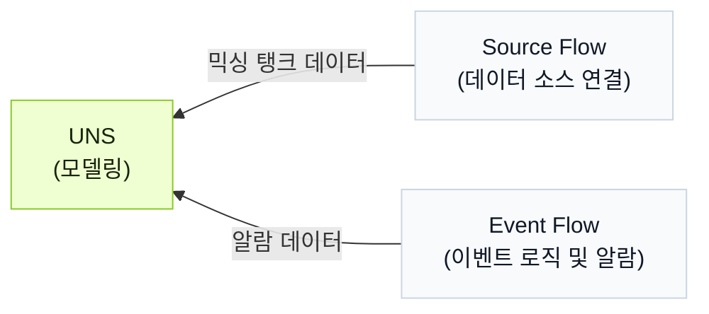

import { Steps } from '@astrojs/starlight/components';

여러 모듈에서 데이터 모델, 연결, 이벤트를 단계별로 만드는 대신, UNS Agent가 대화를 통해 워크플로를 처리합니다.

## 워크플로 배경

믹싱 탱크는 재료를 섞으면서 가열합니다. 데이터 모델을 만들고 온도, 수위, 히터 상태를 수집해 탱크 과열 여부를 판단하고 알람을 트리거합니다.

<div className="t0-compact-mermaid">



</div>

## 워크플로 구축 방법

<Steps>
1. **UNS**에서 `full_access`로 UNS Agent와 대화를 시작합니다.
2. UNS 모델을 만들기 위한 프롬프트를 입력합니다.
    ```text
    믹싱 탱크의 온도, 수위, 히터 상태를 나타내는 데이터 모델을 만듭니다. 온도와 수위는 하나의 metric topic에, 히터 상태는 하나의 state topic에 넣어 주세요.
    ```
3. 모델이 완성되었는지 확인한 뒤, 해당 데이터를 모델에 연결하도록 프롬프트를 입력합니다.
    ```text
    이 2개 topic으로 데이터를 보내는 Source Flow를 만들고 합리적인 데이터를 시뮬레이션해 주세요.
    ```

    :::tip[실제 데이터 소스가 있는 경우]
    데이터 소스 정보를 Agent에게 알려 연결하게 합니다.
    :::

4. 다음 로직으로 이벤트를 만들기 위한 프롬프트를 입력합니다.
    - 낮은 수위 경고: 수위가 20% 미만이고 히터가 켜져 있을 때 트리거됩니다.
    - 건식 가열 알람: 수위가 15% 미만이고 온도가 90°C를 초과하며 히터가 켜져 있을 때 트리거됩니다.

    ```md
    다음 알람 로직을 위한 Event Flow를 만들어 주세요:
      - Warning: level < 20 이고 heater_status = true 일 때 트리거.
      - Critical: level < 15, temperature > 90, heater_status = true 일 때 트리거.
      - level > 25 또는 heater_status = false 이면 활성 알람을 해제.
    기존 UNS 모델 아래에 알람 결과를 받을 새 topic을 만듭니다. 출력에는 알람 레벨, 메시지, 활성 상태, 타임스탬프를 포함합니다.
    ```
5. **UNS**에서 결과를 확인합니다.
</Steps>

:::note
각 단계 이후에도 Agent와 계속 대화해 결과를 조정할 수 있습니다.
:::
