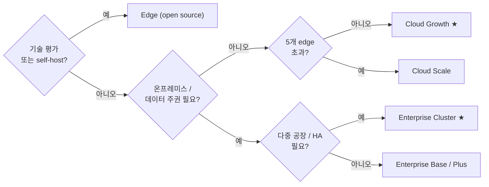

Tier0는 세 가지 에디션으로 제공되는 하나의 플랫폼입니다. namespace model, flow, CLI는 같고, 차이는 누가 운영하는지와 사용할 수 있는 플랫폼 범위입니다.

<section class="t0-board not-content">
	

		

			

				
Open source

			

			

				

					<h3>Edge</h3>
					
The UNS foundation, on one machine. Yours entirely.

					
For PoCs, technical evaluation, and teams running open source themselves.

				

				

					

						Apache-2.0
						free
						
UNS core, SourceFlows/EventFlows, history storage — single-machine Docker deployment.

					

					<a class="t0-col-cta" href="https://github.com/FREEZONEX/Tier0-Edge">Clone on GitHub</a>
				

			

		

		

			

				
Managed SaaS

			

			

				

					<h3>Cloud Most teams start here</h3>
					
The full platform, operated for you.

					
Apps, notebooks, and launchpad on day one — no infrastructure to run.

				

				

					

						Builder
						$199/seat/mo
						
App generation only.

					

					

						Growth ★
						$20,000/yr
						
Up to 5 edges. For a single factory with a few apps, wanting a quick start.

					

					

						Scale
						$38,000/yr
						
Up to 10 edges. For users with multiple factories and many apps.

					

					<a class="t0-col-cta" href="https://tier0.dev/login">Start the 14-day trial</a>
				

			

		

		

			

				
Private deployment

			

			

				

					<h3>Enterprise</h3>
					
The full platform, on your terms.

					
For data sovereignty, scale, governance, and enterprise-grade oversight.

				

				

					

						Base
						$10,000/yr
						
Unified data foundation. A small number of single-purpose apps.

					

					

						Plus
						$20,000/yr
						
Single Instance. Single-factory data integration, apps across multiple use cases.

					

					

						Cluster ★
						$39,900+/yr
						
Multi-Instance. Multiple factories, many apps, centralized private-cloud management.

					

					<a class="t0-col-cta" href="https://tier0.app/talk-to-team">Talk to the team</a>
				

			

		

	

</section>

**Add-ons:** 추가 edge node는 $2,000 /edge/year, 추가 instance는 $10,000 /instance/year입니다. 가격은 참고용이며, 공식 기준은 [tier0.app/pricing](https://tier0.app/pricing)입니다.

:::note[용어 설명]
Cloud 플랜에서 edge는 클라우드 Tier0와 통신하는 연결 노드입니다. Edge Tier0일 수도 있고, 게이트웨이 또는 산업용 PC일 수도 있습니다.
:::

## 기능 매트릭스

| Capability | Edge | Cloud | Enterprise |
|---|---|---|---|
| UNS / Data 모델링 | &#10003; single-machine UNS | &#10003; Growth / Scale | &#10003; Base / Plus / Cluster |
| Industrial protocols | &#10003; MQTT | &#10003; Growth / Scale: MQTT, REST, i3X, OPC UA | &#10003; Base: MQTT; Plus / Cluster: MQTT, REST, i3X, OPC UA |
| UNS Agent | &#215; | &#10003; Growth / Scale | &#215; |
| Notebook (Advanced Analysis) | &#215; | &#10003; Growth / Scale | &#10003; Plus / Cluster |
| Vision | &#215; | &#10003; Scale | &#10003; Plus / Cluster |
| Anchor | &#215; | &#10003; Scale | &#10003; Cluster |
| App Builder + Template Library | &#215; | &#10003; Builder / Growth / Scale | &#215; |
| LaunchPad / My Apps | &#215; | &#10003; Builder / Growth / Scale | &#10003; Base / Plus / Cluster |
| Audit / app & system logs | &#215; | &#10003; Growth / Scale | &#10003; Plus / Cluster; SIEM in Cluster |
| HA / multi-instance / governance | &#215; | &#215; | &#10003; Cluster |
| 작업 | You | FREEZONEX | You, with support |

## Edge 하드웨어 요구사항

:::tip[Edge를 사용하려는 경우]
Edge is intended for technical evaluation and requires operational experience.
사용하기 전에 환경이 다음 하드웨어 요구 사항을 충족하는지 확인하세요.
:::

| | Minimum | Recommended |
|---|---|---|
| CPU | 4 cores | 8 cores |
| Memory | 8 GB | 16 GB |
| Disk | 100 GB (1000 IOPS) | 1 TB |
| OS | Ubuntu 24.04, Windows 10/11 (Docker) | - |

## 의사결정 트리

아직 어떤 옵션을 선택할지 모르겠다면, 경로를 따라 결정해 보세요.

## "edge"(단위)란?

Cloud 플랜에서 *edge*는 설비 가까이에서 데이터를 수집해 네임스페이스로 게시하는 연결 지점입니다. 보통 수집 플로우를 실행하는 게이트웨이 또는 산업용 PC입니다. 사이트 또는 분리된 네트워크 세그먼트마다 대략 하나로 계산합니다. 위의 오픈소스 배포판인 **Edge edition**과 혼동하지 마세요.

## 다음 단계

- [Build Apps on UNS](../../using-tier0/build-apps/) — deploying containers on Edge and Enterprise
- [Installation](../installation/) — the 14-day Cloud trial is the full platform
