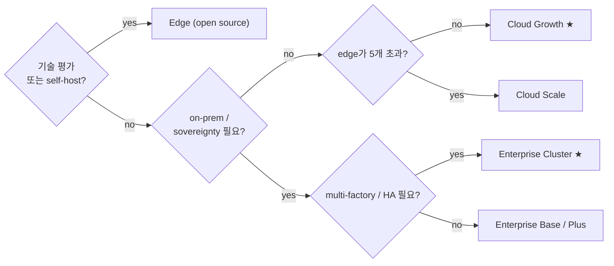

Tier0는 세 가지 에디션으로 제공되는 하나의 platform입니다. namespace model, flow, CLI는 동일하며, 차이는 누가 운영하는지와 사용할 수 있는 platform 범위입니다.

<section class="t0-board not-content">
  

    

      

        
Open source

      

      

        

          <h3>Edge</h3>
          
한 대의 machine에서 운영하는 UNS foundation입니다.

          
PoC, 기술 평가, open source를 직접 운영하는 team에 적합합니다.

        

        

          

            Apache-2.0
            free
            
UNS core, SourceFlows/EventFlows, history storage를 포함한 single-machine Docker deployment입니다.

          

          <a class="t0-col-cta" href="https://github.com/FREEZONEX/Tier0-Edge">GitHub에서 clone</a>
        

      

    

    

      

        
Managed SaaS

      

      

        

          <h3>Cloud 대부분의 team이 여기서 시작합니다</h3>
          
운영을 대신 맡기는 full platform입니다.

          
첫날부터 apps, notebooks, launchpad를 사용할 수 있으며 직접 운영할 infrastructure가 없습니다.

        

        

          

            Builder
            $199/seat/mo
            
App generation만 포함합니다.

          

          

            Growth ★
            $20,000/yr
            
최대 5개 edge. 몇 개의 app으로 빠르게 시작하려는 single factory에 적합합니다.

          

          

            Scale
            $38,000/yr
            
최대 10개 edge. 여러 factory와 많은 app을 운영하는 사용자에게 적합합니다.

          

          <a class="t0-col-cta" href="https://tier0.dev/login">14일 평가판 시작</a>
        

      

    

    

      

        
Private deployment

      

      

        

          <h3>Enterprise</h3>
          
고객 환경에 맞춰 운영하는 full platform입니다.

          
data sovereignty, scale, governance, enterprise-grade oversight가 필요한 경우에 적합합니다.

        

        

          

            Base
            $10,000/yr
            
Unified data foundation과 소수의 single-purpose app을 제공합니다.

          

          

            Plus
            $20,000/yr
            
Single Instance. single-factory data integration과 여러 use case의 app에 적합합니다.

          

          

            Cluster ★
            $39,900+/yr
            
Multi-Instance. 여러 factory, 많은 app, 중앙 집중식 private-cloud management에 적합합니다.

          

          <a class="t0-col-cta" href="https://tier0.app/talk-to-team">team에 문의</a>
        

      

    

  

</section>

**Add-ons:** 추가 edge node는 $2,000 /edge/year, 추가 instance는 $10,000 /instance/year입니다. 가격은 참고용이며, 공식 기준은 [tier0.app/pricing](https://tier0.app/pricing)입니다.

:::note[용어 설명]
Cloud plans에서 edge는 cloud Tier0와 통신하는 connection node입니다. Edge Tier0일 수도 있고 gateway 또는 industrial PC일 수도 있습니다.
:::

## Capability Matrix

| Capability | Edge | Cloud | Enterprise |
|---|---|---|---|
| UNS / Data Modeling | &#10003; single-machine UNS | &#10003; Growth / Scale | &#10003; Base / Plus / Cluster |
| Industrial protocols | &#10003; MQTT | &#10003; Growth / Scale: MQTT, REST, i3X, OPC UA | &#10003; Base: MQTT; Plus / Cluster: MQTT, REST, i3X, OPC UA |
| UNS Agent | &#215; | &#10003; Growth / Scale | &#215; |
| Notebook (Advanced Analysis) | &#215; | &#10003; Growth / Scale | &#10003; Plus / Cluster |
| Vision | &#215; | &#10003; Scale | &#10003; Plus / Cluster |
| Anchor | &#215; | &#10003; Scale | &#10003; Cluster |
| App Builder + Template Library | &#215; | &#10003; Builder / Growth / Scale | &#215; |
| Launchpad / My Apps | &#215; | &#10003; Builder / Growth / Scale | &#10003; Base / Plus / Cluster |
| Audit / app & system logs | &#215; | &#10003; Growth / Scale | &#10003; Plus / Cluster; SIEM in Cluster |
| HA / multi-instance / governance | &#215; | &#215; | &#10003; Cluster |
| Operations | 사용자가 직접 운영 | FREEZONEX 운영 | 사용자 운영, support 제공 |

## Edge 하드웨어 요구사항

:::tip[Edge를 사용하려면]
Edge는 기술 평가 목적에 적합하며 운영 경험이 필요합니다. 사용 전에 환경이 아래 hardware requirements를 만족하는지 확인하세요.
:::

| | Minimum | Recommended |
|---|---|---|
| CPU | 4 cores | 8 cores |
| Memory | 8 GB | 16 GB |
| Disk | 100 GB (1000 IOPS) | 1 TB |
| OS | Ubuntu 24.04, Windows 10/11 (Docker) | - |

## Decision Tree

아직 어떤 option을 선택할지 모르겠다면 아래 path를 따라 결정하세요.

```mermaid
flowchart LR
  q1{"기술 평가<br/>또는 self-host?"} -- "yes" --> edge["Edge (open source)"]
  q1 -- "no" --> q2{"on-prem /<br/>sovereignty 필요?"}
  q2 -- "no" --> q3{"edge가 5개 초과?"}
  q2 -- "yes" --> q4{"multi-factory / HA 필요?"}
  q3 -- "no" --> growth["Cloud Growth ★"]
  q3 -- "yes" --> scale["Cloud Scale"]
  q4 -- "yes" --> cluster["Enterprise Cluster ★"]
  q4 -- "no" --> baseplus["Enterprise Base / Plus"]
  class growth,cluster t0accent
```

## "edge" 단위란?

Cloud plans에서 *edge*는 장비 가까이에서 데이터를 수집하고 namespace로 publish하는 connection point입니다. 일반적으로 collection flows를 실행하는 gateway 또는 industrial PC입니다. 대략 site 또는 독립 network segment마다 하나로 계산합니다. 위의 open-source distribution인 **Edge edition**과 혼동하지 마세요.

## 다음 단계

- [UNS에서 앱 구축](../../using-tier0/build-apps/) - Edge와 Enterprise에서 container를 배포합니다.
- [설치](../installation/) - 14일 Cloud 평가판은 full platform입니다.
