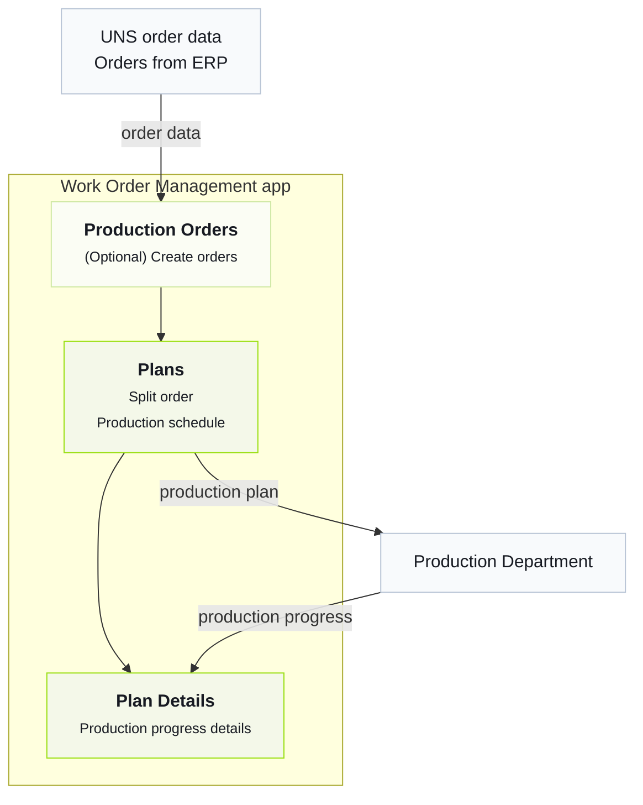

import { Steps } from '@astrojs/starlight/components';

Tier0를 가장 빠르게 이해하는 방법은 이미 동작하는 factory를 직접 살펴보는 것입니다.
## Factory 비즈니스
Tier0의 factory는 ERP에서 주문을 가져오고, 주문을 분할하고, 주문 기반으로 생산을 계획한 뒤, 계획을 전송하고 생산 진행 데이터를 수집합니다.

## 비즈니스 프로세스 이해
<Steps>
1. In Tier0, go to **UNS**, check the details of orders came from ERP.
    - `DemoFactory/ERP/ProductionOrders/State/UpsertProductionOrder`: Orders.
    - `DemoFactory/ERP/ProductionOrders/State/OrderList`: Current order list snapshot.
    :::tip[데이터는 어떻게 UNS로 수집되나요?]
    Go to **Flows** > **Source Flow** > **DemoFactory-Flow** to check the data collection process.
    :::
2. (선택 사항) **Launchpad**로 이동해 **Work Order Management** 애플리케이션에 접속하고 **Production Orders** 페이지에서 주문을 생성합니다.
3. **Work Order Management**에서 order를 분할하고 **Plans** page에서 분할된 workorder의 production plan을 schedule합니다.
4. Send the plan to production, and check the plan details on the following topics on **UNS**.
    - `DemoFactory/ERP/WorkOrderPlan/Metric/SplitCount`: The number of workorders after splitting.
    - `DemoFactory/ERP/WorkOrderPlan/State/PlanStatus`: Current plan status.
    - `DemoFactory/ERP/WorkOrderPlan/State/WorkOrderList`: The workorder list after production plan scheduled.

    :::note
    애플리케이션은 plan과 workorder를 **UNS**로 직접 전송합니다.
    :::
5. Check the production progress data on the **Plan Details** page in the application.
    :::tip[상세 데이터는 어디에서 오나요?]
    생산 진행 데이터는 **Source Flow**의 **DemoFactory-Flow**에서 수집되어 **UNS**에 게시되고, **Plan Details** 페이지에 표시됩니다.
    - `DemoFactory/Site_01/Production/Line_01/WorkOrderExecution/State/CurrentWorkOrder`: The order in process.
    - `DemoFactory/Site_01/Production/Line_01/WorkOrderExecution/State/WorkOrderStatus`: The execution status of the current order.
    - `DemoFactory/Site_01/Production/Line_01/WorkOrderExecution/Metric/Target_Qty`: The target production amount of the current order.
    - `DemoFactory/Site_01/Production/Line_01/WorkOrderExecution/Metric/Produced_Qty`: The amount of products already done of the current order.
    - `DemoFactory/Site_01/Production/Line_01/WorkOrderExecution/Metric/Defect_Qty`: The amount of defects of the current order.
    - `DemoFactory/Site_01/Production/Line_01/WorkOrderExecution/Metric/Completion_Rate`: The completion rate of the current order.
    :::
</Steps>
## 다음 단계

- [Choosing the Best Version](../choosing-version/)
- [UNS Concepts](../../using-tier0/uns-concepts/) — Understand data modeling in Unified Namespace.
