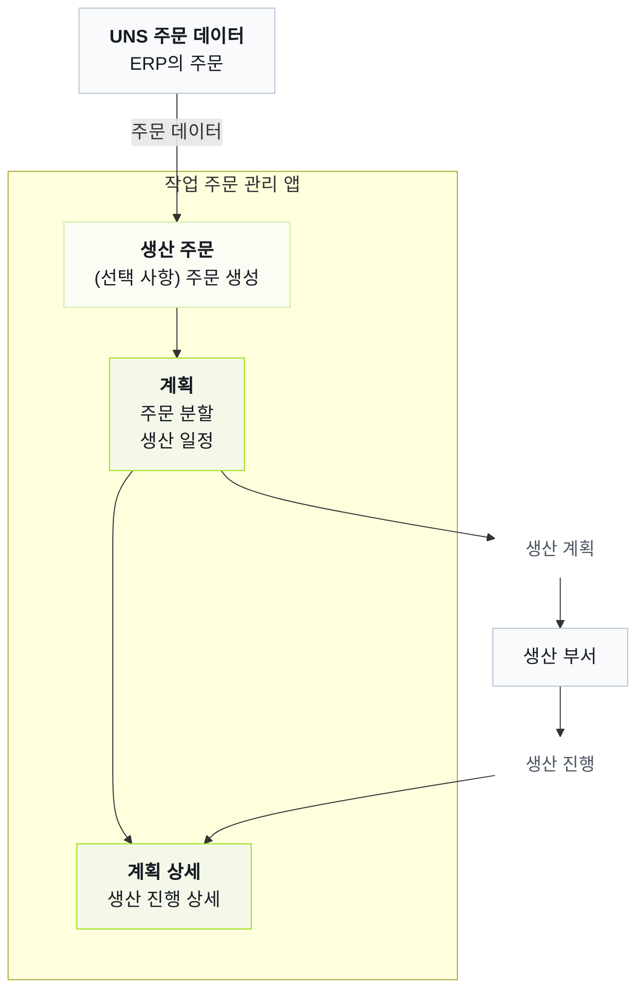

import { Steps } from '@astrojs/starlight/components';

Tier0를 가장 빠르게 이해하는 방법은 이미 작동하는 공장을 살펴보는 것입니다.

## 비즈니스 배경

Tier0의 공장은 ERP에서 주문을 받고, 주문을 분할하고, 생산 일정을 만들고, 그 일정을 생산 부서로 보내며, 작업이 진행되는 동안 생산 진행 데이터를 받습니다.

```mermaid
%%{init: {"themeVariables": {"fontSize": "18px"}, "themeCSS": ".nodeLabel, .edgeLabel, .cluster-label { font-size: 18px !important; } .nodeLabel b, .nodeLabel strong { font-size: 19px !important; }"}}%%
flowchart TB
  uns["<span style='font-size:18px;font-weight:700'>UNS 주문 데이터</span><br/><span style='font-size:16px'>ERP의 주문</span>"]
  production["<span style='font-size:18px'>생산 부서</span>"]

  subgraph app["작업 주문 관리 앱"]
    direction TB
    appSpacer[" "]
    subgraph appPages[" "]
      direction LR
      orders["<span style='font-size:18px;font-weight:700'>생산 주문</span><br/><span style='font-size:16px'>(선택 사항) 주문 생성</span>"]
      plans["<span style='font-size:18px;font-weight:700'>계획</span><br/><span style='font-size:16px'>주문 분할<br/>생산 일정</span>"]
      details["<span style='font-size:18px;font-weight:700'>계획 상세</span><br/><span style='font-size:16px;white-space:nowrap'>생산 진행 상세</span>"]
    end
  end

  uns -- "주문 데이터" --> orders
  orders --> plans
  plans --> details
  plans --> planLabel["생산 계획"]
  planLabel --> production
  production --> progressLabel["생산 진행"]
  progressLabel --> details

  classDef external fill:#f8fafc,stroke:#b8c4d5,color:#171a22,stroke-width:1px,font-size:18px
  classDef optional fill:#fbfdf4,stroke:#cfe8a3,color:#171a22,stroke-width:1px,font-size:18px
  classDef appNode fill:#f4f8e9,stroke:#9adf11,color:#171a22,stroke-width:1px,font-size:18px
  classDef labelNode fill:transparent,stroke:transparent,color:#4b5563,font-size:17px
  classDef invisible fill:transparent,stroke:transparent,color:transparent
  class uns,production external
  class orders optional
  class plans,details appNode
  class planLabel,progressLabel labelNode
  class appSpacer invisible
  style appPages fill:transparent,stroke:transparent
```

## 프로세스 이해

<Steps>
1. Tier0에서 **UNS**로 이동해 ERP에서 온 주문의 세부 정보를 확인합니다.
    - `DemoFactory/ERP/ProductionOrders/State/UpsertProductionOrder`: 주문.
    - `DemoFactory/ERP/ProductionOrders/State/OrderList`: 현재 주문 목록 스냅샷.
    :::tip[데이터는 어떻게 UNS로 수집되나요?]
    **Flows** > **Source Flow** > **DemoFactory-Flow**로 이동해 데이터 수집 세부 정보를 확인합니다.
    :::
2. (선택 사항) **Launchpad**로 이동해 **Work Order Management** 애플리케이션을 열고 **Production Orders** 페이지에서 주문을 생성합니다.
3. **Work Order Management**에서 **Plans** 페이지를 사용해 주문을 분할하고, 분할된 작업 주문의 생산 계획을 예약합니다.
4. 계획을 생산 부서로 보내고 **UNS**의 다음 topics에서 계획 세부 정보를 확인합니다.
    - `DemoFactory/ERP/WorkOrderPlan/Metric/SplitCount`: 분할 후 작업 주문 수.
    - `DemoFactory/ERP/WorkOrderPlan/State/PlanStatus`: 현재 계획 상태.
    - `DemoFactory/ERP/WorkOrderPlan/State/WorkOrderList`: 생산 계획 일정 이후의 작업 주문 목록.

    :::note
    애플리케이션은 plans와 workorders를 **UNS**에 직접 다시 씁니다.
    :::
5. 애플리케이션의 **Plan Details** 페이지에서 생산 진행 데이터를 확인합니다.
    :::tip[상세 데이터는 어디에서 오나요?]
    생산 진행 데이터는 생산 부서에서 오며, **Source Flow**의 **DemoFactory-Flow**가 이를 수집해 **UNS**에 게시하고 **Plan Details** 페이지에 표시합니다.
    - `DemoFactory/Site_01/Production/Line_01/WorkOrderExecution/State/CurrentWorkOrder`: 진행 중인 주문.
    - `DemoFactory/Site_01/Production/Line_01/WorkOrderExecution/State/WorkOrderStatus`: 현재 주문의 실행 상태.
    - `DemoFactory/Site_01/Production/Line_01/WorkOrderExecution/Metric/Target_Qty`: 현재 주문의 목표 생산량.
    - `DemoFactory/Site_01/Production/Line_01/WorkOrderExecution/Metric/Produced_Qty`: 현재 주문에서 완료된 제품 수량.
    - `DemoFactory/Site_01/Production/Line_01/WorkOrderExecution/Metric/Defect_Qty`: 현재 주문의 불량 수량.
    - `DemoFactory/Site_01/Production/Line_01/WorkOrderExecution/Metric/Completion_Rate`: 현재 주문의 완료율.
    :::
</Steps>

## 다음 단계

- [가장 적합한 버전 선택](../choosing-version/) - 각 버전을 비교하고 가장 적합한 버전을 선택합니다
- [UNS 개념](../../using-tier0/uns-concepts/) - Unified Namespace의 데이터 모델링을 이해합니다
