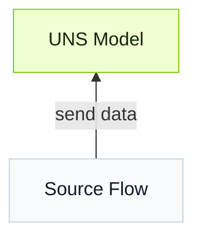

import { Steps } from '@astrojs/starlight/components';

Tier0에 데이터를 연결하려면 먼저 **UNS**에서 model을 만들고, UNS model을 destination으로 사용해 **Source Flow**를 통해 data source를 연결합니다.


## How to Build a Data Model
Define the data hierarchy as a tree map based on a simple folder-file structure.

### Building Models Manually

:::note[Example Model]
**Model**:
```
  Factory_A
  └── Site_01
      └── SMT_Line_1
          └── Metric
              └── Machine_001
```
**Payload**:
```json
"temperature": 85,
"vibration": 2.8
```
:::
<Steps>
1. In **UNS**, add the root path `Factory_A`.
2. Add the second path `Site_01` under `Factory_A`, and subsequent paths in the hierarchical order shown in the tree map.
3. Add the topic `Machine_001` under `SMT_Line_1`, and set its **Topic Type** to **Metric**.
4. Define the topic payload. Add 2 fields `temperature` and `vibration` and set their data types.
5. **Mock Data**를 선택해 simulated data를 model로 보내고, **Enable History**를 선택해 data를 database에 저장합니다.
</Steps>

:::tip[Additional parameters]
**Auto Parsing** parses JSON text and converts it into general fields.
:::

### Importing Models
:::tip
Use LLMs like ChatGPT to help import models.
:::

<Steps>
1. Copy the template JSON or download the template file on **Import** window.
2. Send the template to AI, and use a similar prompt.
    ```
    Generate a UNS model used for xx in xx plant, including xx equipment and data sources based on the template.
    ```
3. Import the generated result in UNS.
</Steps>


## How to Connect Data to UNS
**Source Flow**, based on **Node-RED**, is used to connect data sources to Tier0.
:::tip[To understand Source Flow]
In **Source Flow**:
- 모든 flow는 **mqtt out** 노드로 끝납니다. 이 노드는 MQTT client로 동작해 broker에 데이터를 게시합니다.
- The UNS broker is embedded in the **mqtt out** node with the same name as the flow.
- When a UNS model is used as the topic, data goes directly to the corresponding model in **UNS**.
:::
<Steps>
1. Create a **Source Flow** in **Flows**.
2. Use nodes based on the data source type, and end the flow with an **mqtt out** node.
3. Make sure the **Server** of the node is set to the UNS broker.
4. Use a **UNS** model as MQTT topic (e.g. `Factory_A/Site_01/SMT_Line_1/Metric/Machine_001`).
</Steps>

## Additional Options
:::note
This section describes additional parameters or configurations related to the workflow.
:::

| Scope | Parameter | Item | When to use |
|------|-----------|------|-------------|
| Path | Extended Attribute/Custom Attributes | - | unit information처럼 path에 추가 attribute를 넣어야 할 때 사용합니다. |
| Topic | Topic Type | [Metric, State, Action](../uns-concepts/#metric-state-action) | 측정값, 현재 상태, 실행 가능한 작업 등 데이터 의미에 맞는 topic type을 선택합니다. |
| Topic | Attribute Generation Method | Pre-defined | Manually set attributes for the topic one by one. |
| Topic | Attribute Generation Method | Auto-Parsing | JSON 텍스트에서 attribute를 일괄 자동 변환합니다. |


## 다음 단계

- [Build Apps on UNS](../build-apps/) — Build industrial applications with UNS data.
- [Analyze UNS Data](../analyze-data/) — Analyze UNS data with Marimo Notebook and Python.


