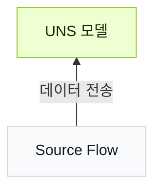

import { Steps } from '@astrojs/starlight/components';

먼저 **UNS**에서 모델을 만든 다음 **Source Flow**를 통해 데이터를 모델에 연결하여, 이후 사용을 위한 데이터 기반을 구성합니다.


```mermaid
flowchart BT
  uns["UNS 모델"]
  flow["Source Flow"]

  flow -->|"데이터 전송"| uns

  classDef t0accent fill:#EFFFD2,stroke:#8AC926,stroke-width:1px,color:#18230B
  classDef t0node fill:#F8FAFC,stroke:#CBD5E1,stroke-width:1px,color:#111827
  class uns t0accent
  class flow t0node
```

:::note
이 프로세스는 UNS Agent와의 대화로 완료할 수 있습니다. 자세한 내용은 [여기](../../best-practice/building-data-workflow-with-agent/)를 확인하세요.
:::

## 데이터 모델 만들기
다음 기준에 따라 데이터 계층을 트리 맵으로 정의합니다.
  - 데이터가 발생하는 물리적 위치([ISA-95](../../reference/isa-95-equipment-hierarchy/) 참고);
  - 데이터가 따르는 비즈니스 로직.

### 모델을 수동으로 만들기

<Steps>
1. 모델 구조를 설계하고, topic을 추가하기 전에 path를 순서대로 추가합니다.
2. [데이터 특성](../uns-concepts/#metric-state-action)에 따라 **Metric**, **State**, **Action** 중에서 **Topic Type**을 설정합니다.
3. **Mock Data**를 선택해 모델로 시뮬레이션 데이터를 보내고, **Enable History**를 켜서 데이터를 데이터베이스에 저장합니다.
4. **Auto Parsing** 또는 **Pre-defined**로 올바른 데이터 타입의 필드를 topic에 추가합니다.
    - **Auto Parsing**: JSON 텍스트에서 필드를 일괄 자동 변환합니다.
    - **Pre-defined**: topic 필드를 하나씩 수동으로 설정합니다.
</Steps>

### 모델 가져오기
:::tip
ChatGPT 같은 LLM을 사용해 모델 가져오기를 도울 수 있습니다.
:::

<Steps>
1. **Import**의 템플릿 JSON을 AI에 보내고 비슷한 prompt를 사용합니다.
    ```
    템플릿을 기반으로 xx 공장의 xx 용도에 사용할 UNS 모델을 생성하고, xx 장비와 데이터 소스를 포함하세요.
    ```
2. 생성된 결과를 UNS로 가져옵니다.
</Steps>

## 데이터를 UNS에 연결하기

### 데이터 플로우 특징
- Node-RED 기반입니다.
- 모든 flow는 `mqtt out` 노드로 끝납니다. 이 노드는 MQTT client로 동작하여 UNS broker에 데이터를 publish합니다.
- UNS broker는 flow와 같은 이름의 `mqtt out` 및 `mqtt in` 노드에 내장되어 있습니다.
- UNS 모델을 topic으로 사용하면 데이터가 **UNS**의 해당 모델로 바로 들어갑니다.

### 단계

<Steps>
1. 데이터 소스 유형에 맞는 노드를 사용해 flow를 만들고, `mqtt out` 노드로 끝냅니다.

    :::tip[필요한 노드가 없는 경우]
    요구사항에 맞게 Node-RED 커뮤니티에서 노드를 설치할 수 있습니다. 커뮤니티 노드는 보통 `node-red-contrib`로 시작합니다.
    :::

2. `mqtt out` 노드의 **Server**가 UNS broker로 설정되어 있고, topic이 **UNS**의 모델인지 확인합니다.
</Steps>

### Flow 버전 관리
데이터 flow의 버전을 저장하면 이전 버전으로 되돌리거나, 히스토리 버전을 기반으로 새 flow를 시작할 수 있습니다.

## 다음

- [공장 데이터로 앱 구축하기](../build-apps/) - UNS 데이터로 산업용 애플리케이션을 구축합니다.
- [공장 데이터 분석](../analyze-data/) - Marimo Notebook과 Python으로 UNS 데이터를 분석합니다.
