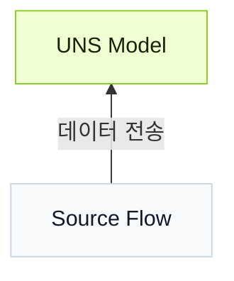

import { Steps } from '@astrojs/starlight/components';

Tier0에 데이터를 연결하려면 먼저 **UNS**에서 model을 만들고, 그 다음 **Source Flow**를 통해 데이터 소스를 UNS model destination으로 연결합니다.


```mermaid
flowchart BT
  uns["UNS Model"]
  flow["Source Flow"]


  flow -->|"데이터 전송"| uns

  classDef t0accent fill:#EFFFD2,stroke:#8AC926,stroke-width:1px,color:#18230B
  classDef t0node fill:#F8FAFC,stroke:#CBD5E1,stroke-width:1px,color:#111827
  class uns t0accent
  class flow t0node
```
## 데이터 모델 구축 방법
간단한 folder-file 구조를 기반으로 데이터 계층을 tree map으로 정의합니다.

### Model을 수동으로 만들기

:::note[예시 Model]
**Model**:
```
  Factory_A
  └── Site_01
      └── SMT_Line_1
          └── Metric
              └── Machine_001
```
**Payload**:
```json
"temperature": 85,
"vibration": 2.8
```
:::
<Steps>
1. **UNS**에서 root path `Factory_A`를 추가합니다.
2. `Factory_A` 아래에 두 번째 path `Site_01`를 추가하고, tree map에 표시된 계층 순서대로 나머지 path를 추가합니다.
3. `SMT_Line_1` 아래에 topic `Machine_001`를 추가하고 **Topic Type**을 **Metric**으로 설정합니다.
4. topic payload를 정의합니다. `temperature`와 `vibration` 두 field를 추가하고 data type을 설정합니다.
5. **Mock Data**를 선택해 model로 simulated data를 보내고, **Enable History**를 선택해 데이터를 database에 저장합니다.
</Steps>

:::tip[추가 parameter]
**Auto Parsing**은 JSON text를 parsing해 일반 field로 변환합니다.
:::

### Model 가져오기
:::tip
ChatGPT 같은 LLM을 사용해 model import를 도울 수 있습니다.
:::

<Steps>
1. **Import** window에서 template JSON을 복사하거나 template file을 다운로드합니다.
2. template을 AI에 보내고 다음과 비슷한 prompt를 사용합니다.
    ```
    Generate a UNS model used for xx in xx plant, including xx equipment and data sources based on the template.
    ```
3. 생성된 결과를 UNS로 import합니다.
</Steps>

## UNS에 데이터 연결하기
**Source Flow**는 **Node-RED**를 기반으로 하며, 데이터 소스를 Tier0에 연결하는 데 사용됩니다.
:::tip[Source Flow 이해하기]
**Source Flow**에서는:
- 모든 flow가 **mqtt out** node로 끝납니다. 이 node는 MQTT client로 동작해 broker에 데이터를 publish합니다.
- UNS broker는 flow와 같은 이름의 **mqtt out** node 안에 포함되어 있습니다.
- UNS model을 topic으로 사용하면 데이터가 **UNS**의 해당 model로 직접 들어갑니다.
:::
<Steps>
1. **Flows**에서 **Source Flow**를 만듭니다.
2. 데이터 소스 유형에 맞는 node를 사용하고, flow의 끝에 **mqtt out** node를 배치합니다.
3. node의 **Server**가 UNS broker로 설정되어 있는지 확인합니다.
4. MQTT topic으로 **UNS** model을 사용합니다. 예: `Factory_A/Site_01/SMT_Line_1/Metric/Machine_001`.
</Steps>

## 추가 옵션
:::note
이 섹션은 workflow와 관련된 추가 parameter 또는 configuration을 설명합니다.
:::

| Scope | Parameter | Item | When to use |
|------|-----------|------|-------------|
| Path | Extended Attribute/Custom Attributes | - | path에 unit 정보 같은 추가 attribute를 넣어야 할 때 사용합니다. |
| Topic | Topic Type | [Metric, State, Action](../uns-concepts/#metric-state-action) | 측정값, 현재 상태, 실행 작업처럼 데이터 의미에 맞는 topic type을 선택합니다. |
| Topic | Attribute Generation Method | Pre-defined | topic attribute를 하나씩 직접 설정합니다. |
| Topic | Attribute Generation Method | Auto-Parsing | JSON text에서 attribute를 batch로 자동 변환합니다. |

## 다음 단계

- [UNS에서 앱 구축](../build-apps/) - UNS 데이터로 산업 애플리케이션을 구축합니다.
- [UNS 데이터 분석](../analyze-data/) - Marimo Notebook과 Python으로 UNS 데이터를 분석합니다.
