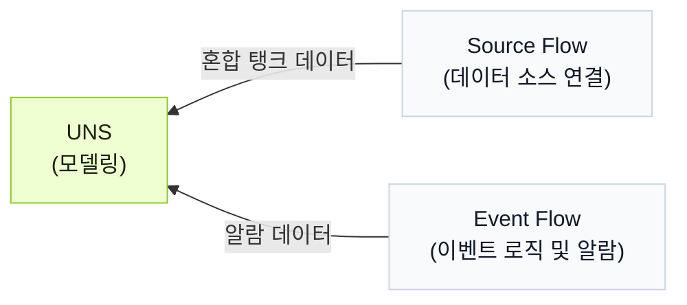

import { Steps } from '@astrojs/starlight/components';
import { Tabs, TabItem } from '@astrojs/starlight/components';

Tier0는 UNS 모델 옆에 agent를 제공하여 자연어로 UNS와 flow를 조작할 수 있게 합니다.

:::note[UNS agent가 필요한 이유]
여러 모듈을 오가며 데이터 모델링, 연결, 이벤트 구성을 단계별로 수행하는 대신, UNS agent가 대화만으로 이를 처리합니다.
:::

## Workflow 배경
:::note
agent가 작업을 대신 수행하는 과정을 간단히 보여주기 위해 예제 workflow를 사용합니다.
:::
혼합 탱크는 재료를 가열하면서 섞는 데 사용됩니다. 데이터 모델을 만들고 온도, 수위, 히터 상태를 수집하여 탱크 과열 여부를 판단하고 알람을 트리거합니다.

<div className="t0-compact-mermaid">



</div>

## Workflow 구축 방법
<Steps>
1. Tier0에 로그인하고 **UNS**로 이동한 뒤, 오른쪽의 UNS agent와 대화를 시작합니다.
2. 대화 권한을 `full_access`로 변경하고 prompt를 입력합니다.
    ```text
    혼합 탱크의 온도, 수위, 히터 상태를 나타내는 데이터 모델을 생성하세요. 온도와 수위는 하나의 metric topic에, 히터 상태는 state topic에 배치하세요.
    ```
3. 모델이 완성된 것을 확인한 뒤 prompt를 입력하여 agent가 해당 데이터를 모델에 연결하도록 합니다.
    ```text
    이 2개의 topic으로 데이터를 보내는 source flow를 생성하고, 합리적인 데이터를 시뮬레이션하세요.
    ```
    :::tip[실제 데이터 소스가 있는 경우]
    데이터 소스 정보를 agent에게 알려주고 연결하도록 합니다.
    :::
4. 다음 로직으로 event를 생성하는 prompt를 입력합니다.
    - 낮은 수위 warning: 수위가 20% 미만이고 히터가 켜져 있을 때 트리거됩니다.
    - 공가열 alarm: 수위가 15% 미만이고 온도가 90°C를 초과하며 히터가 켜져 있을 때 트리거됩니다.
    ```md
    다음 알람 로직에 대한 Event Flow를 생성하세요:
      - Warning: level < 20 이고 heater_status = true 일 때 트리거합니다.
      - Critical: level < 15, temperature > 90, heater_status = true 일 때 트리거합니다.
      - level > 25 또는 heater_status = false 일 때 활성 알람을 해제합니다.
    기존 source path 아래에 알람 결과를 받을 새 topic을 생성하세요. 출력에는 알람 레벨, 메시지, 활성 상태, timestamp를 포함하세요.
    ```
5. **UNS**에서 결과를 확인합니다.
</Steps>

