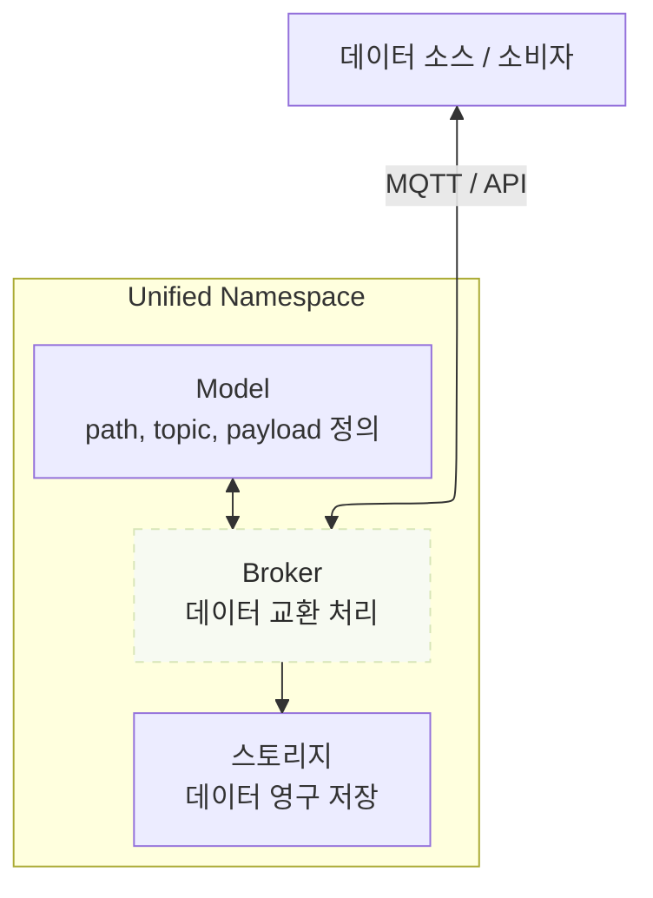
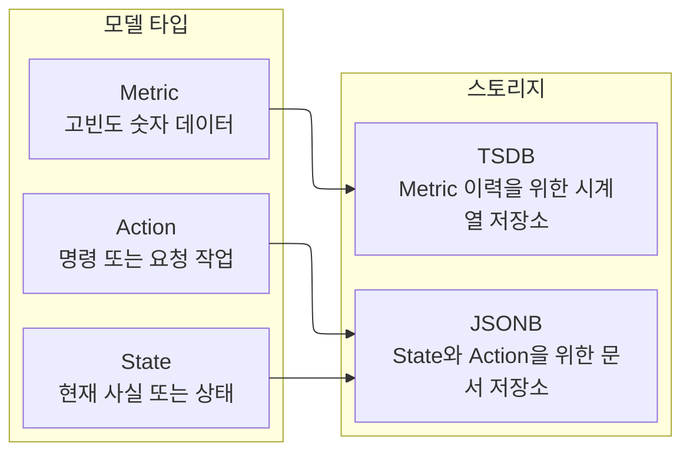

import { Tabs, TabItem } from '@astrojs/starlight/components';


Tier0에서 공장 데이터는 UNS(Unified Namespace) 방법론을 기반으로 명확한 트리 구조의 모델로 구성되어 통합 데이터 기반을 형성합니다.
- Broker는 model topic을 통해 데이터를 수신하고 전송합니다.

<div className="t0-uns-foundation-mermaid t0-uns-foundation-mermaid--flow">

</div>
- Model은 **Metric**, **State**, **Action** 세 가지 type으로 분류됩니다.
- 데이터는 model type에 따라 서로 다른 database에 저장됩니다.
    - **Action/State**: JSONB (PostgreSQL)
    - **Metric**: real-time data(TSDB)

<div className="t0-uns-foundation-mermaid t0-uns-foundation-mermaid--types">

</div>
## Model
:::tip[model을 만들 때 어떤 guide를 따라야 하나요?]
데이터가 무엇을 나타내는지에 따라 modeling 방법을 선택합니다.
- **Physical Data**: machine에서 나오는 real-time data입니다. 보통 **ISA-95** standard를 기반으로 하며 location hierarchy에 크게 의존합니다.
- **Business Data**: 생산 요구사항, schedule, task, dispatching과 관련된 데이터입니다. 보통 **business domain**과 **object** 중심으로 구성합니다.
:::
### Metric, State, Action
산업 데이터는 collection frequency와 목적이 서로 다르기 때문에 Tier0는 UNS model을 세 가지 고정 type으로 구분합니다.

| Type | Why | Example |
|---|---|---|
| `METRIC` | 지속적으로 수집되고 time-series storage가 필요한 고빈도 데이터를 위해 설계되었습니다. | machine temperature / pressure / voltage |
| `STATE` | 더 낮은 빈도로 변경되며 object의 현재 condition 또는 fact를 설명하는 데이터를 위해 설계되었습니다. | machine operational status |
| `ACTION` | 외부 system 또는 operator가 실행해야 하는 command를 기록하는 저빈도 command data를 위해 설계되었습니다. | start batch, stop machine |

### Path/Topic, Payload
각 UNS model은 path, topic, payload로 구성됩니다. 이들은 함께 business context를 담고 산업 데이터를 전달하는 **tree** 구조를 이룹니다.
- **Path/Topic**: path는 data ownership을 나타내고 topic은 message payload를 담습니다. 둘의 조합이 ***model address***입니다.
- **Payload**: topic이 보유한 message payload입니다. JSON **key-value** 형식이며 ***model data***를 정의합니다.

예를 들어 UNS의 model은 아래 tree처럼 보입니다.
<Tabs>
	<TabItem label="Physical Data">
```
  Factory_A
  └── Site_01
      └── SMT_Line_1
          └── Metric
              └── Machine_001
```
- **Path**: `Factory_A/Site_01/SMT_Line_1/Metric`
- **Topic**: `/Machine_001`.
- **Payload**
    ```json
    "temperature": 85,
    "vibration": 2.8,
    ```
</TabItem>
<TabItem label="Business Data">
```
  Factory_A
  └── ERP
      └── ProductionOrders
          └── State
              └── OrderList
```
- **Path**: `Factory_A/ERP/ProductionOrders/State`
- **Topic**: `/OrderList`.
- **Payload**
    ```json
    "orders": "0123569876",
    "updated_at": "2026-7-13",
    ```
</TabItem>
</Tabs>

:::tip[model을 만들려면]
[데이터 모델 구축 방법](../connect-data/#데이터-모델-구축)을 확인하세요.
:::

## Broker
Tier0에서 broker는 data model을 기반으로 MQTT 또는 OpenAPI를 통해 데이터를 수신하고 전송하는 platform component입니다.
- **By MQTT**: model tree의 각 node 전체 path가 message payload를 전달하는 topic address로 동작합니다.
- **By OpenAPI**: HTTP request를 통해 data model에 대한 CRUD command를 수행합니다.
:::tip[API 참조]
API 세부 정보는 [API 참조](../../reference/tier0-openapi/)를 확인하세요.
:::

## Storage
Tier0는 PostgreSQL을 사용해 데이터를 저장합니다. data type마다 변경 빈도와 storage requirement가 다릅니다.

| Data Type | Storage | Description |
|-----------|---------|-------------|
| `METRIC` | Time-series database | temperature, pressure 같은 고빈도 measurement에 최적화되어 있습니다. 각 topic에는 기본 field `timestamp`와 `quality`가 포함됩니다. |
| `STATE` | PostgreSQL | machine 또는 system state를 유연한 `JSONB` format으로 저장합니다. |
| `ACTION` | PostgreSQL | command 또는 action payload를 유연한 `JSONB` format으로 저장합니다. |

## 다음 단계

- [UNS에 데이터 연결](../connect-data/) - plant를 UNS로 model화하고 데이터를 model에 연결하는 방법입니다.
- [UNS 데이터 작업](../working-with-uns-data/) - MQTT와 API로 UNS model을 운영하는 방법입니다.
