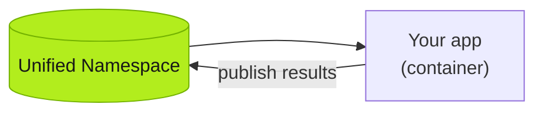
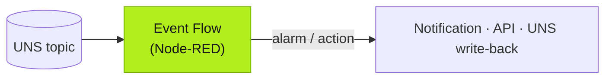

:::caution[TODO — 写作线索 (Huize)]
两个小节。**容器就是 App**:讲什么是 Tier0 App,如何将完整的容器部署在 Tier0 Edge 和 Enterprise 中——建议覆盖:app 的容器规格(镜像要求、环境变量注入 UNS 连接信息)、部署流程(Edge 单机 / Enterprise 集群)、app 如何消费与回写 UNS、Launchpad 的关系。**Using Event Flow to Build Logics**:讲 Event Flow 如何完成逻辑,例如触发报警;以及如何将 Event Flow 作为 Tier0 App 的后端——建议覆盖:订阅 topic → 处理 → 发布/动作 的模式、报警示例(阈值判断 + 通知节点)、EventFlow 作为 app 后端的架构图、和 SourceFlow 的分工。**editions 待确认**:容器部署适用 Edge/Enterprise,Cloud 是否支持自定义容器?确认后补 frontmatter `editions`。
:::

*(Placeholder — this page will be rewritten. The skeleton below marks the intended structure.)*

## A container is an app

> TODO: what a Tier0 app is; container spec; how apps read from and publish back into the UNS.

### Deploy on Edge

> TODO: single-machine deployment steps.

### Deploy on Enterprise

> TODO: cluster deployment, multi-instance considerations.

## Using Event Flow to build logic

> TODO: subscribe → process → act pattern; alarm example (threshold + notification); Event Flow as the app backend.

### Example: threshold alarm

> TODO: real flow walkthrough.

### Event Flow as an app backend

> TODO: pairing a frontend container with Event Flow logic.

## Next

- [Analyze UNS Data](/using-tier0/analyze-data/)
- [Best practice: connecting industrial protocols](/best-practice/protocol-connections/)
