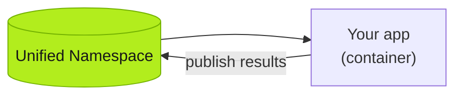
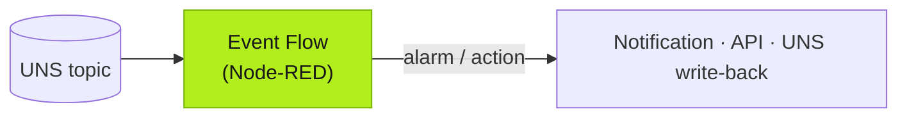

:::caution[TODO — 写作线索 (Huize)]
**容器就是 App**:讲什么是 Tier0 App,如何将完整的容器部署在 Tier0 Edge 和 Enterprise 中。

**Using Event Flow to Build Logics**:讲 Event Flow 如何完成逻辑,例如触发报警。以及如何将 Event Flow 作为 TIER0 APP 的后端。
:::

*(Placeholder — this page will be rewritten. The skeleton below marks the intended structure.)*

## A container is an app

> TODO: 什么是 Tier0 App。

### Deploy on Tier0 Edge

> TODO

### Deploy on Tier0 Enterprise

> TODO

## Using Event Flow to build logics

> TODO: Event Flow 如何完成逻辑,例如触发报警。

### Event Flow as the app backend

> TODO: 如何将 Event Flow 作为 Tier0 App 的后端。

## Next

- [Analyze UNS Data](/using-tier0/analyze-data/)
- [Best practice: connecting industrial protocols](/best-practice/protocol-connections/)
