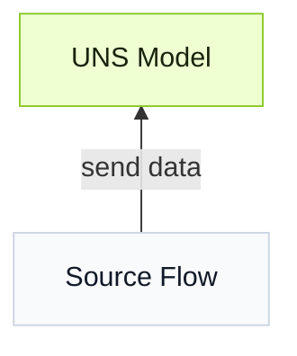

import { Steps } from '@astrojs/starlight/components';

First build a model in **UNS**, then connect data through **Source Flow** to the model, forming a data foundation for subsequent use.


{/* 
:::note
The process can be done through conversations with the UNS agent. Check [here](../../best-practice/building-data-workflow-with-agent/) for details.
::: */}

## Build a Data Model
Define the data hierarchy as a tree map according to:
  - The physical location the data comes from ([ISA-95](../../reference/isa-95-equipment-hierarchy/));
  - The business logic the data conforms to.

### Build Models Manually

:::tip[Use drafts to verify models first]
Create or import models in **Draft** to verify whether the models conform to model principles and deploy them after validity.
:::

<Steps>
1. Design the model structure, and add paths by order before adding the topic.
2. Set **Topic Type** among **Metric**, **State** and **Action** based on [data features](../uns-concepts/#metric-state-action).
3. Select **Mock Data** to send simulated data to the model, and **Enable History** to store the data to database.
    
    :::note
    A flow will be created in **Flows** to send simulated data to the model.
    :::

4. Add data fields to the topic with the correct data types by **Auto Parsing** or **Pre-defined**.
    - **Auto Parsing**: Convert fields automatically from JSON text in batches.

        ```json
        {
          "temp":85.5
        }
        ```
        :::caution
        Can only parse single layer JSON, and for multi-layer JSON, only the first layer will be parsed.
        :::
    - **Pre-defined**: Manually set fields for the topic one by one.
</Steps>

### Import Models
:::tip
Use LLMs like ChatGPT to help import models.
:::

<Steps>
1. Send the template JSON from **Import** to AI, and use a similar prompt.
    ```
    Generate a UNS model used for xx in xx plant, including xx equipment and data sources based on the template.
    ```
2. Import the generated result in UNS.
</Steps>


## Connect Data to UNS

### Data Flow Features
- Based on Node-RED.
- Every flow ends with an `mqtt out` node. It works as an MQTT client to publish data to the UNS broker.
- The UNS broker is embedded in the `mqtt out` and `mqtt in` nodes with the same name as the flow.
- When a UNS model is used as the topic, data goes directly to the corresponding model in **UNS**.

### Steps

<Steps>
1. Use nodes based on the data source type to build a flow, and end it with an `mqtt out` node.

    :::tip[If you need nodes that are not there]
    Install nodes from Node-RED community for your requirements. Official nodes often start with `node-red-contrib`.
    :::
2. Make sure the **Server** of the `mqtt out` node is set to the UNS broker, and topic is a model from **UNS**.
</Steps>

### Flow Version Management
Save versions of the data flow, so you can either roll back to an earlier version or start a new flow with a history version.
:::caution
Version rollback is not supported for Edge edition.
::: 
## Next

- [Build Apps on UNS](../build-apps/) — Build industrial applications with UNS data.
- [Analyze UNS Data](../analyze-data/) — Analyze UNS data with Marimo Notebook and Python.


