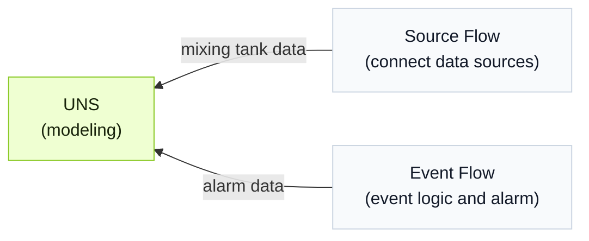

import { Steps } from '@astrojs/starlight/components';
import { Tabs, TabItem } from '@astrojs/starlight/components';

Tier0 provides a UNS agent on the **UNS** page so you can operate on UNS models and flows through natural language.

:::note[Why UNS agent exists]
Instead of building data models, connections, and events step by step across different modules, the UNS agent handles the workflow through conversation.
:::

## Workflow Background
:::note
This example workflow demonstrates how the agent can handle the work for you.
:::
A mixing tank mixes materials while heating them. Build a data model and collect temperature, water level, and heater status to determine whether the tank is overheated and trigger an alarm.

<div className="t0-compact-mermaid">



</div>

## How to Build the Workflow?
<Steps>
1. Log in to Tier0, go to **UNS** and start a conversation with the UNS agent on the right side.
2. Change the conversation permission to `full_access`, and enter the prompt.
    ```text
    Create a data model representing the temperature, water level and heater status of a mixing tank, temperature and level in one metric topic and heater status in a state topic.
    ```
3. Once you confirm that the model is complete, enter the prompt and let the agent connect the corresponding data to the model.
    ```text
    Create a source flow to send data to these 2 topics, simulate reasonable data.
    ```
    :::tip[When you have actual data sources]
    Tell the agent your data source information and have it connect them.
    :::
4. Enter the prompt to create an event with the following logic.
    - Low water level warning: Triggered when the water level is below 20% and the heater is on.
    - Dry-heating alarm: Triggered when the water level is below 15%, temperature is above 90°C and the heater is on.
    ```md
    Create an Event Flow for the following alarm logic:
      - Warning: Trigger when level < 20 and heater_status = true.
      - Critical: Trigger when level < 15, temperature > 90, and heater_status = true.
      - Clear the active alarm when level > 25 or heater_status = false.
    Create a new topic under the existing source path to receive the alarm result. Include the alarm level, message, active status, and timestamp in the output.
    ```
5. Check the results on **UNS**.
</Steps>
