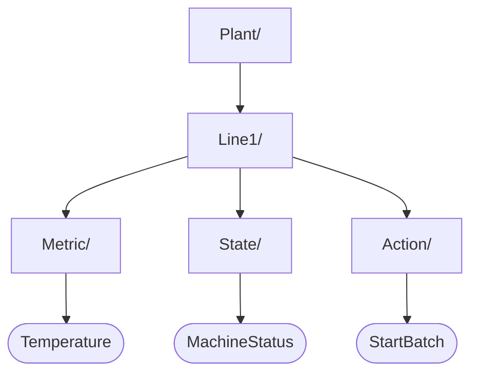

Data collected to Tier0 UNS is categorized into 3 types: **Metric**, **State**, and **Action**.
Different types correspond to different storage methods.

## Metric, State, Action

| Topic type | Carries | Example |
|---|---|---|
| `METRIC` | Real-time data | Machine temperature/pressure/voltage |
| `STATE` | Status data | Machine operational status |
| `ACTION` | Commands or events | Start batch, stop machine |

## How the UNS stores data

| Data Type | Storage | Description |
|-----------|---------|-------------|
| `METRIC` | Time-series database | Optimized for high-frequency measurements such as temperature and pressure. Each topic includes default fields: `timestamp` and `quality`. |
| `STATE` | PostgreSQL (JSONB) | Stores machine or system states in a flexible JSON format. |
| `ACTION` | PostgreSQL (JSONB) | Stores commands or actions in a flexible JSON format. |

## Next

- [Connect Data to UNS](/using-tier0/connect-data/) — How to model your plant to UNS and connect data to the model.
- [Working with UNS Data](/using-tier0/working-with-uns-data/) — How to operate on your UNS model through MQTT and APIs.
