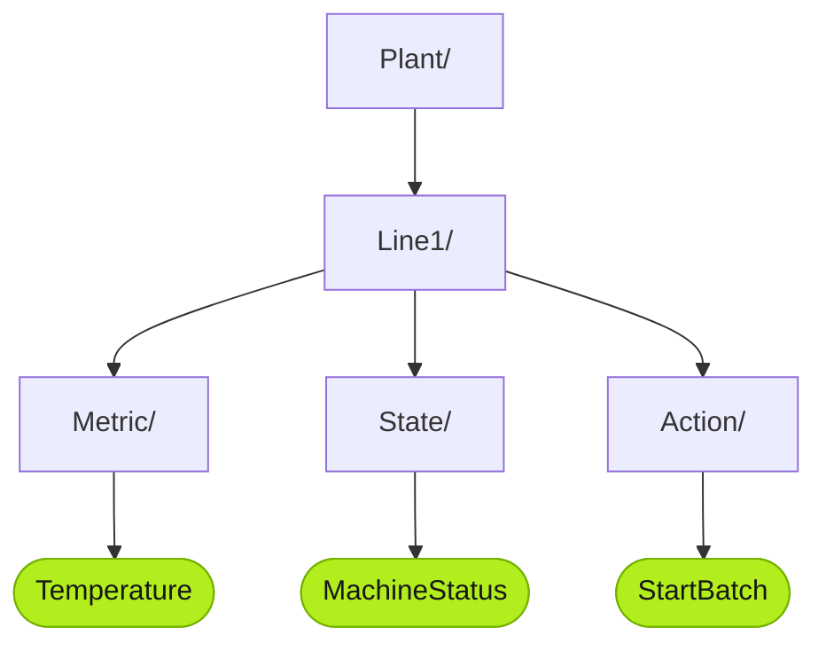

:::caution[TODO — 写作线索 (Huize)]
这部分讲 UNS 的 State、Action、Metric,以及 UNS 如何存储。
:::

*(Placeholder — this page will be rewritten. The skeleton below marks the intended structure.)*

## Metric, State, Action

> TODO

| Topic type | Carries | Example |
|---|---|---|
| `METRIC` | — | — |
| `STATE` | — | — |
| `ACTION` | — | — |

## How the UNS stores data

> TODO

## Next

- [Connect Data to UNS](/using-tier0/connect-data/)
- [Working with UNS Data](/using-tier0/working-with-uns-data/)
