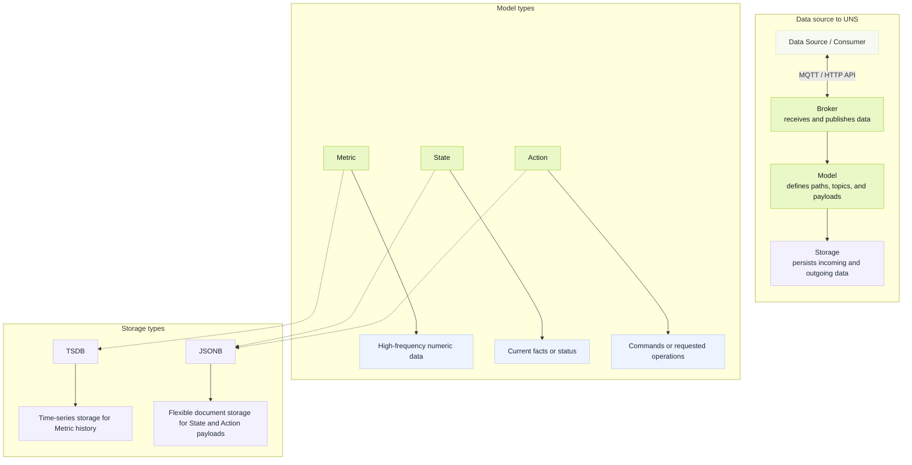

import { Tabs, TabItem } from '@astrojs/starlight/components';

In Tier0, the UNS (Unified Namespace) is organized around three parts: **Model**, **Broker**, and **Storage**.

- Models are categorized into three types, **Metric**, **State**, and **Action**, based on the data being collected.
- The broker receives and sends data through model-defined topics.
- Incoming and outgoing data is stored in different databases based on model type.
    - **Action/State**: JSONB (PostgreSQL)
    - **Metric**: Real-time data (TSDB)


```mermaid
flowchart TB
  subgraph dataFlow["Data source to UNS"]
    direction TB
    source["Data Source / Consumer"]
    broker["Broker<br/>receives and publishes data"]
    model["Model<br/>defines paths, topics, and payloads"]
    storage["Storage<br/>persists incoming and outgoing data"]

    source <-->|"MQTT / HTTP API"| broker
    broker --> model
    model --> storage
  end

  subgraph modelTypes["Model types"]
    direction LR
    metric["Metric"] --> metricData["High-frequency numeric data"]
    state["State"] --> stateData["Current facts or status"]
    action["Action"] --> actionData["Commands or requested operations"]
  end

  subgraph storageTypes["Storage types"]
    direction LR
    tsdb["TSDB"] --> tsdbUse["Time-series storage for Metric history"]
    jsonb["JSONB"] --> jsonbUse["Flexible document storage for State and Action payloads"]
  end

  metric -.-> tsdb
  state -.-> jsonb
  action -.-> jsonb

  classDef t0source fill:#F7FAF2,stroke:#D8E6B8,stroke-width:1px,color:#2A2A2A
  classDef t0uns fill:#EAF8C8,stroke:#A6CF38,stroke-width:1px,color:#171717
  classDef t0data fill:#EEF4FF,stroke:#B7C7E8,stroke-width:1px,color:#1F2937
  classDef t0storage fill:#F4F1FF,stroke:#C7B7E8,stroke-width:1px,color:#1F2937

  class source t0source
  class broker,model,metric,state,action t0uns
  class metricData,stateData,actionData t0data
  class storage,tsdb,jsonb,tsdbUse,jsonbUse t0storage
```
## Model
:::tip[Which guide should I follow when building a model?]
Choose the modeling approach based on what the data represents.
- **Physical Data**: Real-time data from physical machines. It is organized based on the **ISA-95** standard and relies heavily on location hierarchy.
- **Business Data**: Data related to production requirements, schedules, tasks, and dispatching. It is usually organized by **business domain and object**.
:::
### Metric, State, Action
Industrial data changes at different frequencies and serves different purposes, so Tier0 separates UNS models into three fixed types.

| Type | Object | Example |
|---|---|---|
| `METRIC` | Designed for high-frequency data that is collected continuously and needs time-series storage. | Machine temperature/pressure/voltage |
| `STATE` | Designed for data that changes less often and describes the current condition or fact of an object. | Machine operational status |
| `ACTION` | Designed for lower-frequency command data that records what an external system or operator should execute. | Start batch, stop machine |


### Path/Topic, Payload
Each UNS model contains a path, topic, and payload. Together, they form a **tree** structure that carries business context and transports industrial data.
- **Path/Topic**: The path represents data ownership, and the topic carries the message payload. Together, they define the ***model address***.
- **Payload**: The message payload held by the topic. It is JSON in a **key-value** format and defines the ***model data***.

For example, a model in UNS looks like the tree displayed below:
<Tabs>
	<TabItem label="Physical Data">
```
  Factory_A
  └── Site_01
      └── SMT_Line_1
          └── Metric
              └── Machine_001
```
- **Path**: `Factory_A/Site_01/SMT_Line_1/Metric`
- **Topic**: `/Machine_001`.
- **Payload**
    ```json
    "temperature": 85,
    "vibration": 2.8,

    ```
</TabItem>
<TabItem label="Business Data">
```
  Factory_A
  └── ERP
      └── ProductionOrders
          └── State
              └── OrderList
```
- **Path**: `Factory_A/ERP/ProductionOrders/State`
- **Topic**: `/OrderList`.
- **Payload**
    ```json
    "orders": "0123569876",
    "updated_at": 2026-7-13,
    ```
</TabItem>
</Tabs>

:::tip[To build a model]
See [How to Build a Data Model](../connect-data/#how-to-build-a-data-model).
:::

## Broker
In Tier0, the UNS broker is the platform component that receives and sends data through MQTT or OpenAPI based on data models.
- **By MQTT**: The complete path of each node in the model tree works as the topic address to pass the message payload.
- **By OpenAPI**: Perform CRUD commands on data models through HTTP requests.
:::tip[API Reference]
For API details, see [API Reference](../../reference/tier0-openapi/).
:::

## Storage
Tier0 uses PostgreSQL to store data. Different data types change at different rates and have different storage requirements.

| Data Type | Storage | Description |
|-----------|---------|-------------|
| `METRIC` | TSDB | Optimized for high-frequency measurements such as temperature and pressure. Each topic includes default fields: `timestamp` and `quality`. |
| `STATE` | PostgreSQL | Stores machine or system states in a flexible `JSONB` format. |
| `ACTION` | PostgreSQL | Stores commands or actions in a flexible `JSONB` format. |

## Next

- [Connect Data to UNS](../connect-data/) - How to model your plant to UNS and connect data to the model.
- [Working with UNS Data](../working-with-uns-data/) - How to operate on your UNS model through MQTT and APIs.
