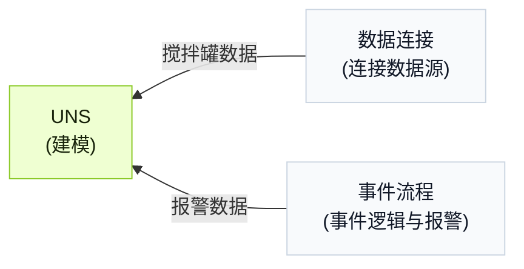

import { Steps } from '@astrojs/starlight/components';

UNS Agent 支持通过自然语言对话简单快速对工厂数据进行建模，连接机器数据并针对数据构建报警事件。

## 工作流背景

一个搅拌罐在加热材料的同时完成混合。构建数据模型并采集温度、水位和加热器状态，用于判断搅拌罐是否过热并触发报警。

<div className="t0-compact-mermaid">



</div>

## 如何构建工作流

<Steps>
1. 在 **UNS** 中使用 `full_access` 与 UNS Agent 开始对话。
2. 输入提示词来构建 UNS 模型。
    ```text
    创建一个表示搅拌罐温度、水位和加热器状态的数据模型，温度和水位放在一个 metric topic 中，加热器状态放在一个 state topic 中。
    ```
3. 确认模型完整后，输入提示词，让 Agent 将对应数据连接到模型。
    ```text
    创建一个数据连接，向这 2 个 topic 发送数据，并模拟合理的数据。
    ```

    :::tip[当你有真实数据源时]
    告诉 Agent 你的数据源信息，让它完成连接。
    :::

4. 输入提示词，按照以下逻辑创建事件。
    - 低水位预警：当水位低于 20% 且加热器开启时触发。
    - 干烧报警：当水位低于 15%、温度高于 90°C 且加热器开启时触发。

    ```md
    为以下报警逻辑创建一个事件流程：
      - Warning：当 level < 20 且 heater_status = true 时触发。
      - Critical：当 level < 15、temperature > 90 且 heater_status = true 时触发。
      - 当 level > 25 或 heater_status = false 时清除当前报警。
    在现有 UNS 模型下创建一个新 topic 来接收报警结果。输出中包含报警等级、消息、是否激活和时间戳。
    ```
5. 在 **UNS** 中检查结果。
</Steps>

:::note
每一步完成后，都可以继续和 Agent 对话来优化结果。
:::
