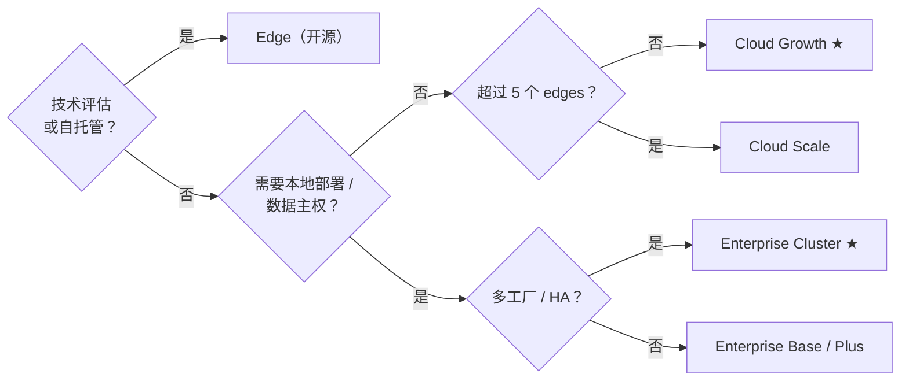

Tier0 是同一平台的三个版本。命名空间模型、flows、CLI 相同——差别在于谁来运维，以及你能获得多少平台能力。

<section class="t0-board not-content">
	

		

			

				
开源

			

			

				

					<h3>Edge</h3>
					
在单机上运行的 UNS 基础能力，完全由你掌控。

					
适合技术评估、PoC，以及能够自行运维开源软件的团队。

				

				

					

						Apache-2.0
						免费
						
UNS 核心、SourceFlows/EventFlows、历史存储——单机 Docker 部署。

					

					<a class="t0-col-cta" href="https://github.com/FREEZONEX/Tier0-Edge">在 GitHub 克隆</a>
				

			

		

		

			

				
托管 SaaS

			

			

				

					<h3>Cloud 大多数团队从这里开始</h3>
					
完整平台，由我们为你运维。

					
第一天即可使用 apps、notebooks 和 launchpad，无需自行运行基础设施。

				

				

					

						Builder
						$199/seat/mo
						
仅用于应用生成。

					

					

						Growth ★
						$20,000/yr
						
最多 5 个 edges。适合单工厂、少量应用，并希望快速启动的用户。

					

					

						Scale
						$38,000/yr
						
最多 10 个 edges。适合多工厂、多应用的用户。

					

					<a class="t0-col-cta" href="https://tier0.dev/login">开始 14 天试用</a>
				

			

		

		

			

				
私有化部署

			

			

				

					<h3>Enterprise</h3>
					
完整平台，按你的要求部署。

					
适合数据主权、规模化、治理和企业级监管需求。

				

				

					

						Base
						$10,000/yr
						
统一数据基础。少量单用途应用。

					

					

						Plus
						$20,000/yr
						
单实例。单工厂数据集成，支持多个使用场景的应用。

					

					

						Cluster ★
						$39,900+/yr
						
多实例。多工厂、多应用、集中式私有云管理。

					

					<a class="t0-col-cta" href="https://tier0.app/talk-to-team">联系团队</a>
				

			

		

	

</section>

**Add-ons：** 额外 edge 节点 $2,000 /edge/年 · 额外实例 $10,000 /instance/年。价格仅供参考——以 [tier0.app/pricing](https://tier0.app/pricing) 为准。

:::note[特殊术语说明]
在 Cloud 套餐中，edge 是与云端 Tier0 通信的连接节点。它可以是 Edge Tier0，也可以是网关或工业 PC。
:::

## 能力矩阵

| 能力 | Edge | Cloud | Enterprise |
|---|---|---|---|
| UNS / 数据建模 | &#10003; 单机 UNS | &#10003; Growth / Scale | &#10003; Base / Plus / Cluster |
| 工业协议 | &#10003; MQTT | &#10003; Growth / Scale：MQTT、REST、i3X、OPC UA | &#10003; Base：MQTT；Plus / Cluster：MQTT、REST、i3X、OPC UA |
| UNS Agent | &#215; | &#10003; Growth / Scale | &#215; |
| Notebook（高级分析） | &#215; | &#10003; Growth / Scale | &#10003; Plus / Cluster |
| Vision | &#215; | &#10003; Scale | &#10003; Plus / Cluster |
| Anchor | &#215; | &#10003; Scale | &#10003; Cluster |
| App Builder + Template Library | &#215; | &#10003; Builder / Growth / Scale | &#215; |
| LaunchPad / My Apps | &#215; | &#10003; Builder / Growth / Scale | &#10003; Base / Plus / Cluster |
| 审计 / 应用与系统日志 | &#215; | &#10003; Growth / Scale | &#10003; Plus / Cluster；Cluster 支持 SIEM |
| HA / 多实例 / 治理 | &#215; | &#215; | &#10003; Cluster |
| 运维 | 你自己 | FREEZONEX | 你自己，附带支持 |

## Edge 硬件要求

:::tip[如果你想使用 Edge]
Edge 面向技术评估，需要一定的运维经验。
使用前请确保你的环境满足以下硬件要求。
:::

| | 最低配置 | 推荐配置 |
|---|---|---|
| CPU | 4 cores | 8 cores |
| Memory | 8 GB | 16 GB |
| Disk | 100 GB (1000 IOPS) | 1 TB |
| OS | Ubuntu 24.04、Windows 10/11 (Docker) | - |

## 决策树

还不确定选择哪个版本？沿着路径判断。

## 什么是 “edge”（计量单位）？

在 Cloud 套餐中，*edge* 是靠近设备采集数据的连接点——通常是运行采集 flows 的网关或工业 PC——并将数据发布到命名空间。大致按每个站点或隔离网段计一个。不要与上方的 **Edge 版本**（开源发行版）混淆。

## 下一步

- [在 UNS 上构建应用](../../using-tier0/build-apps/) — 在 Edge 与 Enterprise 上部署容器
- [安装](../installation/) — 14 天 Cloud 试用包含完整平台
