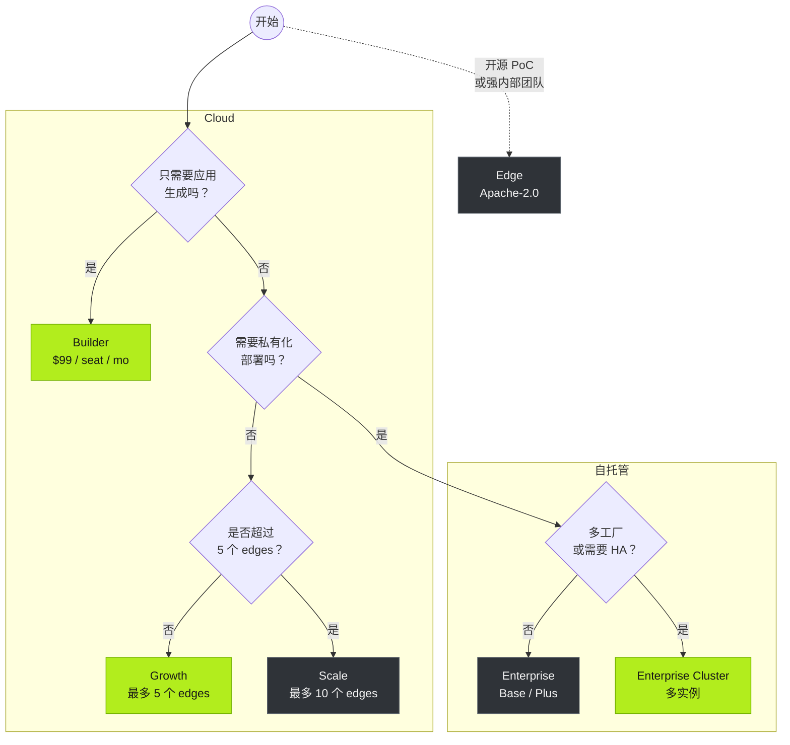

Tier0 提供三个版本。每个版本都有不同的功能、套餐和能力边界。

<section class="t0-board t0-frame not-content">
	
	

		

			
开源

			<h3>Edge</h3>
			
在单机上运行的 UNS 基础能力，完全由你掌控。

			
适合技术评估、PoC，以及能够自行运维开源软件的团队。

			

				

					Apache-2.0
					免费
					
UNS 数据集成、历史存储，单机 Docker 部署。

				

			

			<a class="t0-col-cta" href="https://github.com/FREEZONEX/Tier0-Edge">从 GitHub 克隆</a>
		

		

			
托管 SaaS

			多数团队的首选
			<h3>Cloud</h3>
			
完整平台，由 Tier0 为你运维。

			
即刻可用 apps、notebooks 和 launchpad，无需运行基础设施。

			

				

					Builder
					$99/seat/mo
					
仅限于应用生成。

				

				

					Growth 推荐
					$20,000/yr
					
最多 5 个 edges。适合单工厂、少量应用，并希望快速启用的用户。

				

				

					Scale
					$38,000/yr
					
最多 10 个 edges。适合多工厂、多应用的用户。

				

			

			<a class="t0-col-cta t0-cta-btn" href="https://tier0.app/cloud-trial">开始 14 天试用</a>
		

		

			
私有化部署

			<h3>Enterprise</h3>
			
完整平台，按你的要求部署。

			
面向数据主权、规模化、治理与企业级管控的需求。

			

				

					Base
					$10,000/yr
					
统一数据基础。少量单一用途应用。

				

				

					Plus
					$20,000/yr
					
单实例。单工厂数据集成，支持多个使用场景的应用。

				

				

					Cluster 推荐
					$39,900+/yr
					
多实例。多工厂、多应用、集中式私有云管理。

				

			

			<a class="t0-col-cta" href="https://tier0.app/talk-to-team">联系团队</a>
		

	

</section>

**Add-ons**：额外边缘节点 $2,000 /节点/年 · 额外实例 $10,000 /实例/年。价格仅供参考——详情见 [tier0.app/pricing](https://tier0.app/pricing)。

:::note[特殊术语说明]
在 Cloud 套餐中，edge 是与云端 Tier0 通信的连接节点。它可以是 Edge Tier0，也可以是网关或工业 PC。
:::

## 能力矩阵

| 能力 | Edge | Cloud | Enterprise |
|---|---|---|---|
| UNS / 数据建模 | &#10003; 单机 UNS | &#10003; Growth / Scale | &#10003; Base / Plus / Cluster |
| 工业协议 | &#10003; MQTT | &#10003; Growth / Scale：MQTT、REST、i3X、OPC UA | &#10003; Base：MQTT；Plus / Cluster：MQTT、REST、i3X、OPC UA |
| UNS Agent | &#215; | &#10003; Growth / Scale | &#215; |
| Notebook（高级分析） | &#215; | &#10003; Growth / Scale | &#10003; Plus / Cluster |
| Vision | &#215; | &#10003; Scale | &#10003; Plus / Cluster |
| Anchor | &#215; | &#10003; Scale | &#10003; Cluster |
| App Builder + Template Library | &#215; | &#10003; Builder / Growth / Scale | &#215; |
| LaunchPad / My Apps | &#215; | &#10003; Builder / Growth / Scale | &#10003; Base / Plus / Cluster |
| 审计 / 应用与系统日志 | &#215; | &#10003; Growth / Scale | &#10003; Plus / Cluster；Cluster 支持 SIEM |
| HA / 多实例 / 治理 | &#215; | &#215; | &#10003; Cluster |
| 运维 | 自行运维 | FREEZONEX | 自行运维（含技术支持） |

## Edge 硬件要求

:::tip[如果你想使用 Edge]
Edge 面向技术评估，需要一定的运维经验。
使用前请确保你的硬件满足以下要求。
:::

| | 最低配置 | 推荐配置 |
|---|---|---|
| CPU | 4 cores | 8 cores |
| Memory | 8 GB | 16 GB |
| Disk | 100 GB (1000 IOPS) | 1 TB |
| OS | Ubuntu 24.04、Windows 10/11 (Docker) | - |

## 决策树

对版本选择仍有疑惑？可参考以下路径。

## 下一步

- [在 UNS 上构建应用](../../using-tier0/build-apps/) - 使用 UNS 数据构建工业应用。
- [安装](../installation/) - 包含完整平台的 14天 Cloud 试用。
