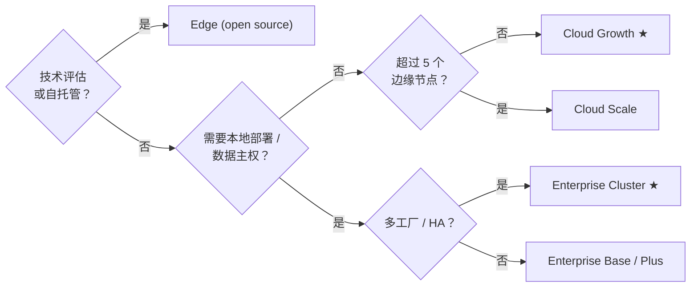

Tier0 提供三个版本。每个版本都有不同的功能、套餐和能力边界。

<section class="t0-board not-content">
	

		

			

				
开源

			

			

				

					<h3>Edge</h3>
					
涵盖 UNS 基础能力，单机运行，私有部署。

					
适合技术评估、PoC，以及能够自行运维开源软件的团队。

				

				

					

						Apache-2.0
						免费
						
UNS 数据集成、历史存储，单机 Docker 部署。

					

					<a class="t0-col-cta" href="https://github.com/FREEZONEX/Tier0-Edge">从 GitHub 克隆</a>
				

			

		

		

			

				
托管 SaaS

			

			

				

					<h3>Cloud 大多数团队从这里开始</h3>
					
完整平台，由 Tier0 为你运维。

					
第一天即可使用 Builder、Notebooks 和应用中心，无需基础设施。

				

				

					

						Builder
						$199/席位/月
						
仅用于应用生成。

					

					

						Growth ★
						$20,000/年
						
最多 5 个边缘节点。适合单工厂、少量应用，并希望快速启动的用户。

					

					

						Scale
						$38,000/年
						
最多 10 个边缘节点。适合多工厂、多应用的用户。

					

					<a class="t0-col-cta" href="https://tier0.dev/login">开始 14 天试用</a>
				

			

		

		

			

				
私有化部署

			

			

				

					<h3>Enterprise</h3>
					
完整平台，按用户要求私有化部署。

					
适合规模化、数据私有、对业务有企业级监管需求的团队。

				

				

					

						Base
						$10,000/年
						
统一数据基础。少量单用途应用。

					

					

						Plus
						$20,000/年
						
单实例。单工厂数据集成，支持多个使用场景的应用。

					

					

						Cluster ★
						$39,900+/年
						
多实例。多工厂、多应用、集中式私有云管理。

					

					<a class="t0-col-cta" href="https://tier0.app/talk-to-team">联系团队</a>
				

			

		

	

</section>

**加油包**：可以根据需求在已有套餐上增加边缘节点和应用数量。详情见 [tier0.app/pricing](https://tier0.app/pricing)。

:::note[特殊术语说明]
在 Cloud 套餐中，边缘节点是与云端 Tier0 通信的节点。它可以是 Edge Tier0，也可以是网关或工业 PC。
:::

## 能力矩阵

| 能力 | Edge | Cloud | Enterprise |
|---|---|---|---|
| UNS / 数据建模 | &#10003; 单机 UNS | &#10003; Growth / Scale | &#10003; Base / Plus / Cluster |
| 工业协议 | &#10003; MQTT | &#10003; Growth / Scale：MQTT、REST、i3X、OPC UA | &#10003; Base：MQTT；Plus / Cluster：MQTT、REST、i3X、OPC UA |
| UNS Agent | &#215; | &#10003; Growth / Scale | &#215; |
| Notebook（高级分析） | &#215; | &#10003; Growth / Scale | &#10003; Plus / Cluster |
| Vision | &#215; | &#10003; Scale | &#10003; Plus / Cluster |
| Anchor | &#215; | &#10003; Scale | &#10003; Cluster |
| App Builder + 模板库 | &#215; | &#10003; Builder / Growth / Scale | &#215; |
| 应用中心 / 我的应用 | &#215; | &#10003; Builder / Growth / Scale | &#10003; Base / Plus / Cluster |
| 审计 / 应用与系统日志 | &#215; | &#10003; Growth / Scale | &#10003; Plus / Cluster；Cluster 支持 SIEM |
| HA / 多实例 / 治理 | &#215; | &#215; | &#10003; Cluster |
| 运维 | 用户 | FREEZONEX | 用户，附带支持 |

## Edge 硬件要求

:::tip[如果你想使用 Edge]
Edge 面向技术评估，需要一定的运维经验。
使用前请确保你的环境满足以下硬件要求。
:::

|项 | 最低配置 | 推荐配置 |
|---|---|---|
| CPU | 4 cores | 8 cores |
| Memory | 8 GB | 16 GB |
| Disk | 100 GB (1000 IOPS) | 1 TB |
| OS | Ubuntu 24.04、Windows 10/11 (Docker)|

## 决策树

还不确定选择哪个版本？用下图决策树辅助判断。

```mermaid
flowchart LR
  q1{"技术评估<br/>或自托管？"} -- "是" --> edge["Edge (open source)"]
  q1 -- "否" --> q2{"需要本地部署 /<br/>数据主权？"}
  q2 -- "否" --> q3{"超过 5 个<br/>边缘节点？"}
  q2 -- "是" --> q4{"多工厂 / HA？"}
  q3 -- "否" --> growth["Cloud Growth ★"]
  q3 -- "是" --> scale["Cloud Scale"]
  q4 -- "是" --> cluster["Enterprise Cluster ★"]
  q4 -- "否" --> baseplus["Enterprise Base / Plus"]
  class growth,cluster t0accent
```

## 下一步

- [在 UNS 上构建应用](../../using-tier0/build-apps/) - 构建并在 Enterprise 上部署 Tier0 应用
- [安装](../installation/)
