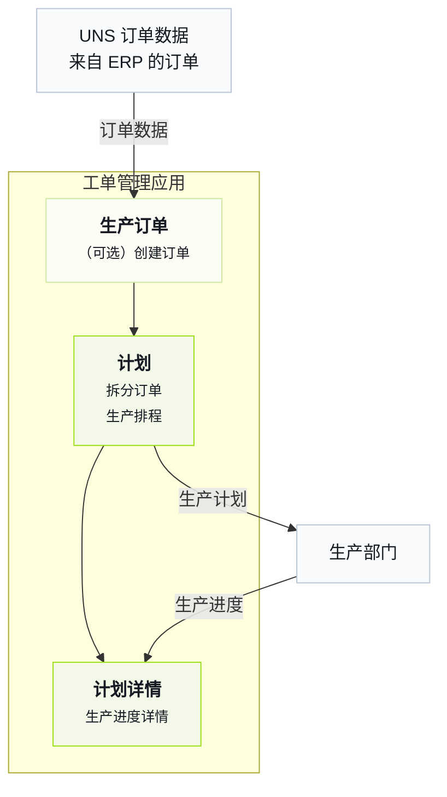

import { Steps } from '@astrojs/starlight/components';

理解 Tier0 最快的方式，是直接查看一个已经可以运行的工厂。
## 工厂业务
Tier0 中的工厂会从 ERP 获取订单，拆分订单，基于订单安排生产计划，发送计划，并在生产过程中获取生产进度数据。

## 了解业务流程
<Steps>
1. 在 Tier0 中进入 **UNS**，查看来自 ERP 的订单详情。
    - `DemoFactory/ERP/ProductionOrders/State/UpsertProductionOrder`：订单。
    - `DemoFactory/ERP/ProductionOrders/State/OrderList`：当前订单列表快照。
    :::tip[这些数据是如何采集到 UNS 的？]
    进入 **Flows** > **Source Flow** > **DemoFactory-Flow**，查看数据采集流程。
    :::
2. （可选）进入 **Launchpad**，打开 **Work Order Management** 应用，在 **Production Orders** 页面创建订单。
3. 在 **Work Order Management** 中，在 **Plans** 页面拆分订单，并为拆分后的工单安排生产计划。
4. 将计划发送到生产，并在 **UNS** 的以下 topics 中查看计划详情。
    - `DemoFactory/ERP/WorkOrderPlan/Metric/SplitCount`：拆分后的工单数量。
    - `DemoFactory/ERP/WorkOrderPlan/State/PlanStatus`：当前计划状态。
    - `DemoFactory/ERP/WorkOrderPlan/State/WorkOrderList`：生产计划排程后的工单列表。

    :::note
    应用会直接将 plans 和 workorders 发送到 **UNS**。
    :::
5. 在应用的 **Plan Details** 页面查看生产进度数据。
    :::tip[详情数据来自哪里？]
    生产进度数据由 **Source Flow** 中的 **DemoFactory-Flow** 采集并发布到 **UNS**，然后展示在 **Plan Details** 页面。
    - `DemoFactory/Site_01/Production/Line_01/WorkOrderExecution/State/CurrentWorkOrder`：正在执行的订单。
    - `DemoFactory/Site_01/Production/Line_01/WorkOrderExecution/State/WorkOrderStatus`：当前订单的执行状态。
    - `DemoFactory/Site_01/Production/Line_01/WorkOrderExecution/Metric/Target_Qty`：当前订单的目标产量。
    - `DemoFactory/Site_01/Production/Line_01/WorkOrderExecution/Metric/Produced_Qty`：当前订单已完成的产品数量。
    - `DemoFactory/Site_01/Production/Line_01/WorkOrderExecution/Metric/Defect_Qty`：当前订单的不良品数量。
    - `DemoFactory/Site_01/Production/Line_01/WorkOrderExecution/Metric/Completion_Rate`：当前订单的完成率。
    :::
</Steps>
## 下一步

- [选择最合适的版本](../choosing-version/)
- [UNS 概念](../../using-tier0/uns-concepts/) - Understand data modeling in Unified Namespace.
