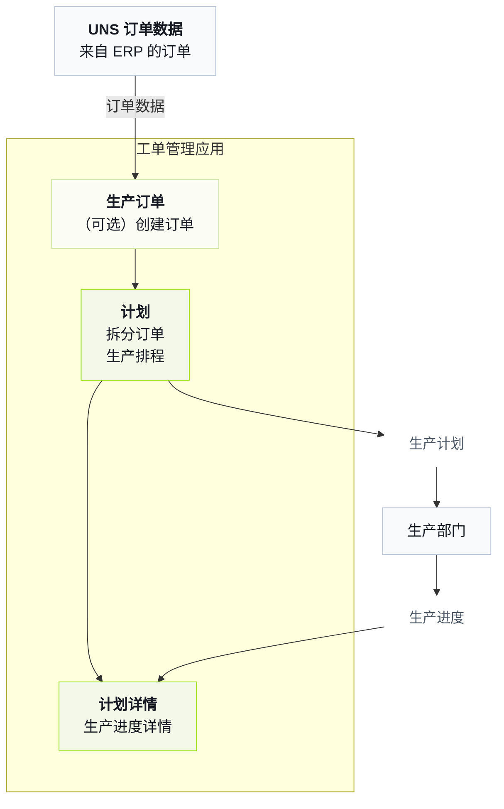

import { Steps } from '@astrojs/starlight/components';

理解 Tier0 最快的方式，是直接查看一个已经可以运行的工厂。

## 业务背景

Demo 工厂会从 ERP 接收订单，拆分订单，安排生产计划，将计划发送给生产部门，并在生产过程中接收生产进度数据。

```mermaid
%%{init: {"themeVariables": {"fontSize": "18px"}, "themeCSS": ".nodeLabel, .edgeLabel, .cluster-label { font-size: 18px !important; } .nodeLabel b, .nodeLabel strong { font-size: 19px !important; }"}}%%
flowchart TB
  uns["<span style='font-size:18px;font-weight:700'>UNS 订单数据</span><br/><span style='font-size:16px'>来自 ERP 的订单</span>"]
  production["<span style='font-size:18px'>生产部门</span>"]

  subgraph app["工单管理应用"]
    direction TB
    appSpacer[" "]
    subgraph appPages[" "]
      direction LR
      orders["<span style='font-size:18px;font-weight:700'>生产订单</span><br/><span style='font-size:16px'>（可选）创建订单</span>"]
      plans["<span style='font-size:18px;font-weight:700'>计划</span><br/><span style='font-size:16px'>拆分订单<br/>生产排程</span>"]
      details["<span style='font-size:18px;font-weight:700'>计划详情</span><br/><span style='font-size:16px;white-space:nowrap'>生产进度详情</span>"]
    end
  end

  uns -- "订单数据" --> orders
  orders --> plans
  plans --> details
  plans --> planLabel["生产计划"]
  planLabel --> production
  production --> progressLabel["生产进度"]
  progressLabel --> details

  classDef external fill:#f8fafc,stroke:#b8c4d5,color:#171a22,stroke-width:1px,font-size:18px
  classDef optional fill:#fbfdf4,stroke:#cfe8a3,color:#171a22,stroke-width:1px,font-size:18px
  classDef appNode fill:#f4f8e9,stroke:#9adf11,color:#171a22,stroke-width:1px,font-size:18px
  classDef labelNode fill:transparent,stroke:transparent,color:#4b5563,font-size:17px
  classDef invisible fill:transparent,stroke:transparent,color:transparent
  class uns,production external
  class orders optional
  class plans,details appNode
  class planLabel,progressLabel labelNode
  class appSpacer invisible
  style appPages fill:transparent,stroke:transparent
```

## 流程

<Steps>
1. 在 Tier0 中进入 **UNS**，查看来自 ERP 的订单详情。
    - `DemoFactory/ERP/ProductionOrders/State/UpsertProductionOrder`：订单。
    - `DemoFactory/ERP/ProductionOrders/State/OrderList`：当前订单列表快照。
    :::tip[数据如何采集到 UNS？]
    进入 **数据流程** > **数据连接** > **DemoFactory-Flow** 查看数据采集详情。
    :::
2. （可选）进入 **应用中心**，打开 **Work Order Management** 应用，并在 **Production Orders** 页面创建订单。
3. 在 **Work Order Management** 中，在 **Plans** 页面拆分订单，并为拆分后的工单安排生产计划。
4. 将计划发送给生产部门，并在 **UNS** 的以下 topics 中查看计划详情。
    - `DemoFactory/ERP/WorkOrderPlan/Metric/SplitCount`：拆分后的工单数量。
    - `DemoFactory/ERP/WorkOrderPlan/State/PlanStatus`：当前计划状态。
    - `DemoFactory/ERP/WorkOrderPlan/State/WorkOrderList`：生产计划排程后的工单列表。

    :::note
    应用会直接将排产计划和工单数据写回 **UNS**。
    :::
5. 在应用的 **Plan Details** 页面查看生产进度数据。
    :::tip[详情数据来自哪里？]
    生产进度数据来自生产部门，由 **数据连接** 中的 **DemoFactory-Flow** 采集并发布到 **UNS**，然后展示在 **Plan Details** 页面。
    - `DemoFactory/Site_01/Production/Line_01/WorkOrderExecution/State/CurrentWorkOrder`：正在执行的订单。
    - `DemoFactory/Site_01/Production/Line_01/WorkOrderExecution/State/WorkOrderStatus`：当前订单的执行状态。
    - `DemoFactory/Site_01/Production/Line_01/WorkOrderExecution/Metric/Target_Qty`：当前订单的目标产量。
    - `DemoFactory/Site_01/Production/Line_01/WorkOrderExecution/Metric/Produced_Qty`：当前订单已完成的产品数量。
    - `DemoFactory/Site_01/Production/Line_01/WorkOrderExecution/Metric/Defect_Qty`：当前订单的不良品数量。
    - `DemoFactory/Site_01/Production/Line_01/WorkOrderExecution/Metric/Completion_Rate`：当前订单的完成率。
    :::
</Steps>

## 下一步

- [选择最合适的版本](../choosing-version/) - 比较各版本并选择最适合你的版本
- [UNS 概念](../../using-tier0/uns-concepts/) - 了解 Unified Namespace 数据建模
