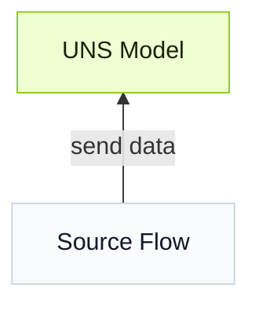

import { Steps } from '@astrojs/starlight/components';

要将数据连接到 Tier0，首先在 **UNS** 中构建模型，然后通过 **Source Flow** 连接数据源，并将 UNS 模型作为目标。


## 如何构建数据模型
基于简单的文件夹-文件结构，将数据层级定义成树形图。

### 手动构建模型

:::note[示例模型]
**Model**：
```
  Factory_A
  └── Site_01
      └── SMT_Line_1
          └── Metric
              └── Machine_001
```
**Payload**：
```json
"temperature": 85,
"vibration": 2.8
```
:::
<Steps>
1. 在 **UNS** 中添加根路径 `Factory_A`。
2. 在 `Factory_A` 下添加第二级路径 `Site_01`，然后按照树形图中的层级顺序继续添加后续路径。
3. 在 `SMT_Line_1` 下添加 topic `Machine_001`，并将 **Topic Type** 设置为 **Metric**。
4. 定义 topic payload。添加 `temperature` 和 `vibration` 两个字段，并设置它们的数据类型。
5. 选择 **Mock Data** 向模型发送模拟数据，并选择 **Enable History** 将数据存储到数据库。
</Steps>

:::tip[附加参数]
**Auto Parsing** 会解析 JSON 文本，并将其转换成通用字段。
:::

### 导入模型
:::tip
可以使用 ChatGPT 等 LLM 帮助导入模型。
:::

<Steps>
1. 在 **Import** 窗口复制模板 JSON，或下载模板文件。
2. 将模板发送给 AI，并使用类似的 prompt。
    ```
    Generate a UNS model used for xx in xx plant, including xx equipment and data sources based on the template.
    ```
3. 在 UNS 中导入生成结果。
</Steps>

## 如何连接数据到 UNS
**Source Flow** 基于 **Node-RED**，用于将数据源连接到 Tier0。
:::tip[理解 Source Flow]
在 **Source Flow** 中：
- 每个 flow 都以 **mqtt out** 节点结束。它作为 MQTT client 将数据发布到 broker。
- UNS broker 会嵌入到与 flow 同名的 **mqtt out** 节点中。
- 当使用 UNS 模型作为 topic 时，数据会直接进入 **UNS** 中对应的模型。
:::
<Steps>
1. 在 **Flows** 中创建一个 **Source Flow**。
2. 根据数据源类型使用对应节点，并以 **mqtt out** 节点结束 flow。
3. 确保节点的 **Server** 设置为 UNS broker。
4. 使用 **UNS** 模型作为 MQTT topic（例如 `Factory_A/Site_01/SMT_Line_1/Metric/Machine_001`）。
</Steps>

## 其他选项
:::note
本节说明与工作流相关的附加参数或配置。
:::

| Scope | Parameter | Item | When to use |
|------|-----------|------|-------------|
| Path | Extended Attribute/Custom Attributes | - | 当需要为 path 添加额外属性时使用，例如单位信息。 |
| Topic | Topic Type | [Metric, State, Action](../uns-concepts/#metric-state-action) | 选择与数据语义匹配的 topic 类型：测量值、当前状态或可执行操作。 |
| Topic | Attribute Generation Method | Pre-defined | 逐个手动设置 topic 属性。 |
| Topic | Attribute Generation Method | Auto-Parsing | 从 JSON 文本批量自动转换属性。 |

## 下一步

- [在 UNS 上构建应用](../build-apps/) - 使用 UNS 数据构建工业应用。
- [分析 UNS 数据](../analyze-data/) - 使用 Marimo Notebook 和 Python 分析 UNS 数据。
