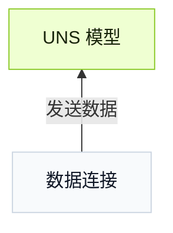

import { Steps } from '@astrojs/starlight/components';

要将数据连接到 Tier0，首先在 **UNS** 中构建模型，然后通过 **数据连接** 连接数据源，将数据发布到 UNS。


```mermaid
flowchart BT
  uns["UNS 模型"]
  flow["数据连接"]

  flow -->|"发送数据"| uns

  classDef t0accent fill:#EFFFD2,stroke:#8AC926,stroke-width:1px,color:#18230B
  classDef t0node fill:#F8FAFC,stroke:#CBD5E1,stroke-width:1px,color:#111827
  class uns t0accent
  class flow t0node
```
## 如何构建数据模型
基于简单的文件夹-文件结构，将数据层级定义成树形图。

### 手动构建模型

:::note[示例模型]
**模型库**：
```
  Factory_A
  └── Site_01
      └── SMT_Line_1
          └── Metric
              └── Machine_001
```
**消息内容**：
```json
"temperature": 85,
"vibration": 2.8
```
:::
<Steps>
1. 在 **UNS** 中添加根 path `Factory_A`。
2. 在 `Factory_A` 下添加第二级 path `Site_01`，然后按照树形图中的层级顺序继续添加后续 path。
3. 在 `SMT_Line_1` 下添加 topic `Machine_001`，并将 **类型** 设置为 **Metric**。
4. 定义 topic 消息内容。添加 `temperature` 和 `vibration` 两个字段，并设置它们的数据类型。
5. 选择 **模拟数据** 向模型发送模拟数据，并选择 **启用历史记录** 将数据存储到数据库。
</Steps>

:::tip[附加参数]
**自动解析** 会解析 JSON 文本，并将其转换成通用字段。
:::

### 导入模型
:::tip
可以使用 ChatGPT 等 LLM 帮助导入模型。
:::

<Steps>
1. 在 **导入** 窗口复制模板 JSON，或下载模板文件。
2. 将模板发送给 AI，并使用类似的 prompt。
    ```
    基于这个模板，生成一个 UNS 数据模型用于 xx 工厂 xx 车间，包括 xx 设备和数据源。
    ```
3. 在 UNS 中导入生成结果。
</Steps>

## 如何连接数据到 UNS
**数据连接** 基于 **Node-RED**，用于将数据源连接到 Tier0。
:::tip[理解数据连接]
在 **数据连接** 中：
- 每个数据流都以 **mqtt out** 节点结束。它可以作为 MQTT 客户端将数据发布到 UNS broker。
- UNS broker 会嵌入到与数据流同名的 **mqtt out** 节点中。
- 当使用 UNS 模型作为 topic 时，数据会直接进入 **UNS** 中对应的模型。
:::
<Steps>
1. 在 **数据流程** 中创建一个 **数据连接**。
2. 根据数据源类型使用对应节点，并以 **mqtt out** 节点作为数据流终点。
3. 确保节点的 **Server** 设置为 UNS broker。
4. 使用 **UNS** 模型作为 MQTT topic（例如 `Factory_A/Site_01/SMT_Line_1/Metric/Machine_001`）。
</Steps>

## 其他选项
:::note
本节说明与本工作流相关的附加参数或配置。
:::

| 范围 | 参数 | 项 | 何时使用 |
|------|-----------|------|-------------|
| Path | 自定义属性 | - | 当需要为 path/topic 添加额外属性时使用，例如单位信息。 |
| Topic | 类型 | [Metric, State, Action](../uns-concepts/#metric-state-action) | 选择与数据语义匹配的 topic 类型：测量值、当前状态或可执行操作。 |
| Topic | 属性生成方式 | 预定义 | 逐个手动设置 topic 属性。 |
| Topic | 属性生成方式 | 自动解析 | 从 JSON 文本批量自动转换属性。 |

## 下一步

- [在 UNS 上构建应用](../build-apps/) - 使用 UNS 数据构建工业应用。
- [分析 UNS 数据](../analyze-data/) - 使用 Marimo Notebook 和 Python 分析 UNS 数据。
