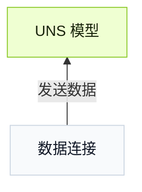

import { Steps } from '@astrojs/starlight/components';

先在 **UNS** 中构建模型，然后通过 **数据连接** 将数据接入模型，形成后续使用的数据基础。


```mermaid
flowchart BT
  uns["UNS 模型"]
  flow["数据连接"]

  flow -->|"发送数据"| uns

  classDef t0accent fill:#EFFFD2,stroke:#8AC926,stroke-width:1px,color:#18230B
  classDef t0node fill:#F8FAFC,stroke:#CBD5E1,stroke-width:1px,color:#111827
  class uns t0accent
  class flow t0node
```

:::note
该流程可以通过与 UNS Agent 对话完成。详情请查看[这里](../../best-practice/building-data-workflow-with-agent/)。
:::

## 构建数据模型
根据以下内容定义数据层级树：
  - 数据来源的物理位置（参考 [ISA-95](../../reference/isa-95-equipment-hierarchy/)）；
  - 数据遵循的业务逻辑。

### 手动构建模型

:::tip[先使用草稿验证模型]
在 **Draft** 中创建或导入模型，先验证模型是否符合建模原则，确认有效后再部署。
:::

<Steps>
1. 设计模型结构，先按顺序创建路径，再创建 topic。
2. 根据[数据特征](../uns-concepts/#metric-state-action)，在 **Metric**、**State** 和 **Action** 中选择 **Topic Type**。
3. 选择 **Mock Data** 向模型发送模拟数据，并启用 **Enable History** 将数据存入数据库。
4. 通过 **Auto Parsing** 或 **Pre-defined** 为 topic 添加正确数据类型的字段。
    - **Auto Parsing**：从 JSON 文本中批量自动转换字段。

        ```json
        {
          "temp":85.5
        }
        ```
        :::caution
        只能解析单层 JSON；对于多层 JSON，只会解析第一层。
        :::

    - **Pre-defined**：逐个手动设置 topic 字段。
</Steps>

### 导入模型
:::tip
可以使用 ChatGPT 等 LLM 辅助导入模型。
:::

<Steps>
1. 将 **Import** 中的模板 JSON 发给 AI，并使用类似的 prompt。
    ```
    根据模板，生成一个用于 xx 工厂 xx 场景的 UNS 模型，包括 xx 设备和数据源。
    ```
2. 将生成结果导入 UNS。
</Steps>

## 连接数据到 UNS

### 数据流程特性
- 基于 Node-RED。
- 每个 flow 都以 `mqtt out` 节点结束。它作为 MQTT client 将数据发布到 UNS broker。
- UNS broker 内置在与 flow 同名的 `mqtt out` 和 `mqtt in` 节点中。
- 当使用 UNS 模型作为 topic 时，数据会直接进入 **UNS** 中对应的模型。

### 步骤

<Steps>
1. 根据数据源类型使用节点构建 flow，并以 `mqtt out` 节点结束。

    :::tip[如果需要当前没有的节点]
    可以从 Node-RED 社区安装所需节点。官方社区节点通常以 `node-red-contrib` 开头。
    :::

2. 确保 `mqtt out` 节点的 **Server** 设置为 UNS broker，并且 topic 是 **UNS** 中的模型。
</Steps>

### Flow 版本管理
保存数据流程版本，这样你可以回滚到早期版本，也可以基于历史版本启动新的 flow。

:::caution
Edge 版本不支持版本回滚。
:::

## 下一步

- [基于工厂数据构建应用](../build-apps/) - 使用 UNS 数据构建工业应用。
- [分析工厂数据](../analyze-data/) - 使用 Marimo Notebook 和 Python 分析 UNS 数据。
